Product Requirements Document (PRD): Aplikasi Inventori Aset

- **Versi**: 2.0
- **Tanggal**: 09 April 2026
- **Pemilik Dokumen**: Angga Samuludi Septiawan

# 1. Pendahuluan

Dokumen ini merinci kebutuhan bisnis, tujuan, dan fitur utama untuk pengembangan aplikasi inventori aset di PT. Trinity Media Indonesia. Aplikasi ini dirancang untuk meningkatkan efisiensi, akuntabilitas, dan visibilitas dalam manajemen aset perusahaan dengan menyediakan solusi digital yang terpusat dan mudah digunakan.

# 2. Latar Belakang & Masalah

Saat ini, PT. Trinity Media Indonesia mengelola aset perusahaan menggunakan metode manual yang rentan terhadap kesalahan, kurang efisien, dan sulit untuk dilacak. Proses mulai dari permintaan barang, pencatatan, serah terima, hingga penarikan kembali aset tidak terpusat, menyebabkan kesulitan dalam audit, potensi kehilangan aset, dan ketidakjelasan status kepemilikan aset.

# 3 Visi & Tujuan Proyek

**Visi**: Menciptakan sistem manajemen inventori aset yang terpusat, modern, dan efisien untuk memberikan visibilitas penuh dan kontrol atas seluruh siklus hidup aset di PT. Trinity Media Indonesia.

**Tujuan**:

1.  **Sentralisasi Data**: Mengumpulkan semua data aset dalam satu database yang terstruktur.
2.  **Otomatisasi Alur Kerja**: Mendigitalkan proses alur kerja yaitu pencatatan asset, jumlah stok dan aktifitas stok asset, permintaan asset, peminjaman dan pengembalian asset, serah terima asset, lapor asset rusak dan perbaikan serta disposal asset jika sudah tidak layak, manajemen proyek infrastuktur, manajemen pelanggan seperti daftar pelanggan, instalasi, dismantle dan maintenance, dan pusat kategori asset.
3.  **Peningkatan Akuntabilitas**: Melacak riwayat setiap aset, seperti siapa yang bertanggung jawab atasnya, siapa yang melakukan permintaan, serah terima, pekerjaan pada waktu tertentu.
4.  **Efisiensi Operasional**: Mempercepat proses audit dan pelaporan dengan data yang akurat dan real-time.
5.  **Pengurangan Risiko**: Meminimalkan risiko kehilangan atau kerusakan aset dengan pemantauan yang lebih baik.

# 4. Lingkup Proyek

Aplikasi ini akan mencakup fungsionalitas end-to-end\_ untuk manajemen aset, termasuk:

- **IN-SCOPE** : dashboard, catat asset, stok asset, permintaan baru, permintaan peminjaman, permintaan pengembalian, serah terima, lapor asset rusak, manajemen proyek, manajemen pelanggan (daftar pelanggan, daftar instalasi, daftar maintenance, daftar dismantle), manajemen kategori, manajemen akun, manajemen pengguna dan divisi, manajemen data pembelian, Integrasi barcode dan qrcode, integritas import dan export (excel, pdf, word), integritas berkas (jpg, pdf).
- **OUT-OF-SCOPE**: expand fitur tiketing, manajemen keuangan mendalam, integrasi email, aset diluar dari device, tools dan materia seperti kendaraan, property dan lainnya.

## 4.1 Daftar Fitur

1.  **Dashboard**: Menyediakan tampilan ringkasan aktivitas aset, status permintaan, dan notifikasi penting.
2.  **Pencatatan Aset**: Memungkinkan pengguna untuk mencatat aset baru dengan detail lengkap, termasuk kategori, tipe, model, dan nilai satuan.
3.  **Stok Aset**: Memantau jumlah stok aset yang tersedia, digunakan, dan rusak.
4.  **Permintaan Aset**: Memfasilitasi proses permintaan aset baru, peminjaman, dan pengembalian dengan alur persetujuan yang jelas.
5.  **Serah Terima Aset**: Mencatat proses serah terima aset antara pengguna dengan detail lengkap.
6.  **Lapor Aset Rusak**: Memungkinkan pengguna untuk melaporkan aset yang rusak dan memantau proses perbaikan atau disposal.
7.  **Manajemen Proyek**: Memfasilitasi manajemen proyek infrastruktur dengan alokasi aset yang tepat.
8.  **Manajemen Pelanggan**: Mengelola daftar pelanggan, instalasi, maintenance, dan dismantle terkait aset.
9.  **Manajemen Kategori**: Mengelola kategori, tipe, dan model aset untuk klasifikasi yang lebih baik.
10. **Manajemen Akun**: Mengelola akun pengguna, termasuk pembuatan, penghapusan, reset password, ganti password, ganti nama, aset yang digunakan dan dipegang, jumlah request, dan aktivitas lainnya.
11. **Manajemen Pengguna dan Divisi**: Mengelola pengguna, peran, dan divisi untuk mengatur hak akses dan tanggung jawab.
12. **Notifikasi**: Memberikan notifikasi real-time untuk aktivitas penting seperti permintaan baru, persetujuan, dan laporan kerusakan.
13. **Laporan & Analitik**: Menyediakan laporan dan analitik terkait penggunaan aset, permintaan, dan status stok untuk mendukung pengambilan keputusan.
14. **Keamanan & Audit**: Menyediakan fitur keamanan untuk melindungi data dan audit trail untuk melacak perubahan dan aktivitas pengguna.
15. **Integrasi**: Menyediakan API untuk integrasi dengan sistem lain di masa depan, seperti sistem keuangan atau ERP.
16. **Mobile Responsiveness**: Memastikan aplikasi dapat diakses dengan baik melalui perangkat mobile untuk fleksibilitas penggunaan di lapangan.
17. **User Experience (UX)**: Mendesain antarmuka yang intuitif dan mudah digunakan untuk meningkatkan adopsi pengguna.
18. **Scalability**: Merancang sistem yang dapat dengan mudah ditingkatkan untuk menangani pertumbuhan jumlah aset dan pengguna di masa depan.
19. **Support & Maintenance**: Menyediakan dukungan teknis dan pemeliharaan berkelanjutan untuk memastikan aplikasi tetap berjalan dengan baik dan diperbarui sesuai kebutuhan dan perjanjian layanan.
20. **Training & Onboarding**: Menyediakan materi pelatihan dan sesi onboarding untuk memastikan pengguna dapat menggunakan aplikasi dengan efektif.
21. **Feedback Loop**: Membangun mekanisme untuk mengumpulkan umpan balik pengguna secara terus-menerus untuk perbaikan dan pengembangan fitur di masa depan.
22. **Compliance & Regulatory**: Memastikan aplikasi mematuhi standar keamanan data dan regulasi yang berlaku untuk melindungi informasi sensitif dan memastikan kepatuhan hukum.
23. **QR Code & Barcode Integration**: Menyediakan fitur untuk mengintegrasikan QR code dan barcode untuk memudahkan pelacakan dan manajemen aset di lapangan.
24. **Import & Export**: Menyediakan fitur untuk mengimpor dan mengekspor data dalam format Excel, PDF, dan Word untuk memudahkan analisis dan pelaporan.
25. **File Attachment**: Menyediakan fitur untuk melampirkan file seperti gambar (JPG) dan dokumen (PDF) terkait aset untuk dokumentasi yang lebih lengkap.
26. **Multi Theme Support**: Menyediakan opsi tema gelap dan terang untuk meningkatkan kenyamanan pengguna saat menggunakan aplikasi dalam berbagai kondisi pencahayaan.
27. **Role-Based Access Control (RBAC)**: Menerapkan kontrol akses berbasis peran untuk memastikan bahwa pengguna hanya dapat mengakses fitur dan data yang sesuai dengan peran mereka dalam organisasi.
28. **Audit Trail**: Menyediakan fitur audit trail untuk melacak semua perubahan dan aktivitas pengguna dalam aplikasi, meningkatkan transparansi dan akuntabilitas.
29. **Data Backup & Recovery**: Menyediakan mekanisme untuk melakukan backup data secara berkala dan recovery data jika terjadi kehilangan atau kerusakan data.
30. **WhatsApp Integration**: Menyediakan fitur integrasi notifikasi dengan WhatsApp untuk memudahkan komunikasi dan notifikasi terkait aktivitas aset kepada pengguna.

# 5. Alur Pengguna & Aturan Bisnis

## 5.1 User Flow

Berikut adalah alur utama (Happy Path) untukk fitur pada aplikasi inventori aset:

- **Manajemen Kategori**:

1. **Inisiasi**: Admin Logistik atau Super Admin
2. **Aksi**: Pengguna mengakses halaman manajemen kategori untuk membuat kategori baru, tipe, dan model aset.
3. **Input**: Pengguna mengisi form yang disediakan.
4. **Validasi**: Sistem memvalidasi input yang diberikan.
5. **Output**: Sistem menyimpan data dan menampilkan konfirmasi bahwa kategori, tipe, atau model aset berhasil dibuat atau gagal dengan pesan error yang sesuai.

- **Data Pembelian**:

1. **Inisiasi**: Admin Purchase atau Super Admin
2. **Aksi**: Pengguna mengakses halaman data pembelian untuk membuat atau mengelola data pembelian.
3. **Input**: Pengguna mengisi form yang disediakan.
4. **Validasi**: Sistem memvalidasi input yang diberikan.
5. **Output**: Sistem menyimpan data dan menampilkan konfirmasi bahwa data pembelian berhasil dibuat atau dikelola atau gagal dengan pesan error yang sesuai.

- **Depresiasi Aset**:

1. **Inisiasi**: Admin Purchase atau Super Admin
2. **Aksi**: Pengguna mengakses halaman depresiasi aset untuk membuat atau mengelola depresiasi aset.
3. **Input**: Pengguna mengisi form yang disediakan.
4. **Validasi**: Sistem memvalidasi input yang diberikan.
5. **Output**: Sistem menyimpan data dan menampilkan konfirmasi bahwa depresiasi aset berhasil dibuat atau dikelola atau gagal dengan pesan error yang sesuai.

- **Daftar Aset**:

1. **Inisiasi**: Admin Logistik, Super Admin.
2. **Aksi**: Pengguna mengakses halaman daftar aset untuk membuat atau mengelola pencatatan aset.
3. **Input**: Pengguna mengisi form yang disediakan.
4. **Validasi**: Sistem memvalidasi input yang diberikan.
5. **Output**: Sistem menyimpan data dan menampilkan konfirmasi bahwa pencatatan aset berhasil dibuat atau dikelola atau gagal dengan pesan error yang sesuai.

- **Stok Aset**:

1. **Inisiasi**: Admin Logistik, Super Admin, Leader.
2. **Aksi**: Pengguna mengakses halaman stok aset untuk mengatur jumlah ambang batas stok aset dan melakukan aksi terkait stok aset.
3. **Input**: Klik tombol untuk mengatur jumlah ambang batas stok aset atau melakukan aksi terkait stok aset.
4. **Output**: Sistem menampilkan modal untuk mengaturjumlah ambang batas stok aset menyimpan data dan menampilkan konfirmasi bahwa jumlah ambang batas stok aset berhasil diatur atau aksi terkait stok aset berhasil dilakukan atau gagal dengan pesan error yang sesuai. dan menuju halaman terkait aksi stok aset yang dipilih.
5. **Validasi**: Sistem memvalidasi input yang diberikan pada modal untuk mengatur jumlah ambang batas stok aset.

- **Permintaan Aset**:

1. **Inisiasi**: Semua Role.
2. **Aksi**: Pengguna mengakses halaman permintaan aset untuk membuat permintaan baru, peminjaman, atau pengembalian aset.
3. **Input**: Pengguna mengisi form yang disediakan untuk permintaan aset.
4. **Validasi**: Sistem memvalidasi input yang diberikan. Memvalidasi ketersediaan stok aset untuk memutuskan tahap selanjutnya dalam alur permintaan aset. Dan approval workflow.
5. **Output**: Sistem menyimpan data dan menampilkan konfirmasi bahwa permintaan aset berhasil dibuat atau gagal dengan pesan error yang sesuai. Dan update stok aset, status aset.

- **Permintaan Peminjaman dan Pengembalian Aset**:

1. **Inisiasi**: Semua Role.
2. **Aksi**: Pengguna mengakses halaman permintaan peminjaman atau pengembalian aset untuk membuat permintaan peminjaman atau pengembalian aset.
3. **Input**: Pengguna mengisi form yang disediakan untuk permintaan peminjaman atau pengembalian aset.
4. **Validasi**: Sistem memvalidasi input yang diberikan. Memvalidasi ketersediaan stok aset untuk memutuskan tahap selanjutnya dalam alur permintaan peminjaman atau pengembalian aset. Dan approval workflow.
5. **Output**: Sistem menyimpan data dan menampilkan konfirmasi bahwa permintaan peminjaman atau pengembalian aset berhasil dibuat atau gagal dengan pesan error yang sesuai. Dan update stok aset, status aset.

- **Serah Terima Aset**:

1. **Inisiasi**: Semua Role.
2. **Aksi**: Pengguna mengakses halaman serah terima aset untuk membuat serah terima aset.
3. **Input**: Pengguna mengisi form yang disediakan untuk serah terima aset.
4. **Validasi**: Sistem memvalidasi input yang diberikan. Memvalidasi ketersediaan stok aset untuk memutuskan tahap selanjutnya dalam alur serah terima aset.
5. **Output**: Sistem menyimpan data dan menampilkan konfirmasi bahwa serah terima aset berhasil dibuat atau gagal dengan pesan error yang sesuai. Dan update stok aset, status aset.

- **Lapor Aset Rusak**:

1. **Inisiasi**: Semua Role.
2. **Aksi**: Pengguna mengakses halaman lapor aset rusak untuk melaporkan aset yang rusak.
3. **Input**: Pengguna mengisi form yang disediakan untuk lapor aset rusak.
4. **Validasi**: Sistem memvalidasi input yang diberikan. Memvalidasi ketersediaan stok aset untuk memutuskan tahap selanjutnya dalam alur lapor aset rusak.
5. **Output**: Sistem menyimpan data dan menampilkan konfirmasi bahwa lapor aset rusak berhasil dibuat atau gagal dengan pesan error yang sesuai. Dan update stok aset, status aset.

- **Manajemen Proyek**:

1. **Inisiasi**: Leader, Staff (divisi tertentu) dan Super Admin, Admin Logistik.
2. **Aksi**: Pengguna mengakses halaman manajemen proyek untuk membuat atau mengelola proyek infrastruktur.
3. **Input**: Pengguna mengisi form yang disediakan untuk manajemen proyek.
4. **Validasi**: Sistem memvalidasi input yang diberikan. Memvalidasi ketersediaan sumber daya untuk memutuskan tahap selanjutnya dalam alur manajemen proyek.
5. **Output**: Sistem menyimpan data dan menampilkan konfirmasi bahwa manajemen proyek berhasil dibuat atau gagal dengan pesan error yang sesuai. Dan update status proyek.

- **Manajemen Pelanggan**:

1. **Inisiasi**: Leader (divisi tertentu) dan Super Admin, Admin Logistik.
2. **Aksi**: Pengguna mengakses halaman manajemen pelanggan untuk membuat atau mengelola daftar pelanggan, instalasi, maintenance, dan dismantle terkait aset.
3. **Input**: Pengguna mengisi form yang disediakan untuk manajemen pelanggan.
4. **Validasi**: Sistem memvalidasi input yang diberikan. Memvalidasi ketersediaan sumber daya untuk memutuskan tahap selanjutnya dalam alur manajemen pelanggan.
5. **Output**: Sistem menyimpan data dan menampilkan konfirmasi bahwa manajemen pelanggan berhasil dibuat atau gagal dengan pesan error yang sesuai. Dan update status pelanggan, instalasi, maintenance, atau dismantle.

- **Manajemen Akun**:

1. **Inisiasi**: Super Admin.
2. **Aksi**: Pengguna mengakses halaman manajemen akun untuk membuat atau mengelola akun pengguna.
3. **Input**: Pengguna mengisi form yang disediakan
4. **Validasi**: Sistem memvalidasi input yang diberikan.
5. **Output**: Sistem menyimpan data dan menampilkan konfirmasi bahwa manajemen akun berhasil dibuat atau gagal dengan pesan error yang sesuai. Dan update status akun pengguna.

- **Manajemen Pengguna dan Divisi**:

1. **Inisiasi**: Super Admin.
2. **Aksi**: Pengguna mengakses halaman manajemen pengguna dan divisi untuk membuat atau mengelola pengguna, peran, dan divisi.
3. **Input**: Pengguna mengisi form yang disediakan untuk manajemen pengguna dan divisi.
4. **Validasi**: Sistem memvalidasi input yang diberikan.
5. **Output**: Sistem menyimpan data dan menampilkan konfirmasi bahwa manajemen pengguna dan divisi berhasil dibuat atau gagal dengan pesan error yang sesuai. Dan update status pengguna, peran, atau divisi.

- **Notifikasi**:

1. **Inisiasi**: Sistem.
2. **Aksi**: Sistem mengirimkan notifikasi real-time untuk aktivitas penting seperti permintaan baru, persetujuan, dan laporan kerusakan.
3. **Input**: Sistem mendeteksi aktivitas penting yang terjadi dalam aplikasi.
4. **Validasi**: Sistem memvalidasi bahwa aktivitas yang terjadi memenuhi kriteria untuk mengirimkan notifikasi.
5. **Output**: Sistem mengirimkan notifikasi kepada pengguna yang relevan dengan informasi yang sesuai tentang aktivitas yang terjadi.

## 5.2 Business Rules

1. **Kekekalan Data Aset**: Aset yang sudah memiliki riwayat transaksi (pernah dipinjam/digunakan) tidak dapat dihapus secara permanen dari database (Soft Delete), melainkan harus diubah statusnya menjadi Disposed atau Archived.
2. **Kewenangan Stok**: Hanya Super Admin dan Admin Logistik yang memiliki hak untuk melakukan penambahan stok manual (Stock Opname). Divisi lain hanya menerima stok melalui alur Serah Terima.
3. **Kewenangan Data Pembelian dan keuangan**: Hanya Super Admin dan Admin Purchase yang memiliki hak untuk membuat dan mengelola data pembelian. Divisi lain tidak memiliki akses ke fitur ini.
4. **Integritas Transaksi**: Setiap perubahan state pada transaksi wajib mencatat ID Pengguna yang melakukan perubahan dan timestamp (Terekam dalam Audit Trail).
5. **Validasi Stok**: Sistem harus memvalidasi ketersediaan stok sebelum menyetujui permintaan peminjaman atau pengembalian aset. Jika stok tidak mencukupi, maka masuk ke proses pengadaan aset baru.
6. **Aset Hilang** : Jika aset dilaporkan hilang, maka status aset berubah menjadi Lost dan tidak dapat digunakan atau dipinjam hingga statusnya diubah kembali oleh Super Admin atau Admin Logistik.

## 5.3 Approval Workflow

### 5.3.1 Table

| Modul                   | Pembuat (Creator) | Persetujuan 1 (Approval 1) | Persetujuan 2 (Approval 2) | Persetujuan 3 (Approval 3) | Persetujuan 4 (Approval 4) | Mengetahui  | Eksekutor Akhir                 |
| ----------------------- | ----------------- | -------------------------- | -------------------------- | -------------------------- | -------------------------- | ----------- | ------------------------------- |
| Permintaan Baru         | Staff             | Leader Divisi              | Admin Logistik             | Admin Purchase             | Super Admin                |             | Admin Logistik                  |
| Permintaan Baru         | Leader Divisi     | Admin Logistik             | Admin Purchase             | Super Admin                |                            |             | Admin Logistik                  |
| Permintaan Baru         | Admin Logistik    | Admin Purchase             | Super Admin                |                            |                            |             | Super Admin atau Admin Logistik |
| Permintaan Baru         | Admin Purchase    | Admin Logistik             | Super Admin                |                            |                            |             | Super Admin atau Admin Logistik |
| Permintaan Baru         | Super Admin       | Admin Logistik             | Admin Purchase             |                            |                            |             | Admin Logistik                  |
| Permintaan Peminjaman   | Staff             | Leader Divisi              | Admin Logistik             |                            |                            | Super Admin | Admin Logistik                  |
| Permintaan Peminjaman   | Leader Divisi     | Admin Logistik             |                            |                            |                            | Super Admin | Admin Logistik                  |
| Permintaan Peminjaman   | Admin Logistik    | Super Admin                |                            |                            |                            |             | Super Admin atau Admin Logistik |
| Permintaan Peminjaman   | Admin Purchase    | Admin Logistik             |                            |                            |                            | Super Admin | Super Admin atau Admin Logistik |
| Permintaan Peminjaman   | Super Admin       | Admin Logistik             |                            |                            |                            |             | Admin Logistik                  |
| Permintaan Pengembalian | Staff             | Leader Divisi              | Admin Logistik             |                            |                            | Super Admin | Admin Logistik                  |
| Permintaan Pengembalian | Leader Divisi     | Admin Logistik             |                            |                            |                            | Super Admin | Admin Logistik                  |
| Permintaan Pengembalian | Admin Logistik    | Super Admin                |                            |                            |                            |             | Super Admin atau Admin Logistik |
| Permintaan Pengembalian | Admin Purchase    | Admin Logistik             |                            |                            |                            | Super Admin | Super Admin atau Admin Logistik |
| Permintaan Pengembalian | Super Admin       | Admin Logistik             |                            |                            |                            |             | Admin Logistik                  |
| Serah Terima            | Staff             | Leader Divisi              | Admin Logistik             |                            |                            | Super Admin | Admin Logistik                  |
| Serah Terima            | Leader Divisi     | Admin Logistik             |                            |                            |                            | Super Admin | Admin Logistik                  |
| Serah Terima            | Admin Logistik    | Super Admin                |                            |                            |                            |             | Super Admin atau Admin Logistik |
| Serah Terima            | Admin Purchase    | Admin Logistik             |                            |                            |                            | Super Admin | Super Admin atau Admin Logistik |
| Serah Terima            | Super Admin       | Admin Logistik             |                            |                            |                            |             | Admin Logistik                  |
| Lapor Aset Rusak        | Staff             | Leader Divisi              | Admin Logistik             |                            |                            | Super Admin | Admin Logistik                  |
| Lapor Aset Rusak        | Leader Divisi     | Admin Logistik             |                            |                            |                            | Super Admin | Admin Logistik                  |
| Lapor Aset Rusak        | Admin Logistik    | Super Admin                |                            |                            |                            |             | Super Admin atau Admin Logistik |
| Lapor Aset Rusak        | Admin Purchase    | Admin Logistik             |                            |                            |                            | Super Admin | Super Admin atau Admin Logistik |
| Lapor Aset Rusak        | Super Admin       | Admin Logistik             |                            |                            |                            |             | Admin Logistik                  |
| Proyek Infrastruktur    | Staff             | Leader Divisi              | Admin Logistik             |                            |                            | Super Admin | Admin Logistik                  |
| Proyek Infrastruktur    | Leader Divisi     | Admin Logistik             |                            |                            |                            | Super Admin | Admin Logistik                  |
| Manajemen Instalasi     | Staff             | Leader Divisi              | Admin Logistik             |                            |                            | Super Admin | Admin Logistik                  |
| Manajemen Instalasi     | Leader Divisi     | Admin Logistik             |                            |                            |                            | Super Admin | Admin Logistik                  |
| Manajemen Maintenance   | Staff             | Leader Divisi              | Admin Logistik             |                            |                            | Super Admin | Admin Logistik                  |
| Manajemen Maintenance   | Leader Divisi     | Admin Logistik             |                            |                            |                            | Super Admin | Admin Logistik                  |
| Manajemen Dismantle     | Staff             | Leader Divisi              | Admin Logistik             |                            |                            | Super Admin | Admin Logistik                  |
| Manajemen Dismantle     | Leader Divisi     | Admin Logistik             |                            |                            |                            | Super Admin | Admin Logistik                  |

### 5.3.2 Diagram Alur Persetujuan

```mermaid
graph TD
    classDef creator fill:#d4edda,stroke:#28a745,stroke-width:2px,color:#000;
    classDef approve fill:#fff3cd,stroke:#ffc107,stroke-width:2px,color:#000;
    classDef cc fill:#e2e3e5,stroke:#6c757d,stroke-width:2px,stroke-dasharray: 5 5,color:#000;
    classDef executor fill:#cce5ff,stroke:#007bff,stroke-width:2px,color:#000;

    subgraph Group_1 [Workflow 1: Modul Permintaan Baru]
        direction TB
        G1_C1([Creator: Staff]):::creator --> G1_1A[App 1: Leader Divisi]:::approve
        G1_1A --> G1_1B[App 2: Admin Logistik]:::approve
        G1_1B --> G1_1C[App 3: Admin Purchase]:::approve
        G1_1C --> G1_1D[App 4: Super Admin]:::approve
        G1_1D --> G1_EX1([Eksekutor: Admin Logistik]):::executor

        G1_C2([Creator: Leader Divisi]):::creator --> G1_2A[App 1: Admin Logistik]:::approve
        G1_2A --> G1_2B[App 2: Admin Purchase]:::approve
        G1_2B --> G1_2C[App 3: Super Admin]:::approve
        G1_2C --> G1_EX1

        G1_C3([Creator: Admin Logistik]):::creator --> G1_3A[App 1: Admin Purchase]:::approve
        G1_3A --> G1_3B[App 2: Super Admin]:::approve
        G1_3B --> G1_EX2([Eksekutor: SA / Admin Logistik]):::executor

        G1_C4([Creator: Admin Purchase]):::creator --> G1_4A[App 1: Admin Logistik]:::approve
        G1_4A --> G1_4B[App 2: Super Admin]:::approve
        G1_4B --> G1_EX2

        G1_C5([Creator: Super Admin]):::creator --> G1_5A[App 1: Admin Logistik]:::approve
        G1_5A --> G1_5B[App 2: Admin Purchase]:::approve
        G1_5B --> G1_EX1
    end

    subgraph Group_2 [Workflow 2: Peminjaman, Pengembalian, Serah Terima, Lapor Rusak]
        direction TB
        G2_C1([Creator: Staff]):::creator --> G2_1A[App 1: Leader Divisi]:::approve
        G2_1A --> G2_1B[App 2: Admin Logistik]:::approve
        G2_1B --> G2_N1{{Mengetahui: Super Admin}}:::cc
        G2_N1 --> G2_EX1([Eksekutor: Admin Logistik]):::executor

        G2_C2([Creator: Leader Divisi]):::creator --> G2_2A[App 1: Admin Logistik]:::approve
        G2_2A --> G2_N2{{Mengetahui: Super Admin}}:::cc
        G2_N2 --> G2_EX1

        G2_C3([Creator: Admin Logistik]):::creator --> G2_3A[App 1: Super Admin]:::approve
        G2_3A --> G2_EX2([Eksekutor: SA / Admin Logistik]):::executor

        G2_C4([Creator: Admin Purchase]):::creator --> G2_4A[App 1: Admin Logistik]:::approve
        G2_4A --> G2_N4{{Mengetahui: Super Admin}}:::cc
        G2_N4 --> G2_EX2

        G2_C5([Creator: Super Admin]):::creator --> G2_5A[App 1: Admin Logistik]:::approve
        G2_5A --> G2_EX1
    end

    subgraph Group_3 [Workflow 3: Infrastruktur, Instalasi, Maintenance, Dismantle]
        direction TB
        G3_C1([Creator: Staff]):::creator --> G3_1A[App 1: Leader Divisi]:::approve
        G3_1A --> G3_1B[App 2: Admin Logistik]:::approve
        G3_1B --> G3_N1{{Mengetahui: Super Admin}}:::cc
        G3_N1 --> G3_EX1([Eksekutor: Admin Logistik]):::executor

        G3_C2([Creator: Leader Divisi]):::creator --> G3_2A[App 1: Admin Logistik]:::approve
        G3_2A --> G3_N2{{Mengetahui: Super Admin}}:::cc
        G3_N2 --> G3_EX1
    end
```

# 6. Kebutuhan Non-Fungsional

## 6.1 NFR

- 6.1.1 **Performance**: Aplikasi harus mampu menangani hingga 1000 pengguna aktif secara bersamaan tanpa penurunan kinerja yang signifikan, dengan waktu respons rata-rata di bawah 2 detik untuk setiap permintaan.
- 6.1.2 **Security**: Aplikasi harus mematuhi standar keamanan industri, termasuk enkripsi data sensitif, otentikasi multi-faktor, dan perlindungan terhadap serangan siber.
- 6.1.3 **Usability**: Aplikasi harus memiliki antarmuka yang intuitif dan mudah digunakan, dengan tingkat kepuasan pengguna minimal 85% berdasarkan survei pengguna.
- 6.1.4 **Scalability**: Aplikasi harus dirancang untuk dapat dengan mudah ditingkatkan untuk menangani pertumbuhan jumlah aset dan pengguna di masa depan.
- 6.1.5 **Maintainability**: Kode aplikasi harus ditulis dengan standar yang tinggi untuk memastikan kemudahan pemeliharaan dan pengembangan di masa depan, dengan dokumentasi yang lengkap.
- 6.1.6 **Compatibility**: Aplikasi harus kompatibel dengan berbagai perangkat dan browser yang umum digunakan, termasuk desktop dan mobile.
- 6.1.7 **Reliability**: Aplikasi harus memiliki tingkat uptime minimal 99,9% untuk memastikan ketersediaan layanan yang konsisten bagi pengguna.
- 6.1.8 **Availability**: Aplikasi harus tersedia 24/7 dengan dukungan teknis yang responsif untuk menangani masalah yang mungkin timbul.
- 6.1.9 **Backup & Recovery**: Aplikasi harus memiliki mekanisme backup data secara berkala dan kemampuan recovery data yang cepat untuk meminimalkan kehilangan data.
- 6.1.10 **Compliance & Regulatory**: Aplikasi harus mematuhi semua regulasi dan standar yang berlaku terkait dengan manajemen data dan keamanan informasi.
- 6.1.11 **Responsiveness**: Aplikasi harus dirancang dengan prinsip responsive design untuk memastikan pengalaman pengguna yang optimal di berbagai ukuran layar dan perangkat.
- 6.1.12 **Throughput**: Aplikasi harus mampu memproses setidaknya 100 transaksi per detik untuk memastikan kinerja yang baik selama periode penggunaan puncak.
- 6.1.13 **Error Handling**: Aplikasi harus memiliki mekanisme penanganan kesalahan yang efektif untuk memberikan umpan balik yang jelas kepada pengguna dan meminimalkan gangguan layanan.

# 7. Fase Rilis & Timeline

## 7.1 MVP

Fokus pada digitalisasi pencatatan dasar dan penghapusan penggunaan kertas.

- Dashboard
- Manajemen kategori
- Data pembelian
- Kelola akun
- Akun dan Divisi
- Modul Transaksi (Permintaan Baru, Permintaan Peminjaman, Permintaan Pengembalian, Serah Terima, Lapor Aset Rusak, proyek infrastruktur, manajemen pelanggan seperti daftar pelanggan, instalasi, maintenance, daftar dismantle)
- Notifikasi, Scan QR code dan barcode, Import dan Export data, Lampiran file, Multi theme support, Role-Based Access Control (RBAC), Audit Trail, Data Backup & Recovery, WhatsApp Integration.

## 7.2 Future Enhancements

Fitur lanjutan yang akan dikembangkan setelah MVP stabil:

- Depresiasi aset
- Stock opname

## 7.3 Timeline & Milestones

Asumsi timeline untuk pengembangan aplikasi inventori aset adalah sebagai berikut:

- **MVP Development**: 4 bulan (Oktober 2025 - Januari 2026)
- **Testing & Feedback**: 3 bulan (Februari 2026 - April 2026)
- **User Acceptance Testing (UAT)**: 1 Minggu (April 2026)
- **Go Live**: 1 Mei 2026
- **Garansi & Maintenance**: 3 bulan (Mei 2026 - Juli 2026)

## 7.4 Resource Allocation

- Full Stack Developer: 1 orang

## 7.5 Risk Management

- **Risiko Teknis**: Keterlambatan dalam pengembangan fitur atau masalah teknis yang tidak terduga. Mitigasi: Menyediakan buffer waktu dalam timeline dan melakukan testing secara berkala.
- **Risiko Adopsi Pengguna**: Pengguna mungkin mengalami kesulitan dalam beradaptasi dengan sistem baru. Mitigasi: Menyediakan pelatihan dan dukungan yang memadai selama fase onboarding.
- **Risiko Keamanan**: Potensi ancaman keamanan seperti kebocoran data atau serangan siber. Mitigasi: Implementasi protokol keamanan yang ketat dan audit keamanan secara berkala.
- **Risiko Keterbatasan Sumber Daya**: Keterbatasan dalam jumlah pengembang atau sumber daya lainnya. Mitigasi: Prioritaskan fitur yang paling penting untuk MVP dan pertimbangkan outsourcing jika diperlukan.
- **Risiko Perubahan Kebutuhan**: Perubahan kebutuhan bisnis selama pengembangan. Mitigasi: Melibatkan pemangku kepentingan secara aktif dalam proses pengembangan dan melakukan iterasi berdasarkan umpan balik dan perjanjian yang disepakati.
- **Risiko Integrasi**: Tantangan dalam mengintegrasikan aplikasi dengan sistem lain di masa depan. Mitigasi: Merancang API yang fleksibel dan memastikan dokumentasi yang lengkap untuk memudahkan integrasi di masa depan.
- **Risiko Kinerja**: Aplikasi mungkin mengalami penurunan kinerja saat digunakan oleh banyak pengguna. Mitigasi: Melakukan pengujian beban secara berkala dan mengoptimalkan kode untuk memastikan kinerja yang baik.
- **Telatnya Umpan Balik Pengguna**: Pengguna mungkin tidak memberikan umpan balik yang cukup selama fase testing. Mitigasi: Mendorong partisipasi pengguna melalui insentif dan komunikasi yang efektif untuk memastikan umpan balik yang konstruktif. Dan menyebabkan keterlambatan dalam perbaikan dan pengembangan fitur.

# 8. Metrik Keberhasilan

## 8.1 Key Performance Indicators (KPIs)

- **Adopsi Pengguna**: Target 80% pengguna aktif dalam 3 bulan pertama setelah peluncuran.
- **Tingkat Kesalahan**: Target tingkat kesalahan di bawah 5% untuk transaksi yang diproses melalui aplikasi.
- **Waktu Respons**: Target waktu respons rata-rata di bawah 2 detik untuk setiap permintaan.
- **Kepuasan Pengguna**: Target tingkat kepuasan pengguna minimal 85% berdasarkan survei pengguna.
- **Tingkat Retensi Pengguna**: Target tingkat retensi pengguna minimal 70% setelah 6 bulan penggunaan.
- **Efisiensi Proses**: Pengurangan waktu pelaporan dan Stock Opname dari rata-rata 3 hari kerja menjadi kurang dari 1 hari kerja.
- **Pengurangan Kesalahan Manusia**: Tingkat akurasi pencatatan stok di sistem vs fisik mencapai minimum 98% di bulan ke-2 pasca-rilis.
- **Pengurangan Aset Hilang**: Penurunan jumlah aset yang hilang atau tidak terdeteksi sebesar 90% dalam 6 bulan pertama setelah implementasi.
- **Peningkatan Akuntabilitas**: 100% transaksi tercatat dengan ID pengguna dan timestamp dalam audit trail.
- **Pengurangan Penggunaan Kertas**: Pengurangan penggunaan kertas untuk pencatatan aset sebesar 95% dalam 3 bulan pertama setelah peluncuran.

## 8.2 User Adoption Metrics

- 100% pengguna dengan peran Leader dan Admin Logistik masuk (login) dan menggunakan sistem minimal 3 kali dalam seminggu pada bulan pertama rilis.
- 80% pengguna dengan peran Staff masuk (login) dan menggunakan sistem minimal 2 kali dalam seminggu pada bulan pertama rilis.
- 70% pengguna dengan peran Leader dan Admin Logistik masuk (login) dan menggunakan sistem minimal 3 kali dalam seminggu pada bulan ketiga rilis.
- 60% pengguna dengan peran Staff masuk (login) dan menggunakan sistem minimal 2 kali dalam seminggu pada bulan ketiga rilis.
- Jumlah pengguna yang melakukan permintaan aset melalui aplikasi dibandingkan dengan metode manual (jika masih ada) dalam 3 bulan pertama 90% setelah peluncuran.

## 8.3 Success Metrics

- 0% rasio kehilangan aset yang tidak terdeteksi penanggung jawabnya (PIC).
- 100% transaksi yang diproses melalui aplikasi tercatat dalam audit trail dengan informasi yang lengkap.
- 90% pengguna melaporkan peningkatan
- efisiensi dalam manajemen aset setelah menggunakan aplikasi dalam 3 bulan pertama.
- 95% pengguna melaporkan peningkatan akuntabilitas dalam manajemen aset setelah menggunakan aplikasi dalam 3 bulan pertama.
- 95% pengguna melaporkan peningkatan kepuasan dalam manajemen aset setelah menggunakan aplikasi dalam 3 bulan pertama.
- 90% pengguna melaporkan peningkatan kolaborasi antar divisi dalam manajemen aset setelah menggunakan aplikasi dalam 3 bulan pertama.
- 80% pengguna melaporkan peningkatan visibilitas dan kontrol atas aset yang mereka kelola setelah menggunakan aplikasi dalam 3 bulan pertama.

# 9. Lampiran

## 9.1 Glossary

- **MVP**: Minimum Viable Product, versi produk dengan fitur dasar yang cukup untuk digunakan oleh pengguna awal.
- **RBAC**: Role-Based Access Control, pembatasan akses sistem berdasarkan peran pengguna.
- **UUID**: Universally Unique Identifier, standar identifikasi data yang aman dan acak.
- **Disposal**: Pemusnahan atau penghapusan aset secara fisik dari perputaran perusahaan.
- **Archived**: Status aset yang sudah tidak aktif tetapi masih disimpan dalam database untuk keperluan historis.
- **Stock Opname**: Proses pemeriksaan fisik dan pencocokan stok aset dengan catatan dalam sistem untuk memastikan akurasi data.
- **Audit Trail**: Catatan kronologis yang mendokumentasikan semua aktivitas dan perubahan yang terjadi dalam sistem, termasuk informasi tentang siapa yang melakukan perubahan dan kapan perubahan tersebut terjadi.
- **Soft Delete**: Metode penghapusan data di mana data tidak benar-benar dihapus dari database, tetapi hanya ditandai sebagai tidak aktif atau dihapus, sehingga masih dapat dipulihkan jika diperlukan.
- **Compliance & Regulatory**: Kepatuhan terhadap peraturan dan standar yang berlaku dalam industri untuk memastikan keamanan data dan operasional yang sesuai dengan hukum.
- **UAT**: User Acceptance Testing, fase pengujian di mana pengguna akhir menguji aplikasi untuk memastikan bahwa aplikasi memenuhi kebutuhan dan harapan mereka sebelum peluncuran resmi.
- **Go Live**: Tahap di mana aplikasi resmi diluncurkan dan tersedia untuk digunakan oleh semua pengguna.
- **Garansi & Maintenance**: Periode setelah peluncuran di mana pengembang memberikan dukungan teknis, perbaikan bug, dan pembaruan untuk memastikan aplikasi tetap berjalan dengan baik dan memenuhi kebutuhan pengguna.

## 9.2 Referensi

- [Inventori Aset Perusahaan XYZ - Dokumen Proyek](https://www.notion.so/Inventori-Aset-Perusahaan-XYZ-Dokumen-Proyek-1234567890abcdef1234567890abcdef)
- [Standar Keamanan Data Industri](https://www.iso.org/isoiec-27001-information-security.html)
- [Best Practices untuk User Experience (UX) dalam Aplikasi Web](https://www.nngroup.com/articles/ux-best-practices/)
- [Role-Based Access Control (RBAC) Implementation Guide](https://www.owasp.org/index.php/Role_Based_Access_Control_Cheat_Sheet)
- [Audit Trail Best Practices](https://www.sans.org/white-papers/361/)
- [Data Backup & Recovery Strategies](https://www.backblaze.com/blog/data-backup-recovery-strategies/)

## 9.3 Dokumen Terkait

- System Design Document (SDD) - Berisi Arsitektur Folder, Skema ORM, dan Deployment.
- User Interface (UI) Design Document - Berisi desain antarmuka pengguna untuk setiap fitur dan modul dalam aplikasi.
- Testing Plan - Berisi rencana pengujian untuk memastikan kualitas dan kinerja aplikasi sebelum peluncuran.
- Training Materials - Berisi materi pelatihan untuk pengguna akhir untuk memastikan mereka dapat menggunakan aplikasi dengan efektif.
- Maintenance Plan - Berisi rencana pemeliharaan untuk memastikan aplikasi tetap berjalan dengan baik setelah peluncuran, termasuk jadwal pembaruan dan perbaikan bug.
- Feedback Collection Plan - Berisi rencana untuk mengumpulkan umpan balik pengguna secara terus-menerus untuk perbaikan dan pengembangan fitur di masa depan.
- Security & Compliance Plan - Berisi rencana untuk memastikan aplikasi mematuhi standar keamanan data dan regulasi yang berlaku.

## 9.4 Kontak Tim Proyek

- Angga Samuludi Septiawan - Full Stack Developer
- Email: a.samaludi@gmail.com
- GitHub: Asamaludi26
