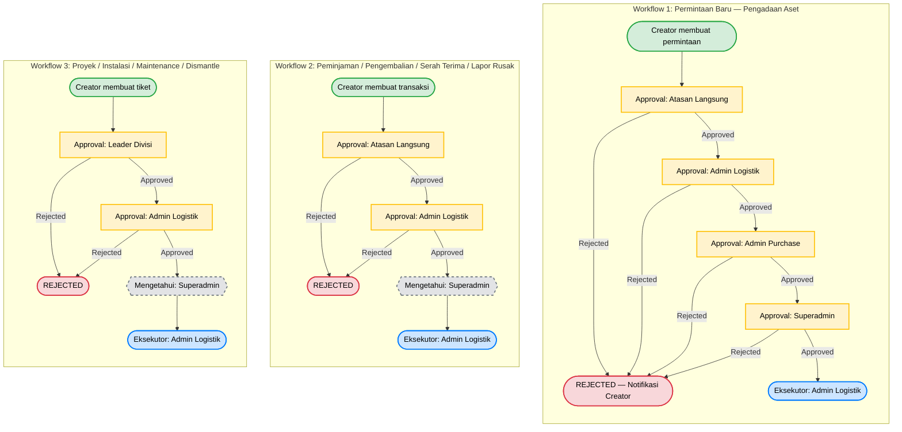

Product Requirements Document (PRD): Aplikasi Inventori Aset

- **Versi**: 3.1 (Rebuild Baseline)
- **Tanggal**: 10 April 2026
- **Pemilik Dokumen**: Angga Samuludi Septiawan
- **Referensi Utama**: PRD v2.0 (09 April 2026) — Seluruh keputusan bisnis dalam dokumen ini merujuk pada PRD v2.0 sebagai source of truth.
- **Status**: FINAL — Dokumen ini adalah standar baku tak terpisahkan untuk seluruh siklus rebuild. Setiap perubahan harus melalui proses Change Request formal.

> **⚠️ PERHATIAN**: Dokumen ini bersifat **independen** dari implementasi kode yang ada di folder `frontend/` dan `backend/` saat ini. Struktur dan spesifikasi di sini adalah **target arsitektur** untuk rebuild total — bukan deskripsi dari kode existing yang sudah tidak valid.

---

# 1. Pendahuluan

Dokumen ini adalah **Golden Record** yang merinci kebutuhan bisnis, tujuan, fitur, aturan bisnis, dan timeline untuk pengembangan ulang (rebuild) Aplikasi Inventori Aset di PT. Trinity Media Indonesia.

**Konteks Rebuild**: Proyek ini awalnya dikerjakan oleh 1 Full-Stack Developer sejak Oktober 2025 dengan target serah terima Januari 2026. Keterlambatan feedback klien selama ~1 bulan (akhir Desember 2025 – akhir Januari 2026) menyebabkan pengembangan backend terburu-buru, menghasilkan kode yang tidak terstruktur, penuh bug, dan memiliki celah keamanan fatal. Keputusan strategis diambil untuk melakukan **rebuild total** menggunakan stack modern (TypeScript, ReactJS, NestJS, Prisma ORM) yang dimulai April 2026.

Dokumen ini menjadi satu-satunya acuan (Single Source of Truth) bagi developer, klien, dan seluruh pemangku kepentingan. Dokumen teknis turunan (SDD, UI Design, Testing Plan) **wajib merujuk** pada PRD ini.

---

# 2. Latar Belakang & Masalah

## 2.1 Kondisi Saat Ini

PT. Trinity Media Indonesia mengelola aset perusahaan (device, tools, material jaringan) menggunakan metode manual (spreadsheet, formulir kertas) yang mengakibatkan:

1. **Data Tersebar & Tidak Konsisten**: Pencatatan aset dilakukan di banyak file terpisah tanpa satu sumber kebenaran.
2. **Tidak Ada Pelacakan Siklus Hidup**: Riwayat perpindahan aset (siapa memegang, kapan dipinjam, kapan dikembalikan) tidak tercatat.
3. **Audit Sulit & Memakan Waktu**: Stock opname manual membutuhkan rata-rata 3 hari kerja dan rawan human error.
4. **Approval Lambat**: Permintaan aset melalui chat/kertas tanpa alur persetujuan yang jelas, menyebabkan bottleneck.
5. **Kehilangan Aset Tidak Terdeteksi**: Tanpa sistem tracking, aset yang hilang baru diketahui saat stock opname berikutnya.

## 2.2 Masalah dari Versi Sebelumnya (v1)

Kode versi pertama (Oktober 2025 – Februari 2026) memiliki kelemahan fundamental:

- Arsitektur monolitik tanpa separation of concerns.
- Tidak ada validasi input yang konsisten — rentan SQL Injection & XSS.
- Tidak ada mekanisme refresh token — sesi dapat dibajak.
- Tidak ada audit trail — tidak ada akuntabilitas perubahan data.
- Kode duplikasi tinggi (melanggar prinsip DRY) — sulit di-maintain.

---

# 3. Visi & Tujuan Proyek

## 3.1 Visi

Menciptakan sistem manajemen inventori aset yang terpusat, modern, aman, dan efisien untuk memberikan visibilitas penuh dan kontrol atas seluruh siklus hidup aset di PT. Trinity Media Indonesia.

## 3.2 Tujuan (SMART)

| #   | Tujuan                                                                                                                                                                                       | Indikator Keberhasilan                              | Target Waktu                    |
| --- | -------------------------------------------------------------------------------------------------------------------------------------------------------------------------------------------- | --------------------------------------------------- | ------------------------------- |
| T1  | **Sentralisasi Data** — Mengumpulkan semua data aset dalam satu database terstruktur                                                                                                         | 100% data aset tercatat di sistem                   | Akhir Minggu ke-2 pasca Go-Live |
| T2  | **Otomatisasi Alur Kerja** — Mendigitalkan seluruh proses: pencatatan, stok, permintaan, peminjaman, pengembalian, serah terima, lapor rusak, manajemen proyek, pelanggan, dan kategori aset | 100% proses operasional dijalankan melalui aplikasi | Bulan ke-1 pasca Go-Live        |
| T3  | **Peningkatan Akuntabilitas** — Melacak riwayat setiap aset dengan audit trail (siapa, kapan, apa yang berubah)                                                                              | 100% transaksi memiliki audit trail lengkap         | Sejak Go-Live                   |
| T4  | **Efisiensi Operasional** — Mempercepat proses audit dan pelaporan                                                                                                                           | Waktu stock opname berkurang dari 3 hari ke <1 hari | Bulan ke-2 pasca Go-Live        |
| T5  | **Pengurangan Risiko** — Meminimalkan kehilangan aset dengan tracking dan notifikasi                                                                                                         | Penurunan aset hilang ≥90% dalam 6 bulan            | Bulan ke-6 pasca Go-Live        |
| T6  | **Keamanan Sistem** — Membangun sistem yang aman dari OWASP Top 10                                                                                                                           | 0 kerentanan kritis pada audit keamanan             | Sebelum Go-Live                 |

---

# 4. Lingkup Proyek

## 4.1 In-Scope (MVP)

| Domain                  | Fitur                                                                                                                                             |
| ----------------------- | ------------------------------------------------------------------------------------------------------------------------------------------------- |
| **Dashboard**           | Dashboard per role (Superadmin, Admin Purchase, Admin Logistik, Leader, Staff)                                                                    |
| **Manajemen Aset**      | Pencatatan aset, stok aset (gudang utama, divisi, pribadi), kategori/tipe/model aset                                                              |
| **Data Pembelian**      | CRUD data pembelian per model aset                                                                                                                |
| **Depresiasi Aset**     | Perhitungan dan pencatatan nilai penyusutan aset berdasarkan metode depresiasi (straight-line, declining balance) per data pembelian              |
| **Transaksi**           | Permintaan baru, peminjaman, pengembalian, serah terima, lapor aset rusak, proyek infrastruktur                                                   |
| **Manajemen Pelanggan** | Daftar pelanggan, instalasi, maintenance, dismantle                                                                                               |
| **Pengaturan**          | Kelola akun, manajemen pengguna & divisi                                                                                                          |
| **Cross-Cutting**       | RBAC, audit trail, notifikasi (in-app + WhatsApp), QR/barcode, import/export (Excel, PDF), file attachment, multi-theme (dark/light), data backup |

## 4.2 Out-of-Scope

- Fitur tiket (helpdesk/support ticketing expansion).
- Manajemen keuangan mendalam (akuntansi, laporan keuangan).
- Integrasi email.
- Aset di luar kategori device/tools/material (kendaraan, properti).
- Multi-tenancy (aplikasi hanya untuk 1 organisasi).

## 4.3 Future Enhancements (Post-MVP)

Fitur yang akan dikembangkan setelah MVP stabil dan diadopsi:

- **Stock Opname Digital**: Proses stock opname dengan scan QR/barcode massal.
- **Analitik Prediktif**: Prediksi kebutuhan pengadaan berdasarkan tren pemakaian.
- **Delegasi Approval**: Fitur delegasi persetujuan saat approver cuti/tidak tersedia.
- **Eskalasi Otomatis**: Notifikasi eskalasi jika tiket pending melebihi SLA.

---

# 5. Daftar Fitur & Kebutuhan

## 5.1 Fitur Fungsional (Grouped by Domain)

### A. Dashboard (F-01)

Menyediakan tampilan ringkasan statistik, grafik tren, aktivitas terbaru, dan notifikasi penting. Setiap role mendapatkan dashboard yang disesuaikan:

| Sub-Fitur                  | URL                     | Role           |
| -------------------------- | ----------------------- | -------------- |
| Dashboard Utama            | `/dashboard`            | Superadmin     |
| Dashboard Keuangan Aset    | `/dashboard/finance`    | Admin Purchase |
| Dashboard Operasional Aset | `/dashboard/operations` | Admin Logistik |
| Dashboard Divisi           | `/dashboard/division`   | Leader         |
| Dashboard Pribadi          | `/dashboard/personal`   | Staff          |

### B. Manajemen Aset (F-02)

| Sub-Fitur           | Deskripsi                                                                                                                 | Role Akses                                                             |
| ------------------- | ------------------------------------------------------------------------------------------------------------------------- | ---------------------------------------------------------------------- |
| **Pencatatan Aset** | CRUD aset dengan detail lengkap (nama, kategori, tipe, model, serial number, status)                                      | Superadmin, Admin Logistik                                             |
| **Stok Aset**       | Monitoring stok gudang utama, gudang divisi, dan stok pribadi. Pengaturan ambang batas (threshold) stok minimum per model | Superadmin, Admin Logistik, Leader (view divisi), Staff (view pribadi) |
| **Kategori Aset**   | CRUD hirarki kategori → tipe → model                                                                                      | Superadmin, Admin Logistik                                             |

### C. Data Pembelian & Depresiasi (F-03)

| Sub-Fitur           | Deskripsi                                                                                                                                            | Role Akses                 |
| ------------------- | ---------------------------------------------------------------------------------------------------------------------------------------------------- | -------------------------- |
| **Data Pembelian**  | CRUD data pembelian yang terkait dengan model aset, termasuk supplier, harga, tanggal, dan jumlah                                                    | Superadmin, Admin Purchase |
| **Depresiasi Aset** | Perhitungan dan pencatatan nilai penyusutan aset berdasarkan metode depresiasi (straight-line, declining balance) yang terkait dengan data pembelian | Superadmin, Admin Purchase |

### D. Modul Transaksi (F-04)

Seluruh modul transaksi mengikuti pola yang sama (DRY):

1. **Buat Transaksi** → Mengisi form → Validasi DTO → Simpan dengan status `PENDING`.
2. **Approval Workflow** → Sistem menentukan chain approval berdasarkan role creator (lihat 6.3).
3. **Eksekusi** → Setelah semua approval selesai, eksekutor akhir menjalankan aksi → Update stok & status aset.
4. **Notifikasi** → Setiap perubahan status memicu notifikasi ke stakeholder terkait.

| Modul                    | URL          | Deskripsi                                                                      |
| ------------------------ | ------------ | ------------------------------------------------------------------------------ |
| **Permintaan Baru**      | `/requests`  | Permintaan pengadaan aset baru. Memerlukan validasi stok dan approval berlapis |
| **Peminjaman**           | `/loans`     | Permintaan meminjam aset yang tersedia di gudang                               |
| **Pengembalian**         | `/returns`   | Pengembalian aset yang sedang dipinjam                                         |
| **Serah Terima**         | `/handovers` | Proses serah terima aset antar pengguna                                        |
| **Lapor Aset Rusak**     | `/repairs`   | Pelaporan dan tracking aset yang rusak hingga diperbaiki atau di-dispose       |
| **Proyek Infrastruktur** | `/projects`  | Manajemen proyek dengan alokasi aset                                           |

### E. Manajemen Pelanggan (F-05)

| Sub-Fitur            | URL             | Deskripsi                                             |
| -------------------- | --------------- | ----------------------------------------------------- |
| **Daftar Pelanggan** | `/customers`    | CRUD data pelanggan                                   |
| **Instalasi**        | `/installation` | Pencatatan dan tracking instalasi di lokasi pelanggan |
| **Maintenance**      | `/maintenance`  | Pencatatan dan tracking maintenance berkala           |
| **Dismantle**        | `/dismantle`    | Pencatatan pembongkaran perangkat di lokasi pelanggan |

**Role Akses**: Semua role pada divisi yang relevan (ditentukan oleh konfigurasi divisi).

### F. Pengaturan (F-06)

| Sub-Fitur         | URL                         | Deskripsi                                           | Role Akses |
| ----------------- | --------------------------- | --------------------------------------------------- | ---------- |
| **Kelola Akun**   | `/settings/profile`         | Ubah nama, ganti password, lihat aset yang dipegang | Semua Role |
| **Akun & Divisi** | `/settings/users-divisions` | CRUD pengguna (assign role), CRUD divisi            | Superadmin |

### G. Cross-Cutting Features (F-07)

| Fitur                 | Deskripsi                                                                                      |
| --------------------- | ---------------------------------------------------------------------------------------------- |
| **RBAC**              | Kontrol akses berbasis peran: Superadmin, Admin Logistik, Admin Purchase, Leader, Staff        |
| **Audit Trail**       | Pencatatan otomatis setiap perubahan data (siapa, kapan, data sebelum/sesudah)                 |
| **Notifikasi**        | In-app notification + WhatsApp integration untuk event penting (approval, rejection, reminder) |
| **QR Code & Barcode** | Generate dan scan QR/barcode untuk identifikasi aset cepat                                     |
| **Import & Export**   | Import data dari Excel; Export ke Excel, PDF                                                   |
| **File Attachment**   | Upload gambar (JPG/PNG) dan dokumen (PDF) per aset/transaksi                                   |
| **Multi Theme**       | Dukungan tema terang dan gelap                                                                 |
| **Data Backup**       | Mekanisme backup database berkala (otomatis via cron job)                                      |

## 5.2 Kebutuhan Non-Fungsional (NFR)

| ID     | Kategori            | Requirement                                                 | Target                                                 |
| ------ | ------------------- | ----------------------------------------------------------- | ------------------------------------------------------ |
| NFR-01 | **Performance**     | Waktu respons API rata-rata                                 | < 500ms (p95 < 2 detik)                                |
| NFR-02 | **Performance**     | Throughput minimum                                          | ≥ 100 transaksi/detik pada peak load                   |
| NFR-03 | **Security**        | Kepatuhan terhadap OWASP Top 10                             | 0 kerentanan kritis & tinggi                           |
| NFR-04 | **Security**        | Enkripsi data sensitif (password, token)                    | bcrypt (cost factor ≥ 12), HTTPS/TLS 1.3               |
| NFR-05 | **Availability**    | Uptime sistem                                               | ≥ 99.5% (realistis untuk single-server deployment)     |
| NFR-06 | **Usability**       | Kepuasan pengguna berdasarkan survei                        | ≥ 85%                                                  |
| NFR-07 | **Scalability**     | Mendukung pertumbuhan pengguna dan data                     | Horizontal scaling via Docker containers               |
| NFR-08 | **Maintainability** | Kode mengikuti standar Clean Code + DRY                     | Code review checklist terpenuhi 100%                   |
| NFR-09 | **Compatibility**   | Browser support                                             | Chrome, Firefox, Safari, Edge (2 versi terakhir)       |
| NFR-10 | **Responsiveness**  | Responsive design                                           | Mobile-first, breakpoint: 360px, 768px, 1024px, 1440px |
| NFR-11 | **Backup**          | Frekuensi backup database                                   | Harian (daily automated backup)                        |
| NFR-12 | **Error Handling**  | Pesan error yang informatif tanpa membocorkan detail teknis | 100% error response sesuai format standar              |

---

# 6. Alur Pengguna & Aturan Bisnis

## 6.1 User Flow (Generic — DRY)

Seluruh fitur CRUD di aplikasi mengikuti pola alur yang sama. Perbedaan hanya terletak pada **role yang berhak**, **field form**, dan **side effect** pasca-aksi.

### Pola Umum: CRUD Master Data

> Berlaku untuk: Manajemen Kategori, Data Pembelian, Daftar Aset, Daftar Pelanggan, Manajemen Akun, Manajemen Divisi.

1. **Inisiasi**: Pengguna dengan role yang berhak mengakses halaman terkait.
2. **Aksi**: Klik tombol "Tambah Baru" atau pilih data untuk diedit/dilihat.
3. **Input**: Mengisi form sesuai field yang ditentukan oleh DTO.
4. **Validasi**: Frontend (Zod schema) + Backend (class-validator DTO) memvalidasi input.
5. **Output**: Sistem menyimpan data, menampilkan toast konfirmasi sukses/gagal, dan memperbarui tabel data.

### Pola Umum: Modul Transaksi (dengan Approval)

> Berlaku untuk: Permintaan Baru, Peminjaman, Pengembalian, Serah Terima, Lapor Rusak, Proyek Infrastruktur, Instalasi, Maintenance, Dismantle.

1. **Inisiasi**: Pengguna (semua role) mengakses halaman transaksi terkait.
2. **Buat Transaksi**: Mengisi form → Validasi → Status awal: `PENDING`.
3. **Validasi Stok** _(jika berlaku)_: Sistem memeriksa ketersediaan stok. Jika tidak cukup, transaksi tetap dibuat tetapi ditandai memerlukan pengadaan.
4. **Approval Chain**: Sistem menentukan daftar approver berdasarkan role creator (lihat 6.3). Setiap approver mendapat notifikasi.
5. **Approval/Reject**: Approver mengambil keputusan. Jika reject, proses berhenti dan creator mendapat notifikasi beserta alasan penolakan.
6. **Eksekusi**: Setelah semua approval selesai, eksekutor akhir menjalankan aksi → Update stok, status aset, dan pencatatan audit trail.
7. **Notifikasi**: Setiap perubahan status memicu notifikasi ke pihak terkait.

### Pola Khusus: Stok Aset

1. **Inisiasi**: Admin Logistik, Superadmin, atau Leader mengakses halaman stok.
2. **View**: Melihat stok berdasarkan perspektif (gudang utama / divisi / pribadi).
3. **Atur Threshold**: Admin Logistik / Superadmin mengatur ambang batas minimum per model aset.
4. **Notifikasi Otomatis**: Sistem mengirim peringatan jika stok suatu model berada di bawah threshold.

### Pola Khusus: Lapor Aset Hilang

1. **Inisiasi**: Pengguna yang memegang aset melaporkan kehilangan melalui form "Lapor Aset Rusak" dengan kategori `LOST`.
2. **Validasi**: Sistem memverifikasi bahwa pelapor adalah PIC (Person In Charge) terakhir dari aset tersebut.
3. **Perubahan Status**: Status aset langsung berubah menjadi `LOST`. Aset tidak dapat dipinjam, ditransfer, atau digunakan.
4. **Notifikasi Eskalasi**: Superadmin dan Admin Logistik mendapat notifikasi instan.
5. **Investigasi**: Admin Logistik / Superadmin melakukan investigasi.
6. **Resolusi**:
   - **Ditemukan**: Status dikembalikan ke status semula oleh Admin Logistik / Superadmin.
   - **Tidak Ditemukan**: Status diubah menjadi `DISPOSED` dan dicatat sebagai kerugian.
7. **Audit Trail**: Seluruh proses tercatat lengkap dengan ID pelapor, ID investigator, timestamp, dan catatan.

## 6.2 Business Rules

| ID    | Rule                          | Deskripsi                                                                                                                                                                                                            |
| ----- | ----------------------------- | -------------------------------------------------------------------------------------------------------------------------------------------------------------------------------------------------------------------- |
| BR-01 | **Kekekalan Data Aset**       | Aset yang memiliki riwayat transaksi (pernah dipinjam/digunakan) tidak dapat dihapus permanen (hard delete). Sistem menggunakan **Soft Delete** — status diubah menjadi `DISPOSED` atau `ARCHIVED`                   |
| BR-02 | **Kewenangan Stok**           | Hanya Superadmin dan Admin Logistik yang boleh melakukan penambahan stok manual (stock opname). Divisi lain menerima stok hanya melalui alur Serah Terima                                                            |
| BR-03 | **Kewenangan Data Pembelian** | Hanya Superadmin dan Admin Purchase yang boleh membuat dan mengelola data pembelian. Role lain tidak memiliki akses ke modul ini                                                                                     |
| BR-04 | **Integritas Transaksi**      | Setiap perubahan state transaksi wajib mencatat: ID pengguna, timestamp, status sebelumnya, status baru, dan catatan (jika ada) ke dalam Audit Trail                                                                 |
| BR-05 | **Validasi Stok**             | Sistem memvalidasi ketersediaan stok sebelum mengeksekusi permintaan peminjaman atau serah terima. Jika stok tidak cukup, transaksi masuk antrian pengadaan                                                          |
| BR-06 | **Aset Hilang**               | Aset yang dilaporkan hilang berubah status menjadi `LOST`. Aset tidak dapat digunakan/dipinjam hingga status diubah oleh Superadmin atau Admin Logistik setelah investigasi. Lihat User Flow 6.1 "Lapor Aset Hilang" |
| BR-07 | **Satu Aset Satu PIC**        | Setiap aset yang berstatus `IN_USE` atau `LOANED` harus memiliki tepat 1 PIC (Person In Charge) yang bertanggung jawab. Transfer PIC hanya melalui modul Serah Terima                                                |
| BR-08 | **Uniqueness**                | Setiap aset memiliki kode unik (format: `AS-YYYY-MMDD-XXXX`), setiap transaksi memiliki kode unik per modul (format: `[PREFIX]-YYYY-MMDD-XXXX`)                                                                      |
| BR-09 | **Cascade Protection**        | Kategori, tipe, atau model yang masih digunakan oleh aset aktif tidak boleh dihapus. Sistem memberikan error yang jelas                                                                                              |

## 6.3 Approval Workflow

### 6.3.1 Prinsip Dasar

Approval workflow menggunakan **dynamic chain** yang ditentukan berdasarkan:

- **Role** pembuat (creator) transaksi.
- **Modul** transaksi (Permintaan Baru memerlukan approval lebih panjang karena implikasi anggaran).

**Aturan Umum**:

- Creator tidak pernah menjadi approver untuk transaksinya sendiri.
- Setiap tahap approval menghasilkan status: `APPROVED` atau `REJECTED`.
- Jika satu tahap di-reject, seluruh proses berhenti dan creator dinotifikasi.
- Kolom "Mengetahui" bersifat informasional (CC) — tidak memblokir proses.

### 6.3.2 Matriks Approval

#### Workflow 1: Permintaan Baru (Pengadaan Aset)

| Pembuat (Creator) | Approval 1     | Approval 2     | Approval 3     | Approval 4 | Eksekutor Akhir             |
| ----------------- | -------------- | -------------- | -------------- | ---------- | --------------------------- |
| Staff             | Leader Divisi  | Admin Logistik | Admin Purchase | Superadmin | Admin Logistik              |
| Leader Divisi     | Admin Logistik | Admin Purchase | Superadmin     | —          | Admin Logistik              |
| Admin Logistik    | Admin Purchase | Superadmin     | —              | —          | Superadmin / Admin Logistik |
| Admin Purchase    | Admin Logistik | Superadmin     | —              | —          | Superadmin / Admin Logistik |
| Superadmin        | Admin Logistik | Admin Purchase | —              | —          | Admin Logistik              |

#### Workflow 2: Peminjaman, Pengembalian, Serah Terima, Lapor Rusak

| Pembuat (Creator) | Approval 1     | Approval 2     | Mengetahui (CC) | Eksekutor Akhir             |
| ----------------- | -------------- | -------------- | --------------- | --------------------------- |
| Staff             | Leader Divisi  | Admin Logistik | Superadmin      | Admin Logistik              |
| Leader Divisi     | Admin Logistik | —              | Superadmin      | Admin Logistik              |
| Admin Logistik    | Superadmin     | —              | —               | Superadmin / Admin Logistik |
| Admin Purchase    | Admin Logistik | —              | Superadmin      | Superadmin / Admin Logistik |
| Superadmin        | Admin Logistik | —              | —               | Admin Logistik              |

#### Workflow 3: Proyek Infrastruktur, Instalasi, Maintenance, Dismantle

| Pembuat (Creator) | Approval 1     | Approval 2     | Mengetahui (CC) | Eksekutor Akhir |
| ----------------- | -------------- | -------------- | --------------- | --------------- |
| Staff             | Leader Divisi  | Admin Logistik | Superadmin      | Admin Logistik  |
| Leader Divisi     | Admin Logistik | —              | Superadmin      | Admin Logistik  |

### 6.3.3 Diagram Alur Persetujuan



---

# 7. Role & Hak Akses (RBAC)

## 7.1 Definisi Role

| Role               | Deskripsi                                                         | Jumlah User (Estimasi) |
| ------------------ | ----------------------------------------------------------------- | ---------------------- |
| **Superadmin**     | Akses penuh ke seluruh sistem. Pemilik tertinggi keputusan        | 1-2                    |
| **Admin Logistik** | Mengelola aset fisik, stok, serah terima, dan eksekusi transaksi  | 2-3                    |
| **Admin Purchase** | Mengelola data pembelian, depresiasi, dan validasi anggaran       | 1-2                    |
| **Leader**         | Memimpin divisi, menyetujui permintaan tim, memonitor stok divisi | 3-5                    |
| **Staff**          | Pengguna akhir. Membuat permintaan, melihat aset pribadi          | 20-50                  |

## 7.2 Matriks Akses per Modul

| Modul                   | Superadmin | Admin Logistik | Admin Purchase |   Leader   |    Staff    |
| ----------------------- | :--------: | :------------: | :------------: | :--------: | :---------: |
| Dashboard Utama         |     ✅     |       —        |       —        |     —      |      —      |
| Dashboard Keuangan      |     —      |       —        |       ✅       |     —      |      —      |
| Dashboard Operasional   |     —      |       ✅       |       —        |     —      |      —      |
| Dashboard Divisi        |     —      |       —        |       —        |     ✅     |      —      |
| Dashboard Pribadi       |     —      |       —        |       —        |     —      |     ✅      |
| Pencatatan Aset (CRUD)  |     ✅     |       ✅       |       —        |     —      |      —      |
| Stok Aset (View All)    |     ✅     |       ✅       |   ✅(gudang)   | ✅(divisi) | ✅(pribadi) |
| Stok Threshold Setting  |     ✅     |       ✅       |       —        |     —      |      —      |
| Kategori/Tipe/Model     |     ✅     |       ✅       |       —        |     —      |      —      |
| Data Pembelian          |     ✅     |       —        |       ✅       |     —      |      —      |
| Depresiasi Aset         |     ✅     |       —        |       ✅       |     —      |      —      |
| Semua Modul Transaksi   |     ✅     |       ✅       |       ✅       |     ✅     |     ✅      |
| Manajemen Pelanggan     |     ✅     |       ✅       |       —        | ✅(divisi) | ✅(divisi)  |
| Kelola Akun Pribadi     |     ✅     |       ✅       |       ✅       |     ✅     |     ✅      |
| Manajemen User & Divisi |     ✅     |       —        |       —        |     —      |      —      |

---

# 8. Fase Rilis & Timeline

## 8.1 Timeline Rebuild (Revisi April 2026)

Timeline ini menggantikan timeline lama dan disesuaikan dengan realitas rebuild yang dimulai April 2026. Dikerjakan oleh 1 Full-Stack Developer.

```
April 2026
├── Minggu 1 (07-13 Apr): Sprint 0 — Fondasi
│   ├── Setup project structure (monorepo, Docker, CI/CD)
│   ├── Prisma schema & migrations (core tables)
│   ├── Auth module (login, JWT, refresh token, RBAC guards)
│   └── Base components (layout, form wrappers, table)
│
├── Minggu 2 (14-20 Apr): Sprint 1 — Master Data
│   ├── Manajemen Kategori/Tipe/Model (CRUD + UI)
│   ├── Pencatatan Aset (CRUD + UI)
│   ├── Stok Aset (view + threshold)
│   └── Data Pembelian (CRUD + UI)
│
├── Minggu 3 (21-27 Apr): Sprint 2 — Transaksi Core
│   ├── Engine Approval Workflow (dynamic chain)
│   ├── Permintaan Baru (full flow + approval)
│   ├── Peminjaman & Pengembalian (full flow)
│   ├── Serah Terima (full flow)
│   └── Lapor Aset Rusak + Aset Hilang flow
│
└── Minggu 4 (28 Apr - 04 Mei): Sprint 3 — Pelanggan & Polish
    ├── Manajemen Pelanggan (CRUD)
    ├── Instalasi, Maintenance, Dismantle
    ├── Proyek Infrastruktur
    ├── Dashboard (semua role)
    ├── Notifikasi (in-app + WhatsApp)
    ├── Import/Export, QR/Barcode
    └── Pengaturan (akun, user, divisi)

Mei 2026
├── Minggu 1 (05-11 Mei): Sprint 4 — Stabilisasi
│   ├── Bug fixing & edge case handling
│   ├── Performance optimization
│   ├── Security audit (OWASP checklist)
│   └── Cross-browser & responsive testing
│
├── Minggu 2 (12-18 Mei): UAT (User Acceptance Testing)
│   ├── Deploy ke staging server
│   ├── User training & onboarding
│   ├── Pengumpulan feedback & iterasi minor
│   └── Sign-off dari klien
│
└── Minggu 3 (19 Mei): 🚀 GO-LIVE
    ├── Deploy ke production
    ├── Data migration (jika ada data lama)
    └── Monitoring intensif 48 jam pertama

Mei - Juli 2026: Garansi & Maintenance (3 bulan)
├── Bug fixing (SLA: critical < 4 jam, major < 24 jam, minor < 72 jam)
├── Minor enhancements berdasarkan feedback
└── Knowledge transfer ke tim internal
```

## 8.2 Resource Allocation

| Resource             | Jumlah  | Peran                                          |
| -------------------- | ------- | ---------------------------------------------- |
| Full-Stack Developer | 1 orang | Pengembangan, testing, deployment, dokumentasi |

## 8.3 Definisi "Done" per Sprint

Sebuah sprint dianggap selesai jika:

1. Semua fitur dalam sprint sudah di-implement dan bisa didemonstrasikan.
2. Unit test untuk service layer sudah ditulis (minimum coverage: 60%).
3. Tidak ada error lint atau TypeScript error.
4. API endpoint terdokumentasi di Swagger.
5. Kode sudah di-review (self-review checklist).

---

# 9. Manajemen Risiko

## 9.1 Risk Register

| ID   | Risiko                                                                                                                | Probabilitas | Dampak | Skor | Mitigasi                                                                                                                                                                                                                                                                                                                                                                                            |
| ---- | --------------------------------------------------------------------------------------------------------------------- | :----------: | :----: | :--: | --------------------------------------------------------------------------------------------------------------------------------------------------------------------------------------------------------------------------------------------------------------------------------------------------------------------------------------------------------------------------------------------------- |
| R-01 | **Rebuild Delay** — Developer sakit, burnout, atau menemukan kompleksitas teknis tak terduga sehingga timeline mundur |    Tinggi    | Tinggi |  🔴  | **Mitigasi**: (1) Buffer 1 minggu sudah dimasukkan di Sprint 4 (stabilisasi). (2) Jika delay >1 minggu, lakukan scope cut: tunda Proyek Infrastruktur dan Manajemen Pelanggan ke Phase 2. (3) Komunikasi proaktif ke klien setiap Jumat (weekly report) agar ekspektasi terkelola. (4) Core MVP (Auth + Aset + Transaksi) diprioritaskan — sistem bisa digunakan meskipun fitur pelanggan belum ada |
| R-02 | **Keterlambatan Feedback Klien (Terulang)** — Klien lambat memberikan UAT feedback sehingga Go-Live mundur            |    Sedang    | Tinggi |  🟠  | **Mitigasi**: (1) Jadwal UAT dikomunikasikan dan di-commit sejak awal sprint. (2) Sediakan form feedback terstruktur (bukan chat). (3) Batasan: Jika feedback tidak diterima dalam 5 hari kerja, persetujuan dianggap diberikan (silent approval clause dalam kontrak)                                                                                                                              |
| R-03 | **Keamanan — Kerentanan Baru** — Celah keamanan ditemukan pasca Go-Live                                               |    Sedang    | Tinggi |  🟠  | **Mitigasi**: (1) OWASP Top 10 checklist di-audit sebelum Go-Live. (2) Dependency scan otomatis via GitHub Dependabot. (3) Rate limiting, input validation, dan refresh token reuse detection sudah built-in                                                                                                                                                                                        |
| R-04 | **Adopsi Pengguna Rendah** — Pengguna tetap menggunakan cara manual                                                   |    Sedang    | Sedang |  🟡  | **Mitigasi**: (1) Training & onboarding session selama UAT. (2) UX dirancang sederhana dan intuitif. (3) Quick-start guide per role. (4) Leader wajib menggunakan sistem (top-down adoption)                                                                                                                                                                                                        |
| R-05 | **Keterbatasan Resource** — 1 developer menangani seluruh stack                                                       |    Tinggi    | Sedang |  🟠  | **Mitigasi**: (1) Arsitektur DRY dan modular meminimalkan kode duplikasi. (2) Menggunakan library teruji (Shadcn UI, Prisma, NestJS) untuk percepatan. (3) Scope MVP sudah dikurangi ke fitur esensial. (4) Otomasi (CI/CD, testing) mengurangi beban manual                                                                                                                                        |
| R-06 | **Performa Buruk pada Data Besar** — Aplikasi lambat saat data aset/transaksi membesar                                |    Rendah    | Sedang |  🟡  | **Mitigasi**: (1) Database indexing yang tepat sejak awal. (2) Pagination di semua list endpoint. (3) Audit log menggunakan table partitioning bulanan. (4) Connection pooling (PgBouncer ready)                                                                                                                                                                                                    |
| R-07 | **Integrasi WhatsApp Gagal** — API WhatsApp berubah atau tidak stabil                                                 |    Sedang    | Rendah |  🟡  | **Mitigasi**: (1) WhatsApp integration diimplementasikan sebagai modul terpisah (loosely coupled). (2) Jika gagal, notifikasi in-app tetap berjalan sebagai fallback. (3) Abstraksi notification service agar provider bisa diganti                                                                                                                                                                 |
| R-08 | **Data Migration Error** — Data dari sistem lama (spreadsheet) rusak/tidak konsisten saat diimport                    |    Sedang    | Sedang |  🟡  | **Mitigasi**: (1) Script import dengan validasi ketat dan dry-run mode. (2) Backup data lama sebelum migrasi. (3) Periode parallel run (sistem lama + baru) selama 2 minggu pertama pasca Go-Live                                                                                                                                                                                                   |

## 9.2 Strategi Manajemen Ekspektasi Klien

Mengingat sejarah keterlambatan pada proyek ini, komunikasi proaktif menjadi kritis:

1. **Weekly Report (setiap Jumat)**: Email/WhatsApp singkat berisi:
   - Fitur yang diselesaikan minggu ini (dengan screenshot/video demo).
   - Fitur yang direncanakan minggu depan.
   - Blocker (jika ada) yang memerlukan keputusan klien.

2. **Demo Session (setiap akhir Sprint)**: Video call 30 menit untuk demo fitur yang sudah jadi di staging server.

3. **Scope Change Protocol**: Setiap permintaan fitur baru di luar PRD ini harus melalui:
   - Pengajuan Change Request tertulis.
   - Analisis dampak terhadap timeline.
   - Persetujuan tertulis dari kedua pihak sebelum dikerjakan.

---

# 10. Metrik Keberhasilan

## 10.1 Key Performance Indicators (KPIs)

| Kategori          | KPI                                                                              | Target           | Waktu Pengukuran         |
| ----------------- | -------------------------------------------------------------------------------- | ---------------- | ------------------------ |
| **Adopsi**        | % pengguna aktif (login ≥ 3x/minggu untuk Leader/Admin, ≥ 2x/minggu untuk Staff) | ≥ 80%            | Bulan ke-1 pasca Go-Live |
| **Adopsi**        | % transaksi via aplikasi vs manual                                               | ≥ 90%            | Bulan ke-3 pasca Go-Live |
| **Akurasi**       | Akurasi pencatatan stok (sistem vs fisik)                                        | ≥ 98%            | Bulan ke-2 pasca Go-Live |
| **Akuntabilitas** | % transaksi dengan audit trail lengkap                                           | 100%             | Sejak Go-Live            |
| **Efisiensi**     | Waktu stock opname                                                               | < 1 hari kerja   | Bulan ke-2 pasca Go-Live |
| **Keamanan**      | Jumlah insiden keamanan                                                          | 0 insiden kritis | Selama masa garansi      |
| **Kepuasan**      | Skor kepuasan pengguna (survei)                                                  | ≥ 85%            | Bulan ke-3 pasca Go-Live |
| **Risiko**        | Pengurangan aset hilang tidak terdeteksi                                         | ≥ 90%            | Bulan ke-6 pasca Go-Live |
| **Paperless**     | Pengurangan penggunaan kertas untuk pencatatan                                   | ≥ 95%            | Bulan ke-3 pasca Go-Live |
| **Performa**      | Waktu respons API (p95)                                                          | < 2 detik        | Sejak Go-Live            |

## 10.2 Acceptance Criteria untuk Go-Live

Sistem dianggap layak Go-Live jika:

1. ✅ Seluruh fitur MVP (4.1) berfungsi dan lolos UAT.
2. ✅ 0 bug berstatus **Critical** atau **High** yang belum terselesaikan.
3. ✅ Audit keamanan OWASP Top 10 lulus tanpa kerentanan kritis.
4. ✅ Backup & recovery mechanism teruji dan terdokumentasi.
5. ✅ User training sudah dilaksanakan untuk semua role.
6. ✅ Dokumentasi API (Swagger) lengkap dan terupdate.
7. ✅ Sign-off tertulis dari klien (PIC PT. Trinity Media Indonesia).

---

# 11. Lampiran

## 11.1 Glosarium

| Istilah           | Definisi                                                                                                        |
| ----------------- | --------------------------------------------------------------------------------------------------------------- |
| **MVP**           | Minimum Viable Product — versi produk dengan fitur inti yang cukup untuk digunakan dan diuji oleh pengguna awal |
| **RBAC**          | Role-Based Access Control — pembatasan akses sistem berdasarkan peran pengguna                                  |
| **UUID**          | Universally Unique Identifier — format identifikasi data unik (128-bit)                                         |
| **Disposal**      | Pemusnahan atau penghapusan aset secara fisik dari perputaran perusahaan                                        |
| **Archived**      | Status aset tidak aktif yang disimpan dalam database untuk keperluan historis                                   |
| **Stock Opname**  | Proses pemeriksaan fisik dan pencocokan stok aset antara catatan sistem dan kondisi aktual                      |
| **Audit Trail**   | Catatan kronologis setiap perubahan data: siapa, kapan, apa yang berubah (before/after)                         |
| **Soft Delete**   | Teknik penghapusan data dimana record ditandai `isDeleted = true` tanpa dihapus dari database                   |
| **PIC**           | Person In Charge — individu yang bertanggung jawab atas suatu aset pada waktu tertentu                          |
| **UAT**           | User Acceptance Testing — pengujian oleh pengguna akhir sebelum peluncuran                                      |
| **Go-Live**       | Tanggal resmi sistem diluncurkan ke production untuk digunakan semua pengguna                                   |
| **Threshold**     | Pengaturan ambang batas                                                                                         |
| **SLA**           | Service Level Agreement — perjanjian tingkat layanan (waktu respon perbaikan bug)                               |
| **Golden Record** | Dokumen standar baku final yang menjadi satu-satunya acuan pengembangan                                         |

## 11.2 Referensi

- [OWASP Top 10 — Web Application Security Risks](https://owasp.org/www-project-top-ten/)
- [Role-Based Access Control (RBAC) Cheat Sheet](https://cheatsheetseries.owasp.org/cheatsheets/Authorization_Cheat_Sheet.html)
- [NestJS Official Documentation](https://docs.nestjs.com/)
- [Prisma ORM Documentation](https://www.prisma.io/docs/)
- [Shadcn UI Component Library](https://ui.shadcn.com/)

## 11.3 Dokumen Terkait

| Dokumen                          | Deskripsi                                                           | Status                    |
| -------------------------------- | ------------------------------------------------------------------- | ------------------------- |
| **System Design Document (SDD)** | Arsitektur folder, skema ORM, API contract, diagram, dan deployment | Revisi paralel dengan PRD |
| **UI Design Document**           | Wireframe dan desain antarmuka per modul                            | Dalam pengerjaan          |
| **Testing Plan**                 | Strategi pengujian (unit, integration, E2E)                         | Terdefinisi di SDD 9      |
| **Training Materials**           | Panduan penggunaan per role                                         | Dibuat saat Sprint 4      |

## 11.4 Kontak Tim Proyek

| Nama                     | Peran                                | Kontak               |
| ------------------------ | ------------------------------------ | -------------------- |
| Angga Samuludi Septiawan | Full-Stack Developer & Project Owner | a.samaludi@gmail.com |

## 11.5 Riwayat Revisi

| Versi | Tanggal       | Perubahan                                                                                                                                                                                                                                 |
| ----- | ------------- | ----------------------------------------------------------------------------------------------------------------------------------------------------------------------------------------------------------------------------------------- |
| 1.0   | Oktober 2025  | Draf awal PRD                                                                                                                                                                                                                             |
| 2.0   | 09 April 2026 | Restrukturisasi untuk rebuild, penambahan workflow dan NFR                                                                                                                                                                                |
| 3.0   | 10 April 2026 | **Golden Record** — Timeline rebuild April 2026, threshold(Pengaturan ambang batas), alur aset hilang, risk register lengkap dengan mitigasi rebuild delay, konsolidasi DRY seluruh user flow, matriks RBAC, acceptance criteria Go-Live  |
| 3.1   | 10 April 2026 | **Rebuild Baseline** — Dokumen di-refresh berdasarkan referensi PRD v2.0 sebagai source of truth bisnis. Depresiasi Aset dikembalikan ke In-Scope (MVP). Ditambahkan deklarasi independensi dari kode existing yang akan di-rebuild total |
