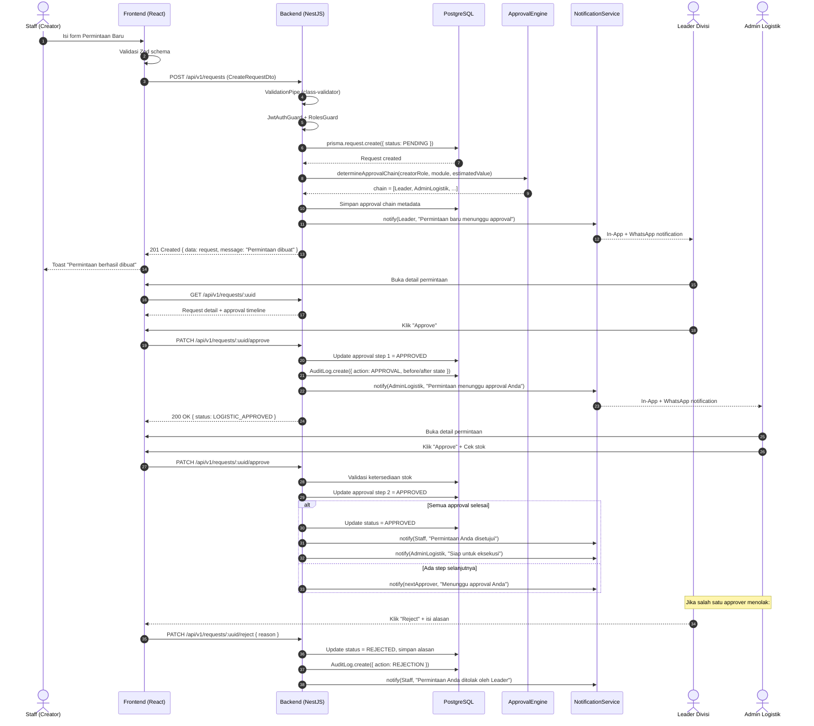
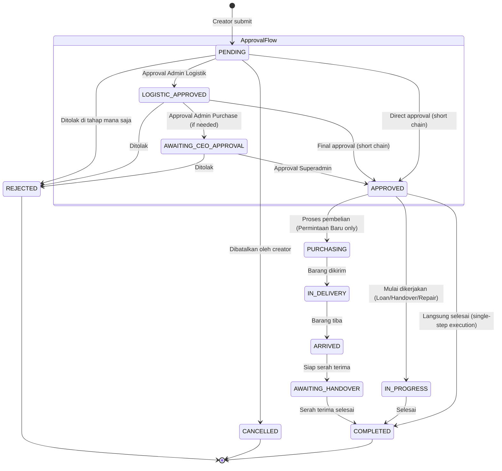
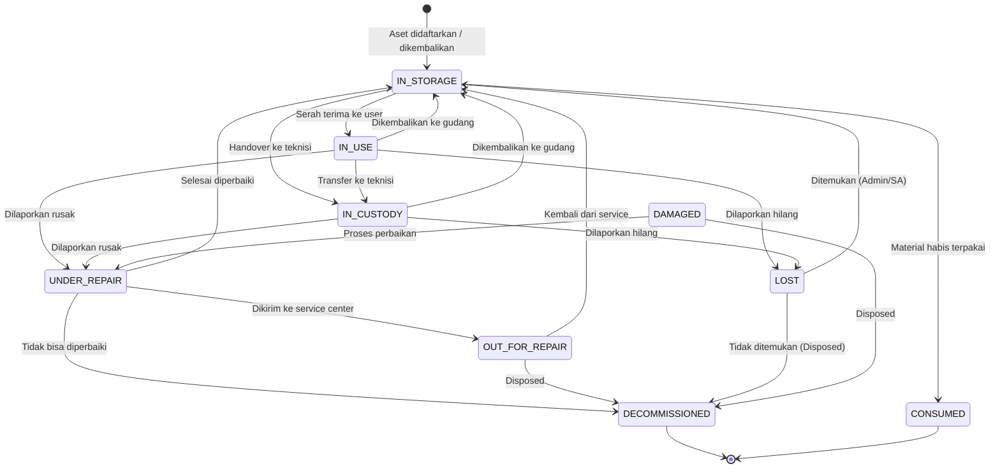
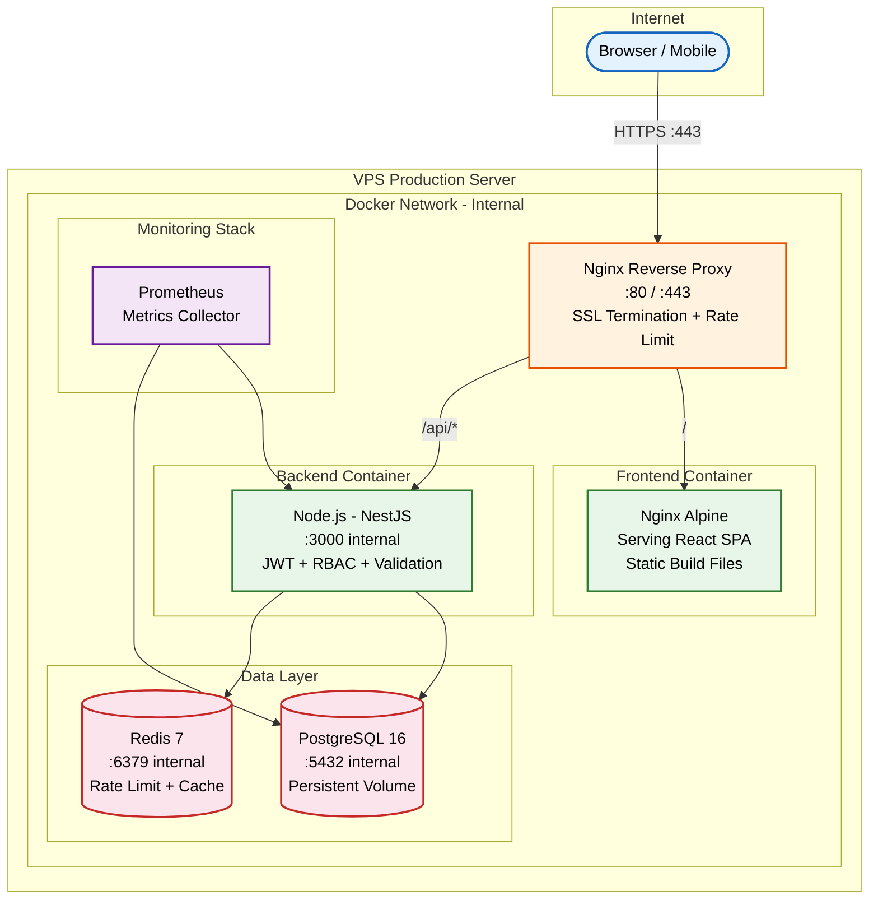
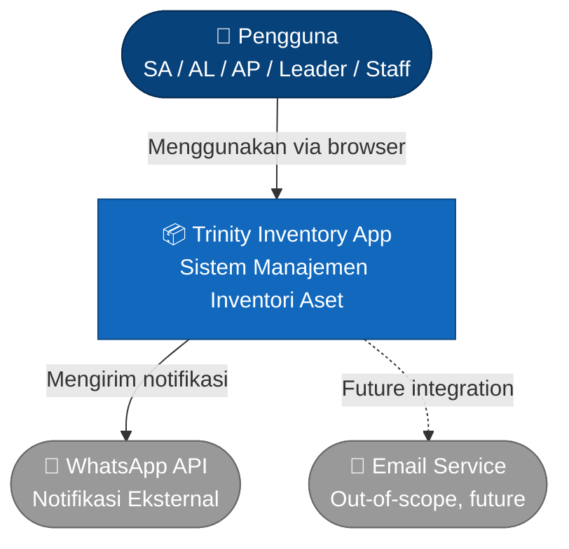
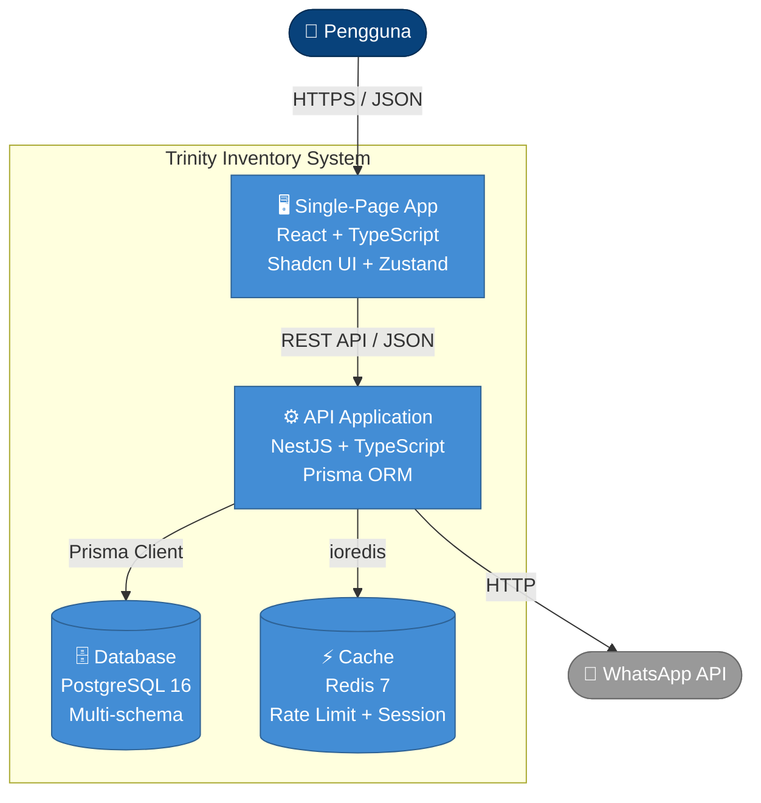
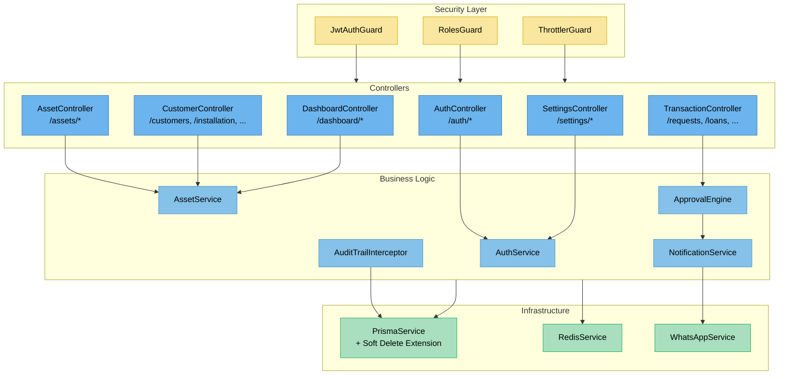
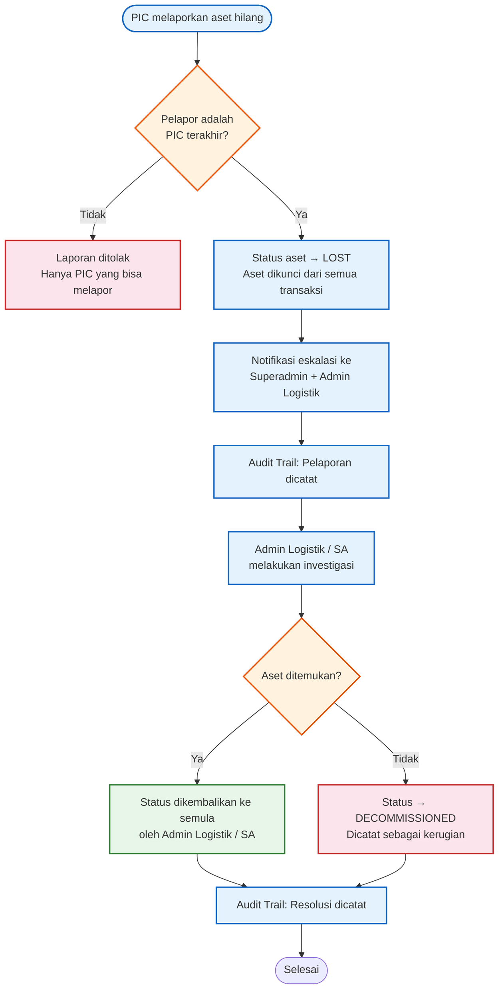
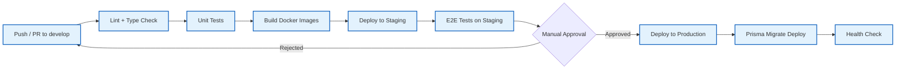

System Design Document (SDD): Aplikasi Inventori Aset

- **Versi**: 3.1 (Rebuild Baseline)
- **Tanggal**: 10 April 2026
- **Pemilik Dokumen**: Angga Samuludi Septiawan
- **Referensi Utama**: PRD v3.1 (10 April 2026) & SDD v2.0 (09 April 2026) — Seluruh keputusan arsitektur merujuk pada PRD sebagai source of truth bisnis, dan SDD v2.0 sebagai baseline arsitektur.
- **Status**: FINAL — Setiap perubahan arsitektur harus melalui Change Request formal.

---

# 1. Struktur Folder

## 1.1 Frontend

```text
frontend/src/
├── components/                # Komponen global yang di-share (DRY)
│   ├── ui/                    # Komponen bawaan Shadcn UI (button, dialog, table, dll)
│   ├── form/                  # Komponen wrapper form (Input, Select) custom dgn React Hook Form
│   ├── layout/                # Sidebar, Header, PageContainer, Footer
│   └── guard/                 # RoleProtectedRoute, AuthGuard (Keamanan Role-Based)
├── config/                    # Konfigurasi global (ENV, Constants, Menu Navigation)
├── hooks/                     # Custom hooks global (useDebounce, useWindowSize, useToast)
├── lib/                       # Utilitas global
│   ├── utils.ts               # Utility functions (cn tailwind merge utk shadcn, formatter)
│   └── axios.ts               # Axios instance + interceptor (auth, refresh token, error handling)
├── routes/                    # Konfigurasi React Router DOM
│   ├── index.tsx              # Router utama (createBrowserRouter)
│   ├── protected.tsx          # Definisi rute yang dibungkus RoleProtectedRoute
│   └── public.tsx             # Rute publik (Login, Error 404/500, dll)
├── store/                     # Global State (Zustand)
│   ├── useAuthStore.ts        # Menyimpan sesi, user, token, dan role aktif
│   └── useUIStore.ts          # Menyimpan state sidebar, theme, dan global modal
├── types/                     # Global TypeScript interfaces (Pagination, API Response, Error Types)
├── validation/                # Zod schemas yang digunakan lintas domain
│
└── features/                  # DOMAIN-DRIVEN MODULES (→ PRD 5.1 A-G)
    │
    ├── auth/                  # MODUL AUTENTIKASI (LOGIN)
    │   ├── api/               # loginUser, logoutUser, refreshToken
    │   ├── components/        # LoginForm
    │   ├── pages/             # LoginPage
    │   ├── schemas/           # Zod: LoginFormSchema
    │   └── types/             # LoginDTO, TokenResponse, UserData
    │
    ├── dashboards/            # F-01: DASHBOARD (→ PRD 5.1 A)
    │   ├── api/               # Aggregation API calls
    │   ├── components/        # Widget chart, stat cards, recent activity
    │   ├── pages/             # MainDashboard, FinanceDashboard, OperationsDashboard,
    │   │                      # DivisionDashboard, PersonalDashboard
    │   └── types/             # Tipe data grafik dan metrik
    │
    ├── assets/                # F-02 + F-03: MANAJEMEN ASET, PEMBELIAN & DEPRESIASI (→ PRD 5.1 B-C)
    │   ├── api/               # CRUD asset, category, type, model, purchase, depreciation
    │   ├── components/        # AssetCard, DetailModal, AssetForm, StockView
    │   ├── schemas/           # Zod: CreateAssetSchema, CategorySchema, PurchaseSchema, DepreciationSchema
    │   ├── store/             # Zustand slice lokal untuk state filter kompleks
    │   ├── types/             # IAsset, ICategory, IType, IModel, IPurchase, IDepreciation
    │   └── pages/
    │       ├── list/          # /assets, /assets/new, /assets/:id
    │       ├── stock/         # /assets/stock?view=main|division|personal
    │       ├── categories/    # /assets/categories/*
    │       ├── types/         # /assets/types/*
    │       ├── models/        # /assets/models/*
    │       ├── purchases/     # /assets/purchases/*
    │       └── depreciation/  # /assets/depreciation/*
    │
    ├── transactions/          # F-04: TRANSAKSI (→ PRD 5.1 D)
    │   ├── api/               # API calls untuk semua modul transaksi
    │   ├── components/        # ApprovalTimeline, TransactionForm, StatusBadge
    │   ├── schemas/           # Zod: RequestSchema, LoanSchema, HandoverSchema, dll
    │   ├── types/             # State machine types (PENDING → APPROVED → COMPLETED)
    │   └── pages/
    │       ├── requests/      # /requests/*
    │       ├── loans/         # /loans/*
    │       ├── returns/       # /returns/*
    │       ├── handovers/     # /handovers/*
    │       ├── repairs/       # /repairs/*
    │       └── projects/      # /projects/*
    │
    ├── customers/             # F-05: MANAJEMEN PELANGGAN (→ PRD 5.1 E)
    │   ├── api/               # CRUD customer, installation, maintenance, dismantle
    │   ├── components/        # CustomerDetail, InstallationForm, MaintenanceTimeline
    │   ├── schemas/           # Zod: CustomerSchema, InstallationSchema, dll
    │   ├── types/             # ICustomer, IInstallation, IMaintenance, IDismantle
    │   └── pages/
    │       ├── clients/       # /customers/*
    │       ├── installation/  # /installation/*
    │       ├── maintenance/   # /maintenance/*
    │       └── dismantle/     # /dismantle/*
    │
    └── settings/              # F-06: PENGATURAN (→ PRD 5.1 F)
        ├── api/               # CRUD user, division, profile
        ├── components/        # UserForm, DivisionForm, ProfileCard
        ├── schemas/           # Zod: UpdateProfileSchema, CreateUserSchema
        ├── types/             # IUser, IDivision
        └── pages/
            ├── profile/       # /settings/profile
            ├── users/         # /settings/users/*
            └── divisions/     # /settings/divisions/*
```

## 1.2 Backend

```text
backend/
├── prisma/
│   ├── schema/                # Multi-file Prisma schema per domain bisnis
│   │   ├── schema.prisma      # Datasource, generator, enums global, model cross-cutting
│   │   ├── auth.prisma        # User, Division, UserRole
│   │   ├── asset.prisma       # AssetCategory, AssetType, AssetModel, Asset, AssetRegistration
│   │   ├── purchase.prisma    # PurchaseMasterData, Depreciation
│   │   ├── transaction.prisma # Request, RequestItem, LoanRequest, LoanItem, AssetReturn, Handover
│   │   ├── project.prisma     # InfraProject, Tasks, Materials, TeamMembers
│   │   └── customer.prisma    # Customer, Installation, Maintenance, Dismantle
│   ├── seed.ts                # Seeder awal (Superadmin, default divisions, kategori)
│   └── migrations/            # Auto-generated migration files
│
├── src/
│   ├── app.module.ts          # Root module
│   ├── main.ts                # Entry point (Swagger, Global Pipes, CORS, Helmet, Rate Limiting)
│   │
│   ├── common/                # Komponen Shareable (→ 8 Keamanan)
│   │   ├── decorators/        # @Roles(), @CurrentUser(), @Public()
│   │   ├── filters/           # PrismaExceptionFilter, HttpExceptionFilter
│   │   ├── guards/            # JwtAuthGuard, RolesGuard (→ PRD 7 RBAC)
│   │   ├── interceptors/      # ResponseTransformInterceptor, AuditTrailInterceptor
│   │   ├── interfaces/        # Global TypeScript interfaces
│   │   ├── dto/               # PaginationQueryDto, DateRangeDto
│   │   └── pipes/             # ValidationPipe configuration
│   │
│   ├── core/                  # Modul Infrastruktur Inti
│   │   ├── config/            # ConfigModule (validasi ENV dengan Zod)
│   │   ├── database/          # PrismaModule & PrismaService (Soft Delete Extension)
│   │   ├── auth/              # MODUL AUTENTIKASI (→ 8.1)
│   │   │   ├── dto/           # LoginDto, RefreshTokenDto
│   │   │   ├── strategies/    # JwtStrategy, JwtRefreshStrategy, LocalStrategy
│   │   │   ├── auth.controller.ts
│   │   │   ├── auth.service.ts
│   │   │   └── auth.module.ts
│   │   └── notifications/     # NotificationService (in-app + WhatsApp abstraction)
│   │
│   └── modules/               # DOMAIN-DRIVEN MODULES (→ PRD 5.1)
│       ├── dashboards/        # F-01: Aggregation queries per role
│       ├── assets/            # F-02 + F-03: Aset, kategori, tipe, model, pembelian, depresiasi, stok
│       │   ├── categories/    # Sub-domain Kategori Asset
│       │   ├── types/         # Sub-domain Tipe Asset
│       │   ├── models/        # Sub-domain Model Asset
│       │   ├── purchases/     # Sub-domain Data Pembelian
│       │   ├── depreciation/  # Sub-domain Logika Depresiasi
│       │   ├── dto/           # Validasi Payload Asset (CreateAssetDto, dll)
│       │   ├── asset.controller.ts
│       │   └── asset.service.ts
│       ├── transactions/      # F-04: requests, loans, returns, handovers, repairs, projects
│       │   ├── requests/      # Permintaan Baru
│       │   ├── loans/         # Peminjaman
│       │   ├── returns/       # Pengembalian
│       │   ├── handovers/     # Serah Terima
│       │   ├── repairs/       # Lapor Rusak
│       │   ├── projects/      # Proyek Infrastruktur
│       │   └── approval/      # Approval Engine (dynamic chain → PRD 6.3)
│       ├── customers/         # F-05: clients, installations, maintenance, dismantles
│       │   ├── clients/       # Data Induk Pelanggan
│       │   ├── installations/ # Tiket Instalasi
│       │   ├── maintenance/   # Tiket Maintenance
│       │   └── dismantles/    # Tiket Dismantle
│       └── settings/          # F-06: users, divisions, audit
│           ├── users/         # Manajemen Akun & Hak Akses
│           ├── divisions/     # Manajemen Divisi
│           └── audit/         # Modul Audit Log / Activity Trail
│
├── test/
│   ├── unit/                  # Unit tests per service (→ 9.3)
│   ├── helpers/               # Test utilities, factories, mocks
│   ├── jest.setup.ts          # Global test setup
│   └── jest-e2e.json          # E2E test configuration
│
├── Dockerfile                 # Multi-stage build
├── docker-entrypoint.sh       # Migration + seeding pada startup
├── nest-cli.json
├── tsconfig.json
└── package.json
```

---

# 2. Fitur Utama & URL Mapping

> Referensi: PRD 5.1 (Fitur Fungsional) dan PRD 7.2 (Matriks Akses)

## 2.1 DASHBOARD (F-01)

| ID  | URL                     | Deskripsi                                             | Role           |
| --- | ----------------------- | ----------------------------------------------------- | -------------- |
| 1.1 | `/dashboard`            | Dashboard Utama — overview seluruh sistem             | Superadmin     |
| 1.2 | `/dashboard/finance`    | Dashboard Keuangan — ringkasan pembelian & depresiasi | Admin Purchase |
| 1.3 | `/dashboard/operations` | Dashboard Operasional — stok, transaksi aktif         | Admin Logistik |
| 1.4 | `/dashboard/division`   | Dashboard Divisi — aset & transaksi divisi            | Leader         |
| 1.5 | `/dashboard/personal`   | Dashboard Pribadi — aset yang dipegang, riwayat       | Staff          |

## 2.2 MANAJEMEN ASET (F-02 + F-03)

| ID    | URL                                           | Deskripsi                                                        | Role           |
| ----- | --------------------------------------------- | ---------------------------------------------------------------- | -------------- |
| 2.1   | `/assets`                                     | Daftar Aset                                                      | SA, AL, AP     |
| 2.1.1 | `/assets/new`                                 | Form Tambah Aset                                                 | SA, AL         |
| 2.1.2 | `/assets/:id`                                 | Detail Aset (halaman: SA, AL, AP — modal: semua role via linked) | SA, AL, AP     |
| 2.2   | `/assets/stock?view=main`                     | Stok Gudang Utama                                                | SA, AL, AP     |
| 2.2.1 | `/assets/stock?view=division`                 | Stok Gudang Divisi                                               | SA, AL, Leader |
| 2.2.2 | `/assets/stock?view=personal`                 | Stok Aset Pribadi                                                | Semua Role     |
| 2.3   | `/assets/categories`                          | Daftar Kategori Aset                                             | SA, AL         |
| 2.3.1 | `/assets/types`                               | Daftar Tipe Aset                                                 | SA, AL         |
| 2.3.2 | `/assets/models`                              | Daftar Model Aset                                                | SA, AL         |
| 2.4   | `/assets/purchases`                           | Data Pembelian                                                   | SA, AP         |
| 2.4.1 | `/assets/purchases/:uuid`                     | Detail Pembelian                                                 | SA, AP         |
| 2.4.2 | `/assets/purchases/new?modelId=:id`           | Form Pembelian                                                   | SA, AP         |
| 2.5   | `/assets/depreciation`                        | Data Depresiasi Aset                                             | SA, AP         |
| 2.5.1 | `/assets/depreciation/:uuid`                  | Detail Depresiasi                                                | SA, AP         |
| 2.5.2 | `/assets/depreciation/new?purchaseUuid=:uuid` | Form Depresiasi                                                  | SA, AP         |

> **Keterangan**: SA = Superadmin, AL = Admin Logistik, AP = Admin Purchase.

## 2.3 TRANSAKSI (F-04)

Setiap modul transaksi memiliki pola URL yang konsisten (DRY):

| Modul                | List URL     | Detail URL         | Form URL         | Prefix Kode |
| -------------------- | ------------ | ------------------ | ---------------- | ----------- |
| Permintaan Baru      | `/requests`  | `/requests/:uuid`  | `/requests/new`  | `RQ-`       |
| Peminjaman           | `/loans`     | `/loans/:uuid`     | `/loans/new`     | `LN-`       |
| Pengembalian         | `/returns`   | `/returns/:uuid`   | `/returns/new`   | `RT-`       |
| Serah Terima         | `/handovers` | `/handovers/:uuid` | `/handovers/new` | `HD-`       |
| Lapor Rusak          | `/repairs`   | `/repairs/:uuid`   | `/repairs/new`   | `RP-`       |
| Proyek Infrastruktur | `/projects`  | `/projects/:uuid`  | `/projects/new`  | `PRJ-`      |

**Role**: Semua role dapat mengakses semua modul transaksi. Aksi yang tersedia ditentukan oleh RBAC (PRD 7.2).

## 2.4 MANAJEMEN PELANGGAN (F-05)

| Modul       | List URL        | Detail URL          | Form URL            | Prefix Kode |
| ----------- | --------------- | ------------------- | ------------------- | ----------- |
| Pelanggan   | `/customers`    | `/customers/:uuid`  | `/customers/new`    | `TMI-`      |
| Instalasi   | `/installation` | `/installation/:id` | `/installation/new` | `INT-`      |
| Maintenance | `/maintenance`  | `/maintenance/:id`  | `/maintenance/new`  | `MT-`       |
| Dismantle   | `/dismantle`    | `/dismantle/:id`    | `/dismantle/new`    | `DSM-`      |

**Role**: Semua role pada divisi yang relevan (konfigurasi `Division.canDoFieldwork`).

## 2.5 PENGATURAN (F-06)

| ID      | URL                                       | Deskripsi               | Role       |
| ------- | ----------------------------------------- | ----------------------- | ---------- |
| 5.1     | `/settings/profile`                       | Kelola Akun Pribadi     | Semua Role |
| 5.2     | `/settings/users-divisions`               | Manajemen Akun & Divisi | Superadmin |
| 5.2.1   | `/settings/users-divisions?tab=summary`   | Tab Ringkasan           | Superadmin |
| 5.2.2   | `/settings/users-divisions?tab=users`     | Tab Daftar Akun         | Superadmin |
| 5.2.3   | `/settings/users-divisions?tab=divisions` | Tab Daftar Divisi       | Superadmin |
| 5.2.2.1 | `/settings/users/new`                     | Form Tambah Akun        | Superadmin |
| 5.2.2.2 | `/settings/users/:uuid`                   | Detail Akun             | Superadmin |
| 5.2.3.1 | `/settings/divisions/new`                 | Form Tambah Divisi      | Superadmin |
| 5.2.3.2 | `/settings/divisions/:uuid`               | Detail Divisi           | Superadmin |

---

# 3. Diagram Arsitektur

## 3.1 ERD (Entity Relationship Diagram) — Core Asset & Transaction

> Diagram ini menampilkan entitas inti dan relasinya. Skema Prisma aktual akan dibangun ulang saat pengembangan dimulai, mengikuti konvensi di 4.1.

```mermaid
erDiagram
    %% ============ MASTER DATA ============
    Division ||--o{ User : "has members"
    Division }o--o{ AssetCategory : "associated"

    User ||--o{ Request : "creates"
    User ||--o{ LoanRequest : "creates"
    User ||--o{ Handover : "menyerahkan/penerima/mengetahui"
    User ||--o{ Asset : "recordedBy"
    User ||--o{ ActivityLog : "performs"
    User ||--o{ Notification : "receives"
    User ||--o{ StockThreshold : "creates"

    %% ============ ASSET HIERARCHY ============
    AssetCategory ||--o{ AssetType : "contains"
    AssetType ||--o{ AssetModel : "contains"
    AssetModel ||--o| PurchaseMasterData : "has purchase config"
    PurchaseMasterData ||--o| Depreciation : "has depreciation"
    AssetModel ||--o{ Asset : "instances"

    AssetCategory ||--o{ Asset : "classifies"
    AssetType ||--o{ Asset : "classifies"

    %% ============ ASSET CORE ============
    AssetRegistration ||--o{ Asset : "registers batch"
    Asset ||--o{ Attachment : "has files"
    Asset ||--o{ ActivityLog : "tracked by"
    Asset ||--o{ StockMovement : "movements"
    Asset ||--o{ HandoverItem : "transferred via"
    Asset ||--o{ LoanAssetAssignment : "assigned to loan"
    Asset ||--o{ AssetReturnItem : "returned via"

    %% ============ TRANSACTIONS ============
    Request ||--o{ RequestItem : "contains"
    Request ||--o{ ActivityLog : "tracked by"
    Request ||--o{ AssetRegistration : "triggers"

    LoanRequest ||--o{ LoanItem : "contains"
    LoanRequest ||--o{ LoanAssetAssignment : "assigns assets"
    LoanRequest ||--o{ AssetReturn : "returned via"

    AssetReturn ||--o{ AssetReturnItem : "contains"

    Handover ||--o{ HandoverItem : "contains"

    %% ============ INFRASTRUCTURE PROJECT ============
    InfraProject ||--o{ InfraProjectTask : "has tasks"
    InfraProject ||--o{ InfraProjectMaterial : "uses materials"
    InfraProject ||--o{ InfraProjectTeamMember : "has team"
    InfraProject ||--o{ Request : "linked requests"

    %% ============ CUSTOMER OPERATIONS ============
    Customer ||--o{ Installation : "has"
    Customer ||--o{ Maintenance : "has"
    Customer ||--o{ Dismantle : "has"
    Customer ||--o{ Attachment : "has files"

    Installation ||--o{ InstallationMaterial : "uses"
    Installation ||--o{ Attachment : "has files"
    Maintenance ||--o{ MaintenanceMaterial : "uses"
    Maintenance ||--o{ MaintenanceReplacement : "replaces"
    Maintenance ||--o{ Attachment : "has files"
    Dismantle ||--o{ Attachment : "has files"
```



## 3.2 Sequence Diagram — Alur Request/Approval (Permintaan Baru)

> Merujuk: PRD 6.1 "Pola Umum: Modul Transaksi" dan PRD 6.3 "Approval Workflow"



## 3.3 State Machine — Siklus Hidup Transaksi

> Merujuk: PRD 6.2 Business Rules (BR-04, BR-05)



### State Machine — Siklus Hidup Aset

> Merujuk: PRD 6.2 BR-01, BR-06, BR-07



## 3.4 Architecture Diagram (Infrastructure)

> Merujuk: SDD 7.1, PRD 5.2 NFR-05, NFR-07



## 3.5 C4 Model

### Level 1: System Context



### Level 2: Container Diagram



### Level 3: Component Diagram (Backend)



## 3.6 Flowchart — Alur Aset Hilang (Lost/Stolen)

> Merujuk: PRD 6.1 "Pola Khusus: Lapor Aset Hilang"



---

# 4. Desain Basis Data (Prisma ORM Schema)

> Referensi: PRD 6.2 Business Rules, PRD 4.1 In-Scope

## 4.1 Skema Relasi & Konvensi

### Database Schema Organization

Multi-file Prisma schema diorganisasi per domain bisnis:

| File                 | Domain                  | Entitas Utama                                                                                                                                        |
| -------------------- | ----------------------- | ---------------------------------------------------------------------------------------------------------------------------------------------------- |
| `schema.prisma`      | Core & Cross-Cutting    | Generator, datasource, enums (AssetStatus, AssetCondition, DepreciationMethod), StockThreshold, StockMovement, Attachment, ActivityLog, Notification |
| `auth.prisma`        | Auth & Settings         | User, Division, UserRole enum                                                                                                                        |
| `asset.prisma`       | Hirarki & Instance Aset | AssetCategory, AssetType, AssetModel, Asset, AssetRegistration                                                                                       |
| `purchase.prisma`    | Pembelian & Depresiasi  | PurchaseMasterData, Depreciation                                                                                                                     |
| `transaction.prisma` | Transaksi               | Request, RequestItem, LoanRequest, LoanItem, LoanAssetAssignment, AssetReturn, AssetReturnItem, Handover, HandoverItem                               |
| `project.prisma`     | Proyek                  | InfraProject, Tasks, Materials, TeamMembers                                                                                                          |
| `customer.prisma`    | Pelanggan               | Customer, Installation, Maintenance, Dismantle + materials                                                                                           |

### Konvensi Penamaan

| Konteks         | Konvensi                                              | Contoh                              |
| --------------- | ----------------------------------------------------- | ----------------------------------- |
| Model           | PascalCase (singular)                                 | `Asset`, `LoanRequest`              |
| Field           | camelCase                                             | `createdAt`, `assetModelId`         |
| Database table  | snake_case via `@@map()`                              | `loan_requests`, `asset_categories` |
| Database column | snake_case via `@map()`                               | `created_at`, `asset_model_id`      |
| Enum            | UPPER_SNAKE_CASE                                      | `IN_STORAGE`, `PENDING`             |
| Index           | Pada foreign keys, filter columns, dan search columns | `@@index([status, categoryId])`     |

### Aturan Integritas Data

| Rule                         | Implementasi                                                                     |
| ---------------------------- | -------------------------------------------------------------------------------- |
| **BR-01 Soft Delete**        | Prisma Client Extension intercept `delete` → `update({ isDeleted: true })` (4.3) |
| **BR-07 Satu Aset Satu PIC** | `Asset.currentUserId` + validasi di service layer                                |
| **BR-08 Uniqueness**         | `@unique` constraint + auto-generated code format di service                     |
| **BR-09 Cascade Protection** | `onDelete: Restrict` atau validasi sebelum delete di service layer               |
| **Optimistic Concurrency**   | Field `version Int @default(1)` pada model yang rawan race condition             |
| **Audit Trail**              | `createdById`, `updatedById`, `createdAt`, `updatedAt` pada semua model          |

## 4.2 Contoh Skema Prisma — Target Arsitektur

> **⚠️ PRESCRIPTIVE**: Kode di bawah adalah spesifikasi target untuk rebuild, bukan copy dari kode existing. Implementasi aktual akan disempurnakan saat pengembangan dimulai, mengikuti konvensi di 4.1.

```prisma
// === HIRARKI ASET (asset.prisma) ===
model AssetCategory {
  id        Int      @id @default(autoincrement())
  name      String   @unique @db.VarChar(255)
  createdAt DateTime @default(now()) @map("created_at")
  updatedAt DateTime @updatedAt @map("updated_at")

  types  AssetType[]
  assets Asset[]

  @@map("asset_categories")
}

model AssetType {
  id             Int    @id @default(autoincrement())
  categoryId     Int    @map("category_id")
  name           String @db.VarChar(255)

  category AssetCategory @relation(fields: [categoryId], references: [id], onDelete: Restrict)
  models   AssetModel[]
  assets   Asset[]

  @@unique([categoryId, name])
  @@index([name])
  @@map("asset_types")
}

model AssetModel {
  id     Int    @id @default(autoincrement())
  typeId Int    @map("type_id")
  name   String @db.VarChar(255)
  brand  String @db.VarChar(255)

  type               AssetType           @relation(fields: [typeId], references: [id], onDelete: Restrict)
  purchaseMasterData PurchaseMasterData?
  assets             Asset[]

  @@unique([typeId, name, brand])
  @@index([brand])
  @@index([name])
  @@map("asset_models")
}

// === INSTANCE ASET (asset.prisma) ===
model Asset {
  id           String         @id @default(cuid())
  name         String         @db.VarChar(255)
  categoryId   Int            @map("category_id")
  typeId       Int?           @map("type_id")
  modelId      Int?           @map("model_id")
  brand        String         @db.VarChar(255)
  serialNumber String?        @map("serial_number") @db.VarChar(255)

  // Purchase snapshot (denormalized for historical accuracy)
  purchasePrice   Decimal?  @map("purchase_price") @db.Decimal(15, 2)
  purchaseDate    DateTime? @map("purchase_date") @db.Date

  // Depreciation snapshot
  depreciationMethod DepreciationMethod? @map("depreciation_method")
  usefulLifeYears    Int?                @map("useful_life_years")
  salvageValue       Decimal?            @map("salvage_value") @db.Decimal(15, 2)

  // Status & Location (→ PRD 6.2 BR-07)
  status        AssetStatus
  condition     AssetCondition
  currentUserId Int?           @map("current_user_id")

  // Audit
  recordedById Int      @map("recorded_by_id")
  version      Int      @default(1)    // Optimistic concurrency
  createdAt    DateTime @default(now()) @map("created_at")
  updatedAt    DateTime @updatedAt @map("updated_at")

  // Relations
  category   AssetCategory @relation(fields: [categoryId], references: [id])
  type       AssetType?    @relation(fields: [typeId], references: [id])
  model      AssetModel?   @relation(fields: [modelId], references: [id])
  recordedBy User          @relation(fields: [recordedById], references: [id])

  @@index([status, categoryId])
  @@index([serialNumber])
  @@index([currentUserId])
  @@index([version])
  @@map("assets")
}

// === DEPRESIASI (purchase.prisma — → PRD F-03) ===
model Depreciation {
  id              String             @id @default(uuid())
  purchaseId      String             @unique @map("purchase_id")
  method          DepreciationMethod
  usefulLifeYears Int                @map("useful_life_years")
  salvageValue    Decimal            @map("salvage_value") @db.Decimal(15, 2)
  startDate       DateTime           @map("start_date") @db.Date
  createdById     Int                @map("created_by_id")
  createdAt       DateTime           @default(now()) @map("created_at")
  updatedAt       DateTime           @updatedAt @map("updated_at")

  purchase  PurchaseMasterData @relation(fields: [purchaseId], references: [id])
  createdBy User               @relation(fields: [createdById], references: [id])

  @@index([method])
  @@map("depreciations")
}

enum DepreciationMethod {
  STRAIGHT_LINE
  DECLINING_BALANCE
}
```

### Indexing Strategy

| Tipe Index           | Kapan Digunakan                    | Contoh                                      |
| -------------------- | ---------------------------------- | ------------------------------------------- |
| **Foreign Key**      | Selalu pada relasi                 | `@@index([categoryId])`                     |
| **Composite Filter** | Kolom yang sering difilter bersama | `@@index([status, categoryId])`             |
| **Search**           | Kolom yang di-search/autocomplete  | `@@index([name])`, `@@index([brand, name])` |
| **Unique**           | Business uniqueness constraint     | `@@unique([typeId, name, brand])`           |
| **Temporal**         | Kolom tanggal untuk range queries  | `@@index([createdAt])`, `@@index([date])`   |
| **Concurrency**      | Optimistic locking                 | `@@index([version])`                        |

## 4.3 Prisma Client Extension — Soft Delete

> Implementasi: PRD 6.2 BR-01 (Kekekalan Data Aset)

> **⚠️ PRESCRIPTIVE**: Kode di bawah adalah spesifikasi target untuk rebuild.

```typescript
// Target: core/database/prisma.extension.ts
import { Prisma } from '@prisma/client';

/**
 * Soft Delete Extension
 *
 * Model yang memiliki field `isDeleted` (Boolean) akan otomatis:
 * 1. delete() → update({ isDeleted: true, deletedAt: now() })
 * 2. findMany() → menambahkan filter { isDeleted: false } secara default
 * 3. findFirst/findUnique → menambahkan filter { isDeleted: false }
 *
 * Untuk query yang PERLU melihat data terhapus (audit, admin):
 * prisma.asset.findMany({ where: { isDeleted: true } }) // explicit override
 */
export const softDeleteExtension = Prisma.defineExtension({
  name: 'softDelete',
  query: {
    // Terapkan pada model yang memiliki riwayat transaksi
    asset: {
      async delete({ args, query }) {
        // Intercept delete → soft delete
        return prisma.asset.update({
          where: args.where,
          data: {
            status: 'DECOMMISSIONED',
            // Tambahkan field deletedAt jika sudah ada di schema
          },
        });
      },
      async findMany({ args, query }) {
        // Default: exclude soft-deleted records
        if (!args.where?.status) {
          args.where = {
            ...args.where,
            NOT: { status: 'DECOMMISSIONED' },
          };
        }
        return query(args);
      },
    },
  },
});

// Usage in PrismaService:
// this.prisma = new PrismaClient().$extends(softDeleteExtension);
```

---

# 5. API Endpoints (RESTful API Design)

> Referensi: PRD 5.1 (Fitur Fungsional), PRD 6.3 (Approval Workflow)

## 5.1 Standar Format Respons Global

Setiap API mengembalikan respons melalui `ResponseTransformInterceptor` di NestJS:

### Success Response

```json
// GET (200 OK) — List dengan pagination
{
  "statusCode": 200,
  "message": "Berhasil mengambil data aset",
  "data": [ ... ],
  "meta": { "page": 1, "limit": 10, "total": 150, "totalPages": 15 }
}

// GET (200 OK) — Single item
{
  "statusCode": 200,
  "message": "Berhasil mengambil detail aset",
  "data": { ... }
}

// POST (201 Created)
{
  "statusCode": 201,
  "message": "Berhasil membuat aset baru",
  "data": { ... }
}

// PATCH (200 OK)
{
  "statusCode": 200,
  "message": "Berhasil memperbarui data aset",
  "data": { ... }
}

// DELETE (200 OK) — Soft delete returns confirmation
{
  "statusCode": 200,
  "message": "Berhasil menghapus aset",
  "data": null
}
```

### Error Response

```json
// 400 Bad Request — Validation Error
{
  "statusCode": 400,
  "message": "Validasi gagal",
  "data": null,
  "error": {
    "code": "VALIDATION_ERROR",
    "details": [
      { "field": "name", "message": "Nama aset wajib diisi" },
      { "field": "categoryId", "message": "Kategori aset tidak valid" }
    ]
  }
}

// 401 Unauthorized
{ "statusCode": 401, "message": "Unauthorized", "data": null,
  "error": { "code": "UNAUTHORIZED", "details": "Token tidak valid atau sudah expired" } }

// 403 Forbidden (RBAC violation)
{ "statusCode": 403, "message": "Forbidden", "data": null,
  "error": { "code": "FORBIDDEN", "details": "Anda tidak memiliki izin untuk mengakses resource ini" } }

// 404 Not Found
{ "statusCode": 404, "message": "Not Found", "data": null,
  "error": { "code": "NOT_FOUND", "details": "Resource yang Anda cari tidak ditemukan" } }

// 409 Conflict (Optimistic Concurrency)
{ "statusCode": 409, "message": "Conflict", "data": null,
  "error": { "code": "CONFLICT", "details": "Data telah diubah oleh pengguna lain. Silakan refresh dan coba lagi." } }

// 422 Unprocessable Entity (Business Rule Violation)
{ "statusCode": 422, "message": "Unprocessable Entity", "data": null,
  "error": { "code": "BUSINESS_RULE_VIOLATION", "details": "Stok tidak mencukupi untuk permintaan ini" } }

// 429 Too Many Requests
{ "statusCode": 429, "message": "Too Many Requests", "data": null,
  "error": { "code": "TOO_MANY_REQUESTS", "details": "Terlalu banyak permintaan. Silakan coba lagi nanti." } }

// 500 Internal Server Error
{ "statusCode": 500, "message": "Internal Server Error", "data": null,
  "error": { "code": "INTERNAL_SERVER_ERROR", "details": "Terjadi kesalahan pada server." } }
```

## 5.2 Endpoint Catalog

### Authentication

| Method  | Endpoint                | Deskripsi                         | Auth | Role                                  |
| ------- | ----------------------- | --------------------------------- | :--: | ------------------------------------- |
| `POST`  | `/auth/login`           | Login user                        |  ❌  | Public                                |
| `POST`  | `/auth/refresh`         | Refresh access token              |  ❌  | Public (requires valid refresh token) |
| `POST`  | `/auth/logout`          | Logout (invalidate refresh token) |  ✅  | All                                   |
| `PATCH` | `/auth/change-password` | Ganti password                    |  ✅  | All                                   |

### Assets (F-02)

| Method   | Endpoint                     | Deskripsi                                    | Role                              |
| -------- | ---------------------------- | -------------------------------------------- | --------------------------------- |
| `GET`    | `/assets`                    | List aset + pagination + filter              | SA, AL, AP                        |
| `GET`    | `/assets/:id`                | Detail aset                                  | SA, AL, AP (halaman), All (modal) |
| `POST`   | `/assets`                    | Buat aset baru                               | SA, AL                            |
| `PATCH`  | `/assets/:id`                | Update aset                                  | SA, AL                            |
| `DELETE` | `/assets/:id`                | Soft delete aset                             | SA, AL                            |
| `GET`    | `/assets/stock`              | Stok aset (`?view=main\|division\|personal`) | Varies                            |
| `PATCH`  | `/assets/stock/threshold`    | Set threshold per model                      | SA, AL                            |
| `GET`    | `/assets/categories`         | List kategori                                | SA, AL                            |
| `POST`   | `/assets/categories`         | Buat kategori                                | SA, AL                            |
| `PATCH`  | `/assets/categories/:id`     | Update kategori                              | SA, AL                            |
| `DELETE` | `/assets/categories/:id`     | Hapus kategori (BR-09: cascade protection)   | SA, AL                            |
| `GET`    | `/assets/types`              | List tipe                                    | SA, AL                            |
| `POST`   | `/assets/types`              | Buat tipe                                    | SA, AL                            |
| `GET`    | `/assets/models`             | List model                                   | SA, AL                            |
| `POST`   | `/assets/models`             | Buat model                                   | SA, AL                            |
| `GET`    | `/assets/purchases`          | List data pembelian                          | SA, AP                            |
| `POST`   | `/assets/purchases`          | Buat data pembelian                          | SA, AP                            |
| `PATCH`  | `/assets/purchases/:uuid`    | Update data pembelian                        | SA, AP                            |
| `GET`    | `/assets/depreciation`       | List data depresiasi                         | SA, AP                            |
| `POST`   | `/assets/depreciation`       | Buat data depresiasi                         | SA, AP                            |
| `PATCH`  | `/assets/depreciation/:uuid` | Update data depresiasi                       | SA, AP                            |
| `GET`    | `/assets/depreciation/:uuid` | Detail depresiasi                            | SA, AP                            |

### Transactions (F-04) — Pola DRY

Setiap modul transaksi memiliki endpoint yang identik:

| Method  | Endpoint Pattern          | Deskripsi                                |
| ------- | ------------------------- | ---------------------------------------- |
| `GET`   | `/{module}`               | List + pagination + filter               |
| `GET`   | `/{module}/:uuid`         | Detail + approval timeline               |
| `POST`  | `/{module}`               | Buat transaksi baru (status: PENDING)    |
| `PATCH` | `/{module}/:uuid`         | Update data transaksi                    |
| `PATCH` | `/{module}/:uuid/approve` | Approve step saat ini                    |
| `PATCH` | `/{module}/:uuid/reject`  | Reject (body: `{ reason }`)              |
| `PATCH` | `/{module}/:uuid/execute` | Eksekusi final (oleh eksekutor)          |
| `PATCH` | `/{module}/:uuid/cancel`  | Cancel oleh creator (jika masih PENDING) |

> `{module}` = `requests`, `loans`, `returns`, `handovers`, `repairs`, `projects`

### Customers (F-05)

Pola endpoint yang sama dengan Transactions, ditambah:

| Method | Endpoint           | Deskripsi                                              |
| ------ | ------------------ | ------------------------------------------------------ |
| `GET`  | `/customers`       | List pelanggan                                         |
| `POST` | `/customers`       | Buat pelanggan                                         |
| `GET`  | `/customers/:uuid` | Detail pelanggan (termasuk tab instalasi/mt/dismantle) |
| `GET`  | `/installation`    | List instalasi                                         |
| `POST` | `/installation`    | Buat instalasi                                         |
| `GET`  | `/maintenance`     | List maintenance                                       |
| `POST` | `/maintenance`     | Buat maintenance                                       |
| `GET`  | `/dismantle`       | List dismantle                                         |
| `POST` | `/dismantle`       | Buat dismantle                                         |

### Settings (F-06)

| Method  | Endpoint                    | Deskripsi                                 | Role |
| ------- | --------------------------- | ----------------------------------------- | ---- |
| `GET`   | `/settings/profile`         | Get profil sendiri                        | All  |
| `PATCH` | `/settings/profile`         | Update profil sendiri                     | All  |
| `GET`   | `/settings/users`           | List users                                | SA   |
| `POST`  | `/settings/users`           | Buat user baru                            | SA   |
| `PATCH` | `/settings/users/:uuid`     | Update user (assign role, reset password) | SA   |
| `GET`   | `/settings/divisions`       | List divisi                               | SA   |
| `POST`  | `/settings/divisions`       | Buat divisi                               | SA   |
| `PATCH` | `/settings/divisions/:uuid` | Update divisi                             | SA   |

### Dashboard (F-01)

| Method | Endpoint                | Deskripsi             | Role   |
| ------ | ----------------------- | --------------------- | ------ |
| `GET`  | `/dashboard/main`       | Statistik utama       | SA     |
| `GET`  | `/dashboard/finance`    | Statistik keuangan    | AP     |
| `GET`  | `/dashboard/operations` | Statistik operasional | AL     |
| `GET`  | `/dashboard/division`   | Statistik divisi      | Leader |
| `GET`  | `/dashboard/personal`   | Statistik pribadi     | Staff  |

### Cross-Cutting

| Method  | Endpoint                  | Deskripsi                | Role   |
| ------- | ------------------------- | ------------------------ | ------ |
| `GET`   | `/notifications`          | List notifikasi user     | All    |
| `PATCH` | `/notifications/:id/read` | Tandai notifikasi dibaca | All    |
| `PATCH` | `/notifications/read-all` | Tandai semua dibaca      | All    |
| `POST`  | `/upload`                 | Upload file attachment   | All    |
| `GET`   | `/export/:module`         | Export data ke Excel/PDF | Varies |

---

# 6. Logika Bisnis & Mesin Status (Workflow State Machine)

> Referensi: PRD 6.3 (Approval Workflow), PRD 6.2 (Business Rules)

## 6.1 Algoritma Approval Workflow (Dynamic Chain)

### Konsep

Sistem menggunakan **tabel konfigurasi** yang menentukan approval chain berdasarkan:

1. **Module** transaksi (`REQUEST`, `LOAN`, `RETURN`, `HANDOVER`, `REPAIR`, `PROJECT`, dll.)
2. **Role creator** (Staff, Leader, Admin Logistik, Admin Purchase, Superadmin)

### Pseudocode — Approval Engine

```typescript
// Target: modules/transactions/approval/approval.engine.ts

interface ApprovalStep {
  sequence: number; // Urutan: 1, 2, 3, ...
  approverRole: UserRole; // Role yang harus approve
  type: 'APPROVAL' | 'CC'; // CC = Mengetahui (non-blocking)
}

function determineApprovalChain(module: TransactionModule, creatorRole: UserRole): ApprovalStep[] {
  // 1. Lookup dari konfigurasi (sesuai PRD 6.3.2)
  const baseChain = APPROVAL_MATRIX[module][creatorRole];

  // 2. Self-approval prevention: filter creator's own role
  return baseChain.filter((step) => step.approverRole !== creatorRole);
}

// Approval Matrix Configuration (→ PRD 6.3.3)
const APPROVAL_MATRIX = {
  REQUEST: {
    STAFF: [
      { seq: 1, role: 'LEADER' },
      { seq: 2, role: 'ADMIN_LOGISTIK' },
      { seq: 3, role: 'ADMIN_PURCHASE' },
      { seq: 4, role: 'SUPER_ADMIN' },
    ],
    LEADER: [
      { seq: 1, role: 'ADMIN_LOGISTIK' },
      { seq: 2, role: 'ADMIN_PURCHASE' },
      { seq: 3, role: 'SUPER_ADMIN' },
    ],
    ADMIN_LOGISTIK: [
      { seq: 1, role: 'ADMIN_PURCHASE' },
      { seq: 2, role: 'SUPER_ADMIN' },
    ],
    ADMIN_PURCHASE: [
      { seq: 1, role: 'ADMIN_LOGISTIK' },
      { seq: 2, role: 'SUPER_ADMIN' },
    ],
    SUPER_ADMIN: [
      { seq: 1, role: 'ADMIN_LOGISTIK' },
      { seq: 2, role: 'ADMIN_PURCHASE' },
    ],
  },
  // LOAN, RETURN, HANDOVER, REPAIR — shorter chain (PRD 6.3.3 Workflow 2)
  LOAN: {
    STAFF: [
      { seq: 1, role: 'LEADER', type: 'APPROVAL' },
      { seq: 2, role: 'ADMIN_LOGISTIK', type: 'APPROVAL' },
      { seq: 99, role: 'SUPER_ADMIN', type: 'CC' },
    ],
    LEADER: [
      { seq: 1, role: 'ADMIN_LOGISTIK', type: 'APPROVAL' },
      { seq: 99, role: 'SUPER_ADMIN', type: 'CC' },
    ],
    ADMIN_LOGISTIK: [{ seq: 1, role: 'SUPER_ADMIN', type: 'APPROVAL' }],
    ADMIN_PURCHASE: [
      { seq: 1, role: 'ADMIN_LOGISTIK', type: 'APPROVAL' },
      { seq: 99, role: 'SUPER_ADMIN', type: 'CC' },
    ],
    SUPER_ADMIN: [{ seq: 1, role: 'ADMIN_LOGISTIK', type: 'APPROVAL' }],
  },
  // RETURN, HANDOVER, REPAIR → same as LOAN
  // PROJECT, INSTALLATION, MAINTENANCE, DISMANTLE → PRD 6.3.3 Workflow 3
};
```

### Approval History (Audit Trail per Transaksi)

```typescript
// Setiap transisi state di-log ke ActivityLog:
await prisma.activityLog.create({
  data: {
    userId: approver.id,
    userName: approver.name,
    action: `APPROVAL_STEP_${stepNumber}`,
    details: JSON.stringify({
      previousStatus: 'PENDING',
      newStatus: 'LOGISTIC_APPROVED',
      reason: null, // atau rejection reason
      transactionModule: 'REQUEST',
      transactionId: request.id,
    }),
    requestId: request.id,
  },
});
```

## 6.2 Delegasi & SLA (Future Enhancement)

> Status: Post-MVP (PRD 4.3). Desain disiapkan di sini agar backward-compatible.

Ketika approval pending > X hari kerja (configurable):

1. Sistem mengirim reminder ke approver.
2. Jika masih pending setelah 2x reminder, eskalasi ke Superadmin.
3. Superadmin dapat melakukan override approval atau mendelegasikan.

---

# 7. Arsitektur Infrastruktur & Deployment

> Referensi: PRD 5.2 (NFR-05 Availability, NFR-07 Scalability)

## 7.1 Topologi & Containerization

```yaml
# docker-compose.yml (Production)
services:
  nginx: # Reverse proxy, SSL termination, rate limiting
    image: nginx:alpine
    ports: ['80:80', '443:443']
    depends_on: [frontend, backend]

  frontend: # React SPA served by Nginx Alpine
    build: ./frontend
    expose: ['80']

  backend: # NestJS Application
    build: ./backend
    expose: ['3000']
    depends_on: [postgres, redis]
    environment:
      DATABASE_URL: 'postgresql://...'
      REDIS_URL: 'redis://redis:6379'
      JWT_SECRET: '${JWT_SECRET}'
      JWT_REFRESH_SECRET: '${JWT_REFRESH_SECRET}'

  postgres: # PostgreSQL 16 — internal only
    image: postgres:16-alpine
    volumes: ['pg_data:/var/lib/postgresql/data']
    # Port 5432 NOT exposed to host

  redis: # Redis 7 — rate limiting, caching
    image: redis:7-alpine
    # Port 6379 NOT exposed to host
```

### Prinsip Keamanan Container

- Database dan Redis **tidak terekspos** ke jaringan publik — hanya accessible via Docker internal network.
- Backend hanya accessible melalui Nginx reverse proxy.
- Variabel sensitif (JWT secrets, DB credentials) disimpan di `.env` dan **tidak di-commit** ke repository.
- Docker images menggunakan non-root user.

## 7.2 CI/CD Pipeline (GitHub Actions)



### Pipeline Stages

| Stage                 | Aksi                                          | Trigger                |
| --------------------- | --------------------------------------------- | ---------------------- |
| **Lint & Type Check** | `pnpm lint`, `tsc --noEmit`                   | Setiap push/PR         |
| **Unit Tests**        | `pnpm test --coverage` (min 60%)              | Setiap push/PR         |
| **Build**             | Docker multi-stage build (frontend + backend) | Merge to `develop`     |
| **Deploy Staging**    | `docker-compose up -d` on staging server      | Merge to `develop`     |
| **E2E Tests**         | Cypress tests (login, transaksi inti)         | Post-staging deploy    |
| **Deploy Production** | Manual approval → `docker-compose up -d`      | Merge to `main`        |
| **DB Migration**      | `npx prisma migrate deploy` (non-destructive) | Post-production deploy |
| **Health Check**      | API `/health` endpoint check                  | Post-deploy            |

### Migrasi Database Nol Downtime

Perubahan skema yang bersifat destruktif (rename column, drop table) **wajib** menggunakan metode **expand-and-contract**:

1. **Expand**: Tambah kolom/tabel baru, migrasi data secara bertahap.
2. **Migrate**: Aplikasi menulis ke kolom lama DAN baru secara paralel.
3. **Contract**: Setelah semua data termigras, hapus kolom/tabel lama di migrasi berikutnya.

---

# 8. Keamanan, Kepatuhan, & Audit

> Referensi: PRD 5.2 NFR-03, NFR-04, PRD 3.2 T6

## 8.1 Keamanan Aplikasi (OSI Layer 7) — Prioritas Utama

### 8.1.1 Autentikasi & Sesi (JWT)

```
┌─────────────────────────────────────────────────────────────────┐
│                    JWT Token Architecture                        │
├─────────────────────────────────────────────────────────────────┤
│                                                                  │
│  Access Token (Short-lived)           Refresh Token (Long-lived) │
│  ├── Payload: userId, role, divisionId  ├── Stored: DB (hashed)  │
│  ├── Expiry: 15 menit                  ├── Expiry: 7 hari       │
│  ├── Storage: Memory (Zustand)          ├── Storage: httpOnly     │
│  └── Transport: Authorization header    │   Secure cookie        │
│                                         └── One-time use          │
│                                                                  │
│  ⚠️ Refresh Token Reuse Detection:                               │
│  Jika refresh token yang SUDAH DIGUNAKAN dicoba lagi,            │
│  sistem LANGSUNG:                                                │
│  1. Invalidate SEMUA token user (tokenVersion++)                 │
│  2. Force logout dari semua device                               │
│  3. Log sebagai security incident di ActivityLog                 │
│                                                                  │
└─────────────────────────────────────────────────────────────────┘
```

**Implementasi:**

```typescript
// Target: auth.service.ts — Refresh Token Reuse Detection
async refreshToken(oldRefreshToken: string): Promise<TokenPair> {
  const user = await this.prisma.user.findFirst({
    where: { refreshToken: await hash(oldRefreshToken) },
  });

  if (!user) {
    // REUSE DETECTED — token sudah dipakai sebelumnya
    // Asumsi: token dicuri oleh attacker
    const compromisedUser = await this.findUserByRefreshTokenHistory(oldRefreshToken);
    if (compromisedUser) {
      // Invalidate ALL tokens for this user
      await this.prisma.user.update({
        where: { id: compromisedUser.id },
        data: { tokenVersion: { increment: 1 }, refreshToken: null },
      });
      // Log security incident
      await this.logSecurityIncident(compromisedUser.id, 'REFRESH_TOKEN_REUSE');
    }
    throw new UnauthorizedException('Token reuse detected. All sessions invalidated.');
  }

  // Normal flow: issue new token pair
  const newTokens = this.generateTokenPair(user);

  // Rotate refresh token (invalidate old one)
  await this.prisma.user.update({
    where: { id: user.id },
    data: { refreshToken: await hash(newTokens.refreshToken) },
  });

  return newTokens;
}
```

### 8.1.2 Otorisasi (RBAC — Role-Based Access Control)

> Implementasi: PRD 7 (Role & Hak Akses)

```typescript
// Target: common/guards/roles.guard.ts
@Injectable()
export class RolesGuard implements CanActivate {
  canActivate(context: ExecutionContext): boolean {
    const requiredRoles = this.reflector.getAllAndOverride<UserRole[]>(
      ROLES_KEY, [context.getHandler(), context.getClass()]
    );
    if (!requiredRoles) return true;

    const { user } = context.switchToHttp().getRequest();
    return requiredRoles.includes(user.role);
  }
}

// Usage di controller:
@Roles(UserRole.SUPER_ADMIN, UserRole.ADMIN_LOGISTIK)
@Get('assets')
findAll() { ... }
```

### 8.1.3 Validasi Input (DTO + class-validator)

**Semua** endpoint yang menerima body/query params **wajib** memiliki DTO:

```typescript
// Target: modules/assets/dto/create-asset.dto.ts
export class CreateAssetDto {
  @IsString()
  @IsNotEmpty()
  @MaxLength(255)
  name: string;

  @IsInt()
  @IsPositive()
  categoryId: number;

  @IsOptional()
  @IsString()
  @MaxLength(255)
  @Matches(/^[a-zA-Z0-9\-]+$/, {
    message: 'Serial number hanya boleh alfanumerik dan dash',
  })
  serialNumber?: string;

  @IsEnum(AssetStatus)
  status: AssetStatus;

  @IsEnum(AssetCondition)
  condition: AssetCondition;

  // ... field lainnya
}
```

**Global Validation Pipe** (di `main.ts`):

```typescript
app.useGlobalPipes(
  new ValidationPipe({
    whitelist: true, // Strip field yang tidak ada di DTO
    forbidNonWhitelisted: true, // Error jika ada field tidak dikenal
    transform: true, // Auto-transform tipe data
    transformOptions: { enableImplicitConversion: true },
  }),
);
```

### 8.1.4 Rate Limiting

```typescript
// main.ts — Global rate limiting via @nestjs/throttler
app.useGlobalGuards(new ThrottlerGuard());

// Konfigurasi per-endpoint:
// Login: 5 attempts / 60 detik per IP
// API umum: 100 requests / 60 detik per user
// Upload: 10 requests / 60 detik per user

// Brute Force Protection (Login):
// 3 gagal → block 30 detik
// 4 gagal → block 1 menit
// 5 gagal → block 5 menit
// 7 gagal → akun terkunci (perlu Superadmin untuk unlock)
```

### 8.1.5 Proteksi Umum

| Ancaman                     | Mitigasi                                      | Implementasi                                    |
| --------------------------- | --------------------------------------------- | ----------------------------------------------- |
| **SQL Injection**           | Prisma parameterized queries                  | Otomatis oleh Prisma ORM                        |
| **XSS**                     | Content Security Policy + output sanitization | Helmet middleware + React auto-escaping         |
| **CSRF**                    | SameSite cookie + custom header check         | Cookie attribute + `X-Requested-With` header    |
| **CORS**                    | Whitelist origin yang diizinkan               | NestJS `@nestjs/common` CORS config             |
| **Sensitive Data Exposure** | Generic error messages                        | PrismaExceptionFilter mapping                   |
| **Insecure Headers**        | Security headers                              | Helmet middleware (X-Frame-Options, HSTS, etc.) |
| **File Upload Abuse**       | File type + size validation                   | Multer config + magic bytes check               |

### 8.1.6 Error Handling — Tidak Membocorkan Detail Teknis

```typescript
// Target: common/filters/prisma-exception.filter.ts
@Catch(Prisma.PrismaClientKnownRequestError)
export class PrismaExceptionFilter implements ExceptionFilter {
  catch(exception: Prisma.PrismaClientKnownRequestError, host: ArgumentHost) {
    switch (exception.code) {
      case 'P2002': // Unique constraint violation
        return {
          statusCode: 409,
          message: 'Data sudah ada',
          error: { code: 'DUPLICATE_ENTRY' },
        };
      case 'P2025': // Record not found
        return {
          statusCode: 404,
          message: 'Data tidak ditemukan',
          error: { code: 'NOT_FOUND' },
        };
      default:
        // JANGAN pernah expose Prisma error detail ke client
        Logger.error(`Prisma Error ${exception.code}`, exception.message);
        return {
          statusCode: 500,
          message: 'Terjadi kesalahan pada server',
          error: { code: 'INTERNAL_SERVER_ERROR' },
        };
    }
  }
}
```

## 8.2 Keamanan Infrastruktur (OSI Layer 3-4)

| Layer         | Proteksi      | Detail                                                                                                          |
| ------------- | ------------- | --------------------------------------------------------------------------------------------------------------- |
| **Network**   | Firewall      | Hanya port 80/443 terbuka ke publik. Port DB (5432), Redis (6379), Backend (3000) hanya internal Docker network |
| **Transport** | HTTPS/TLS 1.3 | SSL termination di Nginx. Certificate via Let's Encrypt (auto-renewal)                                          |
| **Container** | Isolation     | Setiap service berjalan di container terpisah. Non-root user                                                    |
| **Secrets**   | ENV isolation | `.env` file tidak di-commit. Pada production bisa di-manage via Docker secrets                                  |
| **Access**    | SSH key only  | Akses server production hanya via SSH key (password auth disabled)                                              |

## 8.3 Audit Trail & Soft Delete

### Audit Trail (→ PRD 6.2 BR-04)

```typescript
// Target: common/interceptors/audit-trail.interceptor.ts
@Injectable()
export class AuditTrailInterceptor implements NestInterceptor {
  intercept(context: ExecutionContext, next: CallHandler): Observable<any> {
    const request = context.switchToHttp().getRequest();
    const method = request.method;

    // Hanya log mutasi (POST, PATCH, PUT, DELETE)
    if (['POST', 'PATCH', 'PUT', 'DELETE'].includes(method)) {
      return next.handle().pipe(
        tap(async (response) => {
          await this.prisma.activityLog.create({
            data: {
              userId: request.user.id,
              userName: request.user.name,
              action: `${method} ${request.route.path}`,
              details: JSON.stringify({
                body: this.sanitize(request.body), // Strip sensitive fields
                params: request.params,
                responseId: response?.data?.id,
              }),
            },
          });
        }),
      );
    }
    return next.handle();
  }

  // Sanitize: hapus password, token, dll dari log
  private sanitize(body: any): any {
    const sensitiveFields = ['password', 'refreshToken', 'token'];
    return Object.fromEntries(
      Object.entries(body).filter(([key]) => !sensitiveFields.includes(key)),
    );
  }
}
```

### Optimasi Penyimpanan — Table Partitioning (ActivityLog)

```sql
-- PostgreSQL native table partitioning (bulanan)
-- Dijalankan via custom migration script

CREATE TABLE activity_logs (
    id BIGSERIAL,
    timestamp TIMESTAMPTZ NOT NULL DEFAULT NOW(),
    user_id INT NOT NULL,
    user_name VARCHAR(255) NOT NULL,
    action VARCHAR(255) NOT NULL,
    details TEXT NOT NULL,
    asset_id VARCHAR(255),
    customer_id VARCHAR(255),
    request_id VARCHAR(255)
) PARTITION BY RANGE (timestamp);

-- Partisi dibuat otomatis per bulan via cron/script:
CREATE TABLE activity_logs_2026_04 PARTITION OF activity_logs
    FOR VALUES FROM ('2026-04-01') TO ('2026-05-01');
CREATE TABLE activity_logs_2026_05 PARTITION OF activity_logs
    FOR VALUES FROM ('2026-05-01') TO ('2026-06-01');
-- dst...
```

## 8.4 Kepatuhan & Standar

| Standar                | Cakupan                                           | Status                        |
| ---------------------- | ------------------------------------------------- | ----------------------------- |
| **OWASP Top 10**       | Semua 10 risiko ter-address di 8.1                | ✅ Built-in                   |
| **GDPR-like**          | Data privacy (hanya relevan untuk data pelanggan) | ✅ Soft delete, audit trail   |
| **UU PDP (Indonesia)** | Perlindungan data pribadi karyawan & pelanggan    | ✅ Encryption at rest/transit |

---

# 9. Dokumentasi & Testing

> Referensi: PRD 8.3 (Definisi "Done" per Sprint), PRD 5.2 NFR-08

## 9.1 Dokumentasi API (Swagger/OpenAPI)

- Setiap endpoint di-dekorasi dengan `@ApiTags()`, `@ApiOperation()`, `@ApiResponse()` dari `@nestjs/swagger`.
- Swagger UI tersedia di **development server** (`/api/v1/docs`) dengan autentikasi basic.
- **Production**: Swagger UI **dinonaktifkan** untuk keamanan.
- DTO class secara otomatis menghasilkan schema OpenAPI via `@nestjs/swagger` plugin.

```typescript
// Contoh dekorasi Swagger di controller
@ApiTags('Assets')
@ApiBearerAuth()
@Controller('assets')
export class AssetController {

  @Get()
  @ApiOperation({ summary: 'List aset dengan pagination dan filter' })
  @ApiQuery({ name: 'page', required: false, type: Number })
  @ApiQuery({ name: 'limit', required: false, type: Number })
  @ApiQuery({ name: 'status', required: false, enum: AssetStatus })
  @ApiResponse({ status: 200, description: 'Berhasil mengambil data aset' })
  findAll(@Query() query: AssetFilterDto) { ... }
}
```

## 9.2 Dokumentasi Kode & Arsitektur

| Artefak             | Lokasi                                  | Deskripsi                                  |
| ------------------- | --------------------------------------- | ------------------------------------------ |
| **PRD v3.1**        | `.github/docs/01_BUSINESS_LOGIC/PRD.md` | Rebuild Baseline — requirements            |
| **SDD v3.1**        | `.github/docs/01_BUSINESS_LOGIC/SDD.md` | Rebuild Baseline — arsitektur teknis       |
| **Swagger**         | `/api/v1/docs` (dev only)               | API documentation auto-generated           |
| **README**          | Root, `backend/`, `frontend/`, `e2e/`   | Setup instructions per package             |
| **Inline Comments** | Hanya pada logika bisnis kompleks       | Approval engine, state machine transitions |

## 9.3 Testing Strategy

### Piramida Testing

```
        ╱╲
       ╱ E2E ╲          ← Sedikit tapi kritis (login, transaksi inti)
      ╱────────╲
     ╱Integration╲      ← API endpoint tests (controller + service + DB)
    ╱──────────────╲
   ╱   Unit Tests    ╲   ← Banyak, cepat (service layer logic)
  ╱────────────────────╲
```

### Unit Tests (Service Layer)

**Framework**: Jest + `@nestjs/testing`
**Coverage Target**: ≥ 60% overall, ≥ 80% pada service kritis (auth, approval engine)

| Service               | Test Focus                                                                  | Prioritas |
| --------------------- | --------------------------------------------------------------------------- | :-------: |
| `AuthService`         | Login, token generation, refresh token reuse detection, password hashing    |   🔴 P0   |
| `ApprovalEngine`      | Chain determination per role, self-approval prevention                      |   🔴 P0   |
| `AssetService`        | CRUD, soft delete, cascade protection (BR-09), status transition validation |   🟠 P1   |
| `RequestService`      | Create request, stock validation (BR-05), approval step execution           |   🟠 P1   |
| `LoanService`         | Loan flow, PIC assignment (BR-07), overdue detection                        |   🟠 P1   |
| `HandoverService`     | Handover execution, stock movement creation                                 |   🟡 P2   |
| `NotificationService` | Notification creation, WhatsApp dispatch (mock external)                    |   🟡 P2   |

**Contoh Unit Test:**

```typescript
// Target: test/unit/auth.service.spec.ts
describe('AuthService', () => {
  describe('refreshToken', () => {
    it('should return new token pair for valid refresh token', async () => {
      // Arrange
      const user = createMockUser({ refreshToken: hashedToken });
      prisma.user.findFirst.mockResolvedValue(user);

      // Act
      const result = await authService.refreshToken(validRefreshToken);

      // Assert
      expect(result.accessToken).toBeDefined();
      expect(result.refreshToken).toBeDefined();
      expect(result.refreshToken).not.toBe(validRefreshToken); // Rotated
    });

    it('should invalidate ALL tokens on reuse detection', async () => {
      // Arrange: token sudah dipakai (tidak ditemukan di DB)
      prisma.user.findFirst.mockResolvedValue(null);

      // Act & Assert
      await expect(authService.refreshToken(reusedToken)).rejects.toThrow(UnauthorizedException);

      // Verify: tokenVersion incremented
      expect(prisma.user.update).toHaveBeenCalledWith(
        expect.objectContaining({
          data: expect.objectContaining({ tokenVersion: { increment: 1 } }),
        }),
      );
    });
  });
});

// Target: test/unit/approval-engine.spec.ts
describe('ApprovalEngine', () => {
  describe('determineApprovalChain', () => {
    it('should return full chain for Staff creating Request', () => {
      const chain = engine.determineApprovalChain('REQUEST', 'STAFF', 1000000);
      expect(chain).toEqual([
        { sequence: 1, approverRole: 'LEADER', type: 'APPROVAL' },
        { sequence: 2, approverRole: 'ADMIN_LOGISTIK', type: 'APPROVAL' },
        { sequence: 3, approverRole: 'ADMIN_PURCHASE', type: 'APPROVAL' },
        { sequence: 4, approverRole: 'SUPER_ADMIN', type: 'APPROVAL' },
      ]);
    });

    it('should skip Admin Purchase for low-value requests (≤ 500rb)', () => {
      const chain = engine.determineApprovalChain('REQUEST', 'STAFF', 300000);
      const roles = chain.map((s) => s.approverRole);
      expect(roles).not.toContain('ADMIN_PURCHASE');
    });

    it('should prevent self-approval', () => {
      const chain = engine.determineApprovalChain('LOAN', 'ADMIN_LOGISTIK');
      const roles = chain.map((s) => s.approverRole);
      expect(roles).not.toContain('ADMIN_LOGISTIK');
    });
  });
});
```

### E2E Tests (Critical Paths)

**Framework**: Cypress (frontend) + Supertest (backend API)
**Lokasi**: `e2e/cypress/e2e/`

| Test Suite               | Skenario                                                                  | Prioritas |
| ------------------------ | ------------------------------------------------------------------------- | :-------: |
| `auth.cy.ts`             | Login sukses, login gagal, refresh token, logout, brute force lockout     |   🔴 P0   |
| `request-flow.cy.ts`     | Staff buat permintaan → Leader approve → Admin Logistik approve → selesai |   🔴 P0   |
| `loan-return-flow.cy.ts` | Peminjaman → approval → pengembalian → verifikasi                         |   🟠 P1   |
| `asset-crud.cy.ts`       | Buat aset → edit → soft delete → verify tidak muncul di list              |   🟠 P1   |
| `rbac.cy.ts`             | Staff tidak bisa akses halaman admin, role guard enforcement              |   🟠 P1   |
| `handover.cy.ts`         | Serah terima → stok terupdate → PIC berubah                               |   🟡 P2   |

## 9.4 Test Coverage & Quality Gates

| Gate                                 | Threshold                            | Enforcement                         |
| ------------------------------------ | ------------------------------------ | ----------------------------------- |
| **Unit Test Coverage**               | ≥ 60% overall, ≥ 80% auth + approval | CI pipeline — block merge if below  |
| **Lint**                             | 0 errors                             | CI pipeline — block merge if errors |
| **TypeScript**                       | 0 errors (`tsc --noEmit`)            | CI pipeline — block merge if errors |
| **E2E Critical Paths**               | 100% pass (P0 suite)                 | Pre-production deploy gate          |
| **No High/Critical Vulnerabilities** | 0 findings                           | `npm audit` in CI                   |

## 9.5 Mocking & Test Data Management

### Test Database

- Unit tests: menggunakan **mocked Prisma Client** (`jest.mock`) — tidak memerlukan database.
- Integration/E2E tests: menggunakan **dedicated test database** (PostgreSQL container via Docker Compose test profile).
- Test database di-reset sebelum setiap test suite (`prisma migrate reset --force`).

### Factory Pattern

```typescript
// test/helpers/factories.ts
export function createMockUser(overrides?: Partial<User>): User {
  return {
    id: 1,
    name: 'Test User',
    email: 'test@example.com',
    role: UserRole.STAFF,
    divisionId: 1,
    isActive: true,
    tokenVersion: 0,
    ...overrides,
  };
}

export function createMockAsset(overrides?: Partial<Asset>): Asset {
  return {
    id: 'cuid-test-001',
    name: 'Test Router',
    categoryId: 1,
    brand: 'MikroTik',
    status: AssetStatus.IN_STORAGE,
    condition: AssetCondition.BRAND_NEW,
    version: 1,
    ...overrides,
  };
}
```

## 9.6 Continuous Testing dalam CI/CD Pipeline

```yaml
# .github/workflows/ci.yml (simplified)
name: CI Pipeline
on:
  push:
    branches: [develop, main]
  pull_request:
    branches: [develop]

jobs:
  lint-and-typecheck:
    runs-on: ubuntu-latest
    steps:
      - uses: actions/checkout@v4
      - uses: pnpm/action-setup@v4
      - run: pnpm install --frozen-lockfile
      - run: pnpm --filter backend lint
      - run: pnpm --filter frontend lint
      - run: pnpm --filter backend exec tsc --noEmit

  test-unit:
    runs-on: ubuntu-latest
    needs: lint-and-typecheck
    steps:
      - uses: actions/checkout@v4
      - uses: pnpm/action-setup@v4
      - run: pnpm install --frozen-lockfile
      - run: pnpm --filter backend test --coverage
      - name: Check coverage threshold
        run: |
          # Fail if overall coverage < 60%
          pnpm --filter backend test --coverage --coverageThreshold='{"global":{"lines":60}}'

  test-e2e:
    runs-on: ubuntu-latest
    needs: test-unit
    services:
      postgres:
        image: postgres:16-alpine
        env:
          POSTGRES_DB: trinity_test
          POSTGRES_USER: test
          POSTGRES_PASSWORD: test
        ports: ['5432:5432']
    steps:
      - uses: actions/checkout@v4
      - uses: pnpm/action-setup@v4
      - run: pnpm install --frozen-lockfile
      - run: pnpm --filter backend exec npx prisma migrate deploy
      - run: pnpm --filter backend test:e2e
```

---

# 10. Riwayat Revisi

| Versi | Tanggal       | Perubahan                                                                                                                                                                                                                                                                                                                          |
| ----- | ------------- | ---------------------------------------------------------------------------------------------------------------------------------------------------------------------------------------------------------------------------------------------------------------------------------------------------------------------------------- |
| 1.0   | Oktober 2025  | Draf awal SDD                                                                                                                                                                                                                                                                                                                      |
| 2.0   | 09 April 2026 | Restrukturisasi untuk rebuild, penambahan folder structure dan API contract                                                                                                                                                                                                                                                        |
| 3.0   | 10 April 2026 | **Golden Record** — Diagram arsitektur lengkap (ERD, Sequence, State Machine, C4, Flowchart), keamanan Layer 7 diperkuat (refresh token reuse detection, rate limiting, DTO validation), Prisma schema didokumentasikan dari kode aktual, soft delete extension, testing strategy (unit + E2E + CI/CD), approval engine pseudocode |
