# User Flow & System Flow — TrinityApps v1.0

| Metadata      | Detail                                                |
| ------------- | ----------------------------------------------------- |
| **Versi**     | 1.0 Final                                             |
| **Tanggal**   | 10 April 2026                                         |
| **Status**    | Ready for Review                                      |
| **Format**    | Mermaid.js (render di GitHub, VS Code, atau Obsidian) |
| **Referensi** | PRD v3.1, SDD v3.1, UI/UX Design Document v1.0        |
| **Go-Live**   | 1 Mei 2026                                            |

> **Tujuan**: Menyediakan representasi visual dua dimensi dari alur sistem TrinityApps:
>
> 1. **User Flow** — langkah pengguna dari perspektif UI/interaksi.
> 2. **System Flow** — aliran data dari perspektif teknis (Client → Server → Database).  
>    Format: Mermaid.js agar dapat di-render langsung di GitHub Markdown dan VS Code.

---

## Daftar Isi

1. [User Journey Map: Login hingga Aksi Utama](#1-user-journey-map-login-hingga-aksi-utama)
2. [User Flow: Request Pengadaan Aset (Workflow 1)](#2-user-flow-request-pengadaan-aset-workflow-1)
3. [User Flow: Peminjaman & Pengembalian Aset (Workflow 2)](#3-user-flow-peminjaman--pengembalian-aset-workflow-2)
4. [User Flow: Serah Terima (Handover)](#4-user-flow-serah-terima-handover)
5. [User Flow: Lapor Kerusakan & Perbaikan](#5-user-flow-lapor-kerusakan--perbaikan)
6. [User Flow: Operasi Pelanggan (Instalasi/Maintenance/Dismantle)](#6-user-flow-operasi-pelanggan)
7. [User Flow: Proyek Infrastruktur](#7-user-flow-proyek-infrastruktur)
8. [System Flow: Sequence Diagram — Autentikasi (JWT)](#8-system-flow-autentikasi-jwt)
9. [System Flow: Sequence Diagram — Request Approval Multi-Layer](#9-system-flow-request-approval-multi-layer)
10. [System Flow: Sequence Diagram — Peminjaman Aset](#10-system-flow-peminjaman-aset)
11. [State Machine: Siklus Hidup Request/Transaksi](#11-state-machine-siklus-hidup-requesttransaksi)
12. [State Machine: Siklus Hidup Aset](#12-state-machine-siklus-hidup-aset)
13. [State Machine: Siklus Hidup Pinjaman](#13-state-machine-siklus-hidup-pinjaman)
14. [State Machine: Siklus Hidup Proyek](#14-state-machine-siklus-hidup-proyek)
15. [Approval Chain Decision Tree](#15-approval-chain-decision-tree)
16. [System Architecture Overview](#16-system-architecture-overview)

---

## 1. User Journey Map: Login hingga Aksi Utama

Diagram berikut menunjukkan alur umum **semua role** dari login hingga melakukan aksi utama.

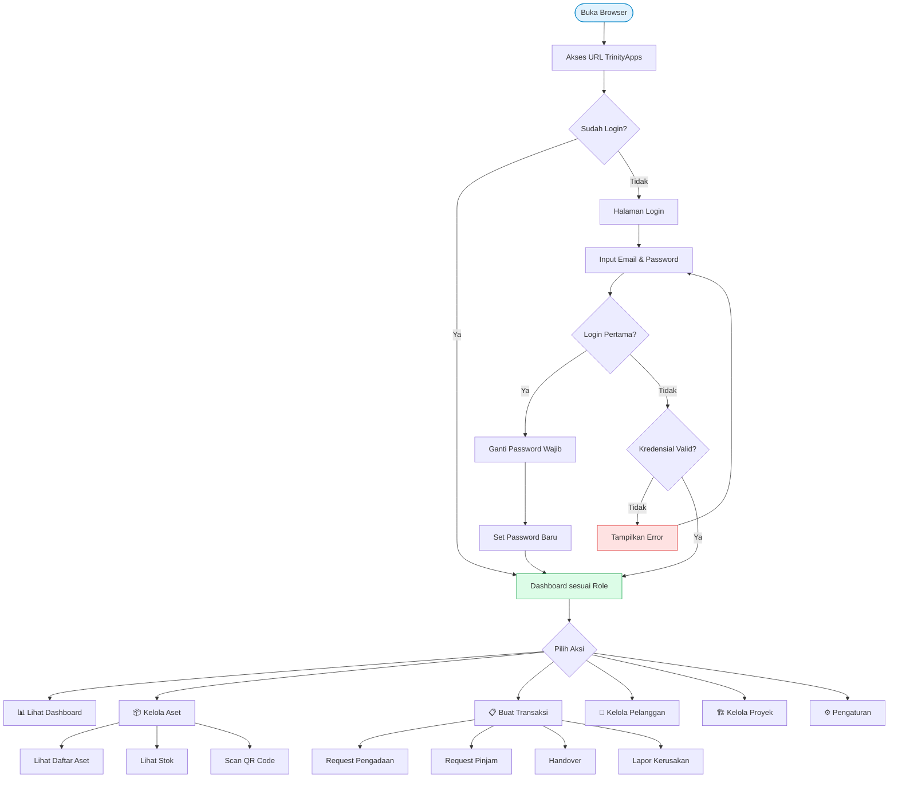
```mermaid
flowchart TD
    A([Buka Browser]) --> B[Akses URL TrinityApps]
    B --> C{Sudah Login?}
    C -- Ya --> E[Dashboard sesuai Role]
    C -- Tidak --> D[Halaman Login]
    D --> D1[Input Email & Password]
    D1 --> D2{Login Pertama?}
    D2 -- Ya --> D3[Ganti Password Wajib]
    D3 --> D4[Set Password Baru]
    D4 --> E
    D2 -- Tidak --> D5{Kredensial Valid?}
    D5 -- Tidak --> D6[Tampilkan Error]
    D6 --> D1
    D5 -- Ya --> E

    E --> F{Pilih Aksi}
    F --> G[📊 Lihat Dashboard]
    F --> H[📦 Kelola Aset]
    F --> I[📋 Buat Transaksi]
    F --> J[👥 Kelola Pelanggan]
    F --> K[🏗 Kelola Proyek]
    F --> L[⚙ Pengaturan]

    H --> H1[Lihat Daftar Aset]
    H --> H2[Lihat Stok]
    H --> H3[Scan QR Code]

    I --> I1[Request Pengadaan]
    I --> I2[Request Pinjam]
    I --> I3[Handover]
    I --> I4[Lapor Kerusakan]

    style A fill:#e0f2fe,stroke:#0284c7
    style E fill:#dcfce7,stroke:#16a34a
    style D6 fill:#fee2e2,stroke:#dc2626
```

---

## 2. User Flow: Request Pengadaan Aset (Workflow 1)

### 2.1 Flow Pembuatan Request (Creator)

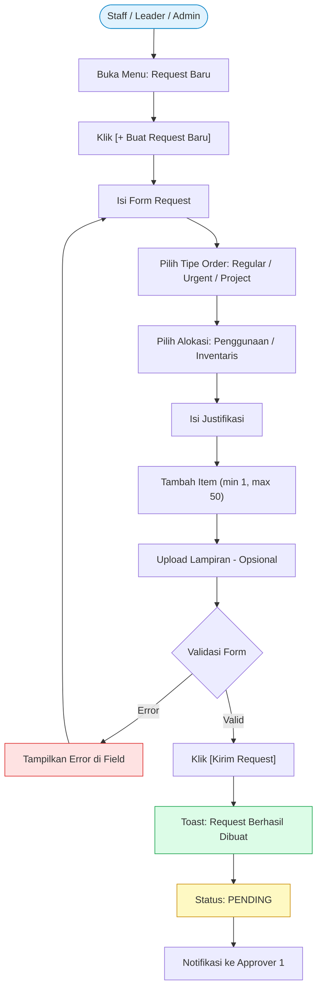
```mermaid
flowchart TD
    A([Staff / Leader / Admin]) --> B[Buka Menu: Request Baru]
    B --> C["Klik [+ Buat Request Baru]"]
    C --> D[Isi Form Request]
    D --> D1[Pilih Tipe Order: Regular / Urgent / Project]
    D1 --> D2[Pilih Alokasi: Penggunaan / Inventaris]
    D2 --> D3[Isi Justifikasi]
    D3 --> D4["Tambah Item (min 1, max 50)"]
    D4 --> D5[Upload Lampiran - Opsional]
    D5 --> E{Validasi Form}
    E -- Error --> E1[Tampilkan Error di Field]
    E1 --> D
    E -- Valid --> F["Klik [Kirim Request]"]
    F --> G[Toast: Request Berhasil Dibuat]
    G --> H[Status: PENDING]
    H --> I[Notifikasi ke Approver 1]

    style A fill:#e0f2fe,stroke:#0284c7
    style G fill:#dcfce7,stroke:#16a34a
    style E1 fill:#fee2e2,stroke:#dc2626
    style H fill:#fef9c3,stroke:#ca8a04
```

### 2.2 Flow Approval (Approver)

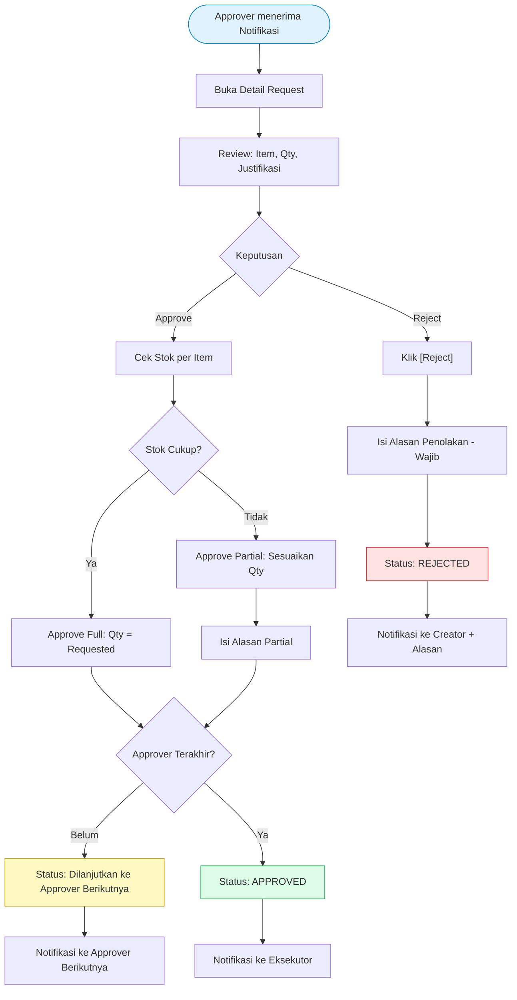
```mermaid
flowchart TD
    A([Approver menerima Notifikasi]) --> B[Buka Detail Request]
    B --> C[Review: Item, Qty, Justifikasi]
    C --> D{Keputusan}

    D -- Approve --> E[Cek Stok per Item]
    E --> E1{Stok Cukup?}
    E1 -- Ya --> E2[Approve Full: Qty = Requested]
    E1 -- Tidak --> E3[Approve Partial: Sesuaikan Qty]
    E3 --> E4[Isi Alasan Partial]
    E2 --> F{Approver Terakhir?}
    E4 --> F

    F -- Belum --> G[Status: Dilanjutkan ke Approver Berikutnya]
    G --> H[Notifikasi ke Approver Berikutnya]
    F -- Ya --> I[Status: APPROVED]
    I --> J[Notifikasi ke Eksekutor]

    D -- Reject --> K["Klik [Reject]"]
    K --> K1[Isi Alasan Penolakan - Wajib]
    K1 --> L[Status: REJECTED]
    L --> M[Notifikasi ke Creator + Alasan]

    style A fill:#e0f2fe,stroke:#0284c7
    style I fill:#dcfce7,stroke:#16a34a
    style L fill:#fee2e2,stroke:#dc2626
    style G fill:#fef9c3,stroke:#ca8a04
```

### 2.3 Flow Pasca-Approval (Eksekusi)

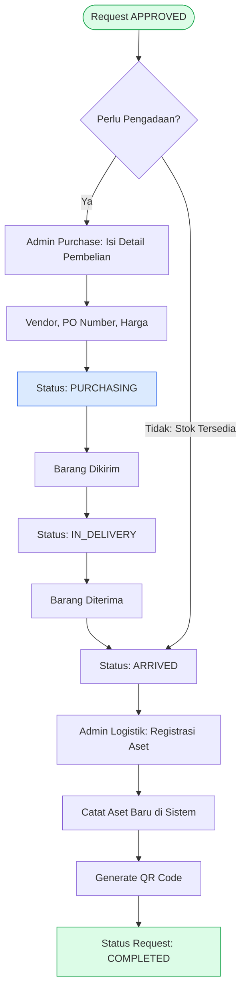
```mermaid
flowchart TD
    A([Request APPROVED]) --> B{Perlu Pengadaan?}
    B -- Ya --> C[Admin Purchase: Isi Detail Pembelian]
    C --> C1[Vendor, PO Number, Harga]
    C1 --> D[Status: PURCHASING]
    D --> E[Barang Dikirim]
    E --> F[Status: IN_DELIVERY]
    F --> G[Barang Diterima]
    G --> H[Status: ARRIVED]

    B -- Tidak: Stok Tersedia --> H

    H --> I[Admin Logistik: Registrasi Aset]
    I --> I1[Catat Aset Baru di Sistem]
    I1 --> I2[Generate QR Code]
    I2 --> J[Status Request: COMPLETED]

    style A fill:#dcfce7,stroke:#16a34a
    style J fill:#dcfce7,stroke:#16a34a
    style D fill:#dbeafe,stroke:#2563eb
```

---

## 3. User Flow: Peminjaman & Pengembalian Aset (Workflow 2)

### 3.1 Flow Peminjaman

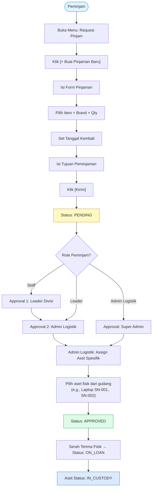
```mermaid
flowchart TD
    A([Peminjam]) --> B[Buka Menu: Request Pinjam]
    B --> C["Klik [+ Buat Pinjaman Baru]"]
    C --> D[Isi Form Pinjaman]
    D --> D1[Pilih Item + Brand + Qty]
    D1 --> D2[Set Tanggal Kembali]
    D2 --> D3[Isi Tujuan Peminjaman]
    D3 --> E["Klik [Kirim]"]
    E --> F[Status: PENDING]

    F --> G{Role Peminjam?}
    G -- Staff --> H1[Approval 1: Leader Divisi]
    H1 --> H2[Approval 2: Admin Logistik]
    G -- Leader --> H2
    G -- Admin Logistik --> H3[Approval: Super Admin]

    H2 --> I[Admin Logistik: Assign Aset Spesifik]
    H3 --> I
    I --> I1["Pilih aset fisik dari gudang
    (e.g., Laptop SN-001, SN-002)"]
    I1 --> J[Status: APPROVED]
    J --> K["Serah Terima Fisik → Status: ON_LOAN"]
    K --> L[Aset Status: IN_CUSTODY]

    style A fill:#e0f2fe,stroke:#0284c7
    style J fill:#dcfce7,stroke:#16a34a
    style F fill:#fef9c3,stroke:#ca8a04
    style L fill:#dbeafe,stroke:#2563eb
```

### 3.2 Flow Pengembalian

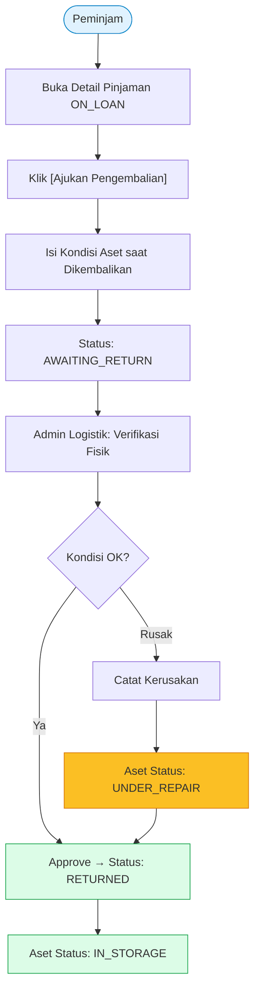
```mermaid
flowchart TD
    A([Peminjam]) --> B[Buka Detail Pinjaman ON_LOAN]
    B --> C["Klik [Ajukan Pengembalian]"]
    C --> D[Isi Kondisi Aset saat Dikembalikan]
    D --> E[Status: AWAITING_RETURN]
    E --> F[Admin Logistik: Verifikasi Fisik]
    F --> G{Kondisi OK?}
    G -- Ya --> H["Approve → Status: RETURNED"]
    H --> I[Aset Status: IN_STORAGE]
    G -- Rusak --> J[Catat Kerusakan]
    J --> K[Aset Status: UNDER_REPAIR]
    K --> H

    style A fill:#e0f2fe,stroke:#0284c7
    style H fill:#dcfce7,stroke:#16a34a
    style I fill:#dcfce7,stroke:#16a34a
    style K fill:#fbbf24,stroke:#d97706
```

### 3.3 Flow Overdue

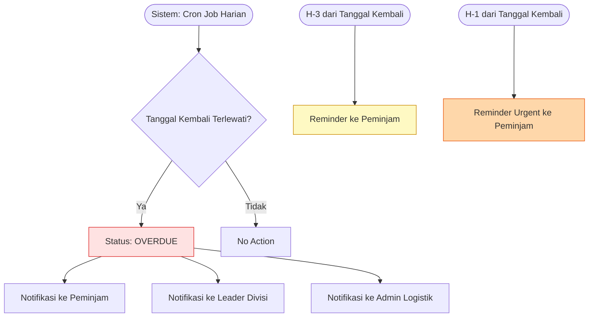
```mermaid
flowchart TD
    A([Sistem: Cron Job Harian]) --> B{Tanggal Kembali Terlewati?}
    B -- Ya --> C[Status: OVERDUE]
    C --> D[Notifikasi ke Peminjam]
    C --> E[Notifikasi ke Leader Divisi]
    C --> F[Notifikasi ke Admin Logistik]
    B -- Tidak --> G[No Action]

    H([H-3 dari Tanggal Kembali]) --> I[Reminder ke Peminjam]
    J([H-1 dari Tanggal Kembali]) --> K[Reminder Urgent ke Peminjam]

    style C fill:#fee2e2,stroke:#dc2626
    style I fill:#fef9c3,stroke:#ca8a04
    style K fill:#fed7aa,stroke:#ea580c
```

---

## 4. User Flow: Serah Terima (Handover)

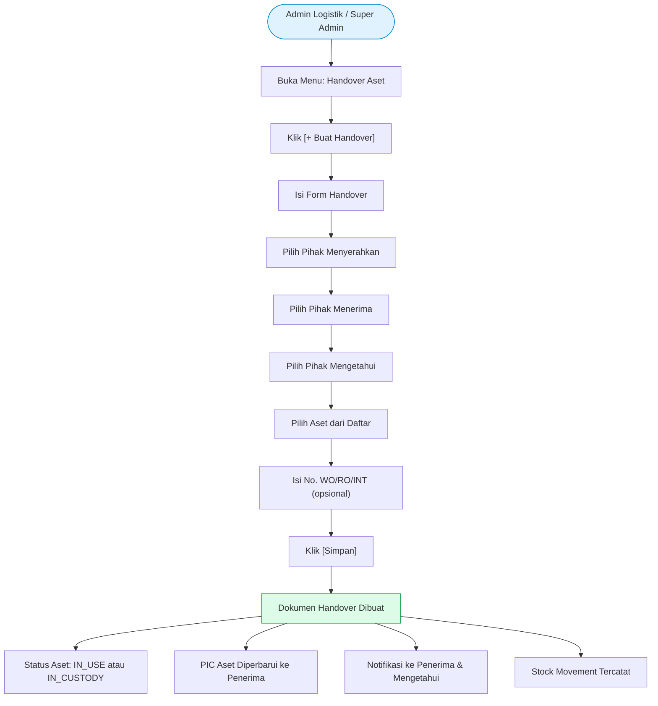
```mermaid
flowchart TD
    A([Admin Logistik / Super Admin]) --> B[Buka Menu: Handover Aset]
    B --> C["Klik [+ Buat Handover]"]
    C --> D[Isi Form Handover]
    D --> D1[Pilih Pihak Menyerahkan]
    D1 --> D2[Pilih Pihak Menerima]
    D2 --> D3[Pilih Pihak Mengetahui]
    D3 --> D4[Pilih Aset dari Daftar]
    D4 --> D5["Isi No. WO/RO/INT (opsional)"]
    D5 --> E["Klik [Simpan]"]
    E --> F[Dokumen Handover Dibuat]
    F --> G[Status Aset: IN_USE atau IN_CUSTODY]
    F --> H[PIC Aset Diperbarui ke Penerima]
    F --> I[Notifikasi ke Penerima & Mengetahui]
    F --> J[Stock Movement Tercatat]

    style A fill:#e0f2fe,stroke:#0284c7
    style F fill:#dcfce7,stroke:#16a34a
```

---

## 5. User Flow: Lapor Kerusakan & Perbaikan

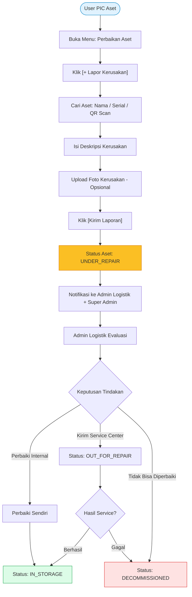
```mermaid
flowchart TD
    A([User PIC Aset]) --> B[Buka Menu: Perbaikan Aset]
    B --> C["Klik [+ Lapor Kerusakan]"]
    C --> D[Cari Aset: Nama / Serial / QR Scan]
    D --> E[Isi Deskripsi Kerusakan]
    E --> F[Upload Foto Kerusakan - Opsional]
    F --> G["Klik [Kirim Laporan]"]
    G --> H[Status Aset: UNDER_REPAIR]
    H --> I[Notifikasi ke Admin Logistik + Super Admin]

    I --> J[Admin Logistik Evaluasi]
    J --> K{Keputusan Tindakan}

    K -- Perbaiki Internal --> L[Perbaiki Sendiri]
    L --> M[Status: IN_STORAGE]

    K -- Kirim Service Center --> N[Status: OUT_FOR_REPAIR]
    N --> O{Hasil Service?}
    O -- Berhasil --> M
    O -- Gagal --> P[Status: DECOMMISSIONED]

    K -- Tidak Bisa Diperbaiki --> P

    style A fill:#e0f2fe,stroke:#0284c7
    style M fill:#dcfce7,stroke:#16a34a
    style P fill:#fee2e2,stroke:#dc2626
    style H fill:#fbbf24,stroke:#d97706
```

---

## 6. User Flow: Operasi Pelanggan

### 6.1 Instalasi

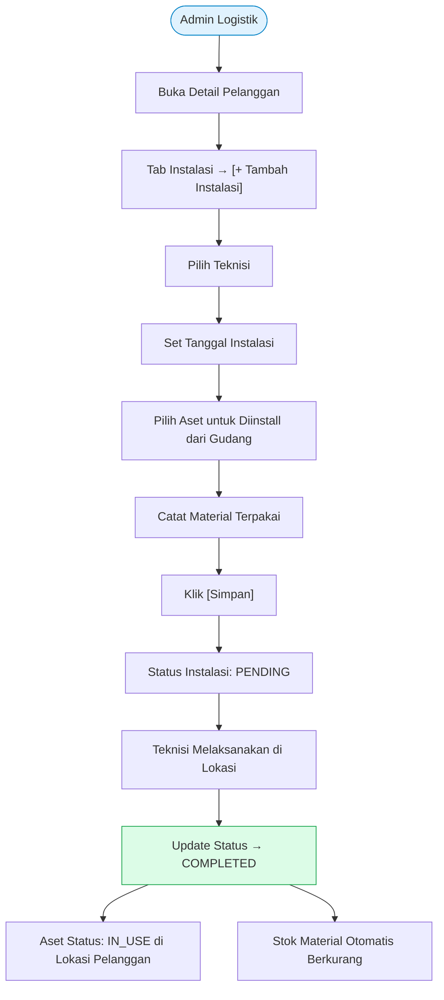
```mermaid
flowchart TD
    A([Admin Logistik]) --> B[Buka Detail Pelanggan]
    B --> C["Tab Instalasi → [+ Tambah Instalasi]"]
    C --> D[Pilih Teknisi]
    D --> E[Set Tanggal Instalasi]
    E --> F[Pilih Aset untuk Diinstall dari Gudang]
    F --> G[Catat Material Terpakai]
    G --> H["Klik [Simpan]"]
    H --> I[Status Instalasi: PENDING]
    I --> J[Teknisi Melaksanakan di Lokasi]
    J --> K["Update Status → COMPLETED"]
    K --> L[Aset Status: IN_USE di Lokasi Pelanggan]
    K --> M[Stok Material Otomatis Berkurang]

    style A fill:#e0f2fe,stroke:#0284c7
    style K fill:#dcfce7,stroke:#16a34a
```

### 6.2 Maintenance

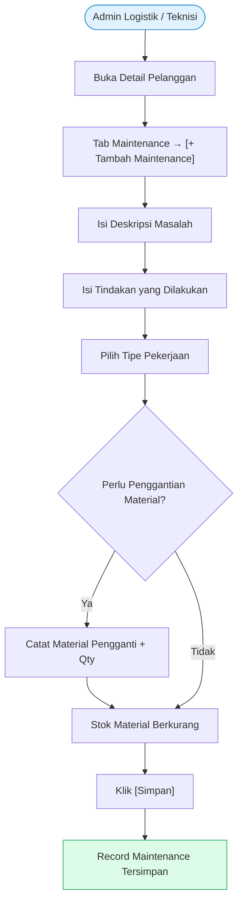
```mermaid
flowchart TD
    A([Admin Logistik / Teknisi]) --> B[Buka Detail Pelanggan]
    B --> C["Tab Maintenance → [+ Tambah Maintenance]"]
    C --> D[Isi Deskripsi Masalah]
    D --> E[Isi Tindakan yang Dilakukan]
    E --> F[Pilih Tipe Pekerjaan]
    F --> G{Perlu Penggantian Material?}
    G -- Ya --> H[Catat Material Pengganti + Qty]
    H --> I[Stok Material Berkurang]
    G -- Tidak --> I
    I --> J["Klik [Simpan]"]
    J --> K[Record Maintenance Tersimpan]

    style A fill:#e0f2fe,stroke:#0284c7
    style K fill:#dcfce7,stroke:#16a34a
```

### 6.3 Dismantle

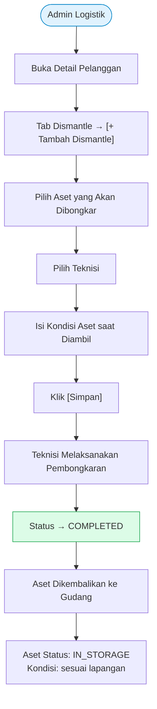
```mermaid
flowchart TD
    A([Admin Logistik]) --> B[Buka Detail Pelanggan]
    B --> C["Tab Dismantle → [+ Tambah Dismantle]"]
    C --> D[Pilih Aset yang Akan Dibongkar]
    D --> E[Pilih Teknisi]
    E --> F[Isi Kondisi Aset saat Diambil]
    F --> G["Klik [Simpan]"]
    G --> H[Teknisi Melaksanakan Pembongkaran]
    H --> I["Status → COMPLETED"]
    I --> J[Aset Dikembalikan ke Gudang]
    J --> K["Aset Status: IN_STORAGE
    Kondisi: sesuai lapangan"]

    style A fill:#e0f2fe,stroke:#0284c7
    style I fill:#dcfce7,stroke:#16a34a
```

---

## 7. User Flow: Proyek Infrastruktur

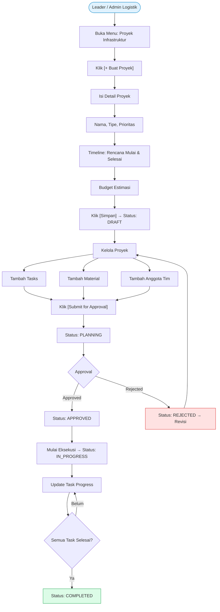
```mermaid
flowchart TD
    A([Leader / Admin Logistik]) --> B[Buka Menu: Proyek Infrastruktur]
    B --> C["Klik [+ Buat Proyek]"]
    C --> D[Isi Detail Proyek]
    D --> D1[Nama, Tipe, Prioritas]
    D1 --> D2[Timeline: Rencana Mulai & Selesai]
    D2 --> D3[Budget Estimasi]
    D3 --> E["Klik [Simpan] → Status: DRAFT"]
    E --> F[Kelola Proyek]
    F --> F1[Tambah Tasks]
    F --> F2[Tambah Material]
    F --> F3[Tambah Anggota Tim]
    F1 & F2 & F3 --> G["Klik [Submit for Approval]"]
    G --> H[Status: PLANNING]
    H --> I{Approval}
    I -- Approved --> J[Status: APPROVED]
    J --> K["Mulai Eksekusi → Status: IN_PROGRESS"]
    K --> L[Update Task Progress]
    L --> M{Semua Task Selesai?}
    M -- Ya --> N["Status: COMPLETED"]
    M -- Belum --> L
    I -- Rejected --> O[Status: REJECTED → Revisi]
    O --> F

    style A fill:#e0f2fe,stroke:#0284c7
    style N fill:#dcfce7,stroke:#16a34a
    style O fill:#fee2e2,stroke:#dc2626
```

---

## 8. System Flow: Sequence Diagram — Autentikasi (JWT)

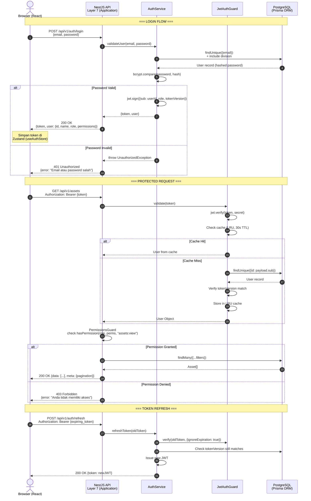
```mermaid
sequenceDiagram
    autonumber
    actor User as Browser (React)
    participant API as NestJS API<br/>Layer 7 (Application)
    participant Auth as AuthService
    participant Guard as JwtAuthGuard
    participant DB as PostgreSQL<br/>(Prisma ORM)

    Note over User,DB: === LOGIN FLOW ===

    User->>API: POST /api/v1/auth/login<br/>{email, password}
    API->>Auth: validateUser(email, password)
    Auth->>DB: findUnique({email})<br/>+ include division
    DB-->>Auth: User record (hashed password)
    Auth->>Auth: bcrypt.compare(password, hash)

    alt Password Valid
        Auth->>Auth: jwt.sign({sub: userId, role, tokenVersion})
        Auth-->>API: {token, user}
        API-->>User: 200 OK<br/>{token, user: {id, name, role, permissions}}
        Note over User: Simpan token di<br/>Zustand (useAuthStore)
    else Password Invalid
        Auth-->>API: throw UnauthorizedException
        API-->>User: 401 Unauthorized<br/>{error: "Email atau password salah"}
    end

    Note over User,DB: === PROTECTED REQUEST ===

    User->>API: GET /api/v1/assets<br/>Authorization: Bearer {token}
    API->>Guard: validate(token)
    Guard->>Guard: jwt.verify(token, secret)
    Guard->>Guard: Check cache (LRU, 30s TTL)

    alt Cache Hit
        Guard-->>API: User from cache
    else Cache Miss
        Guard->>DB: findUnique({id: payload.sub})
        DB-->>Guard: User record
        Guard->>Guard: Verify tokenVersion match
        Guard->>Guard: Store in LRU cache
        Guard-->>API: User Object
    end

    API->>API: PermissionsGuard<br/>check hasPermission(role, perms, "assets:view")

    alt Permission Granted
        API->>DB: findMany({...filters})
        DB-->>API: Asset[]
        API-->>User: 200 OK {data: [...], meta: {pagination}}
    else Permission Denied
        API-->>User: 403 Forbidden<br/>{error: "Anda tidak memiliki akses"}
    end

    Note over User,DB: === TOKEN REFRESH ===

    User->>API: POST /api/v1/auth/refresh<br/>Authorization: Bearer {expiring_token}
    API->>Auth: refreshToken(oldToken)
    Auth->>Guard: verify(oldToken, {ignoreExpiration: true})
    Auth->>DB: Check tokenVersion still matches
    Auth->>Auth: Issue new JWT
    Auth-->>User: 200 OK {token: newJWT}
```

---

## 9. System Flow: Sequence Diagram — Request Approval Multi-Layer

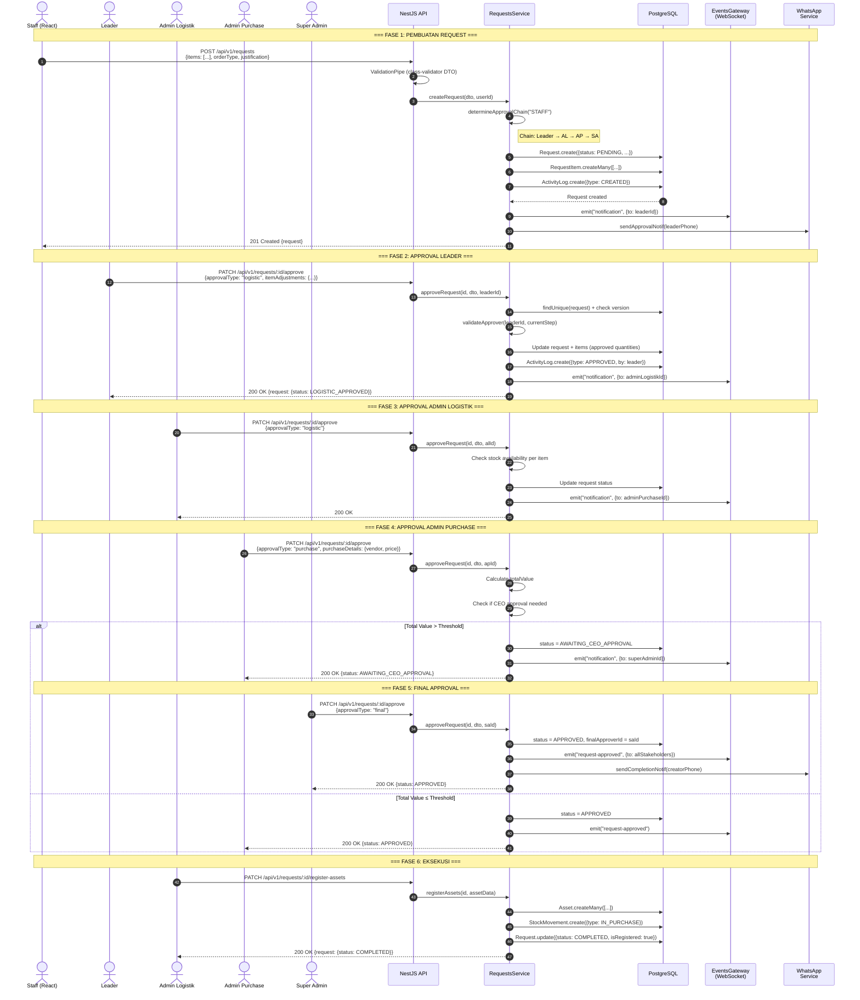
```mermaid
sequenceDiagram
    autonumber
    actor Staff as Staff (React)
    actor Leader as Leader
    actor AL as Admin Logistik
    actor AP as Admin Purchase
    actor SA as Super Admin
    participant API as NestJS API
    participant Svc as RequestsService
    participant DB as PostgreSQL
    participant WS as EventsGateway<br/>(WebSocket)
    participant WA as WhatsApp<br/>Service

    Note over Staff,WA: === FASE 1: PEMBUATAN REQUEST ===

    Staff->>API: POST /api/v1/requests<br/>{items: [...], orderType, justification}
    API->>API: ValidationPipe (class-validator DTO)
    API->>Svc: createRequest(dto, userId)
    Svc->>Svc: determineApprovalChain("STAFF")
    Note right of Svc: Chain: Leader → AL → AP → SA
    Svc->>DB: Request.create({status: PENDING, ...})
    Svc->>DB: RequestItem.createMany([...])
    Svc->>DB: ActivityLog.create({type: CREATED})
    DB-->>Svc: Request created
    Svc->>WS: emit("notification", {to: leaderId})
    Svc->>WA: sendApprovalNotif(leaderPhone)
    Svc-->>Staff: 201 Created {request}

    Note over Staff,WA: === FASE 2: APPROVAL LEADER ===

    Leader->>API: PATCH /api/v1/requests/:id/approve<br/>{approvalType: "logistic", itemAdjustments: {...}}
    API->>Svc: approveRequest(id, dto, leaderId)
    Svc->>DB: findUnique(request) + check version
    Svc->>Svc: validateApprover(leaderId, currentStep)
    Svc->>DB: Update request + items (approved quantities)
    Svc->>DB: ActivityLog.create({type: APPROVED, by: leader})
    Svc->>WS: emit("notification", {to: adminLogistikId})
    Svc-->>Leader: 200 OK {request: {status: LOGISTIC_APPROVED}}

    Note over Staff,WA: === FASE 3: APPROVAL ADMIN LOGISTIK ===

    AL->>API: PATCH /api/v1/requests/:id/approve<br/>{approvalType: "logistic"}
    API->>Svc: approveRequest(id, dto, alId)
    Svc->>Svc: Check stock availability per item
    Svc->>DB: Update request status
    Svc->>WS: emit("notification", {to: adminPurchaseId})
    Svc-->>AL: 200 OK

    Note over Staff,WA: === FASE 4: APPROVAL ADMIN PURCHASE ===

    AP->>API: PATCH /api/v1/requests/:id/approve<br/>{approvalType: "purchase", purchaseDetails: {vendor, price}}
    API->>Svc: approveRequest(id, dto, apId)
    Svc->>Svc: Calculate totalValue
    Svc->>Svc: Check if CEO approval needed

    alt Total Value > Threshold
        Svc->>DB: status = AWAITING_CEO_APPROVAL
        Svc->>WS: emit("notification", {to: superAdminId})
        Svc-->>AP: 200 OK {status: AWAITING_CEO_APPROVAL}

        Note over Staff,WA: === FASE 5: FINAL APPROVAL ===
        SA->>API: PATCH /api/v1/requests/:id/approve<br/>{approvalType: "final"}
        API->>Svc: approveRequest(id, dto, saId)
        Svc->>DB: status = APPROVED, finalApproverId = saId
        Svc->>WS: emit("request-approved", {to: allStakeholders})
        Svc->>WA: sendCompletionNotif(creatorPhone)
        Svc-->>SA: 200 OK {status: APPROVED}
    else Total Value ≤ Threshold
        Svc->>DB: status = APPROVED
        Svc->>WS: emit("request-approved")
        Svc-->>AP: 200 OK {status: APPROVED}
    end

    Note over Staff,WA: === FASE 6: EKSEKUSI ===

    AL->>API: PATCH /api/v1/requests/:id/register-assets
    API->>Svc: registerAssets(id, assetData)
    Svc->>DB: Asset.createMany([...])
    Svc->>DB: StockMovement.create({type: IN_PURCHASE})
    Svc->>DB: Request.update({status: COMPLETED, isRegistered: true})
    Svc-->>AL: 200 OK {request: {status: COMPLETED}}
```

---

## 10. System Flow: Sequence Diagram — Peminjaman Aset

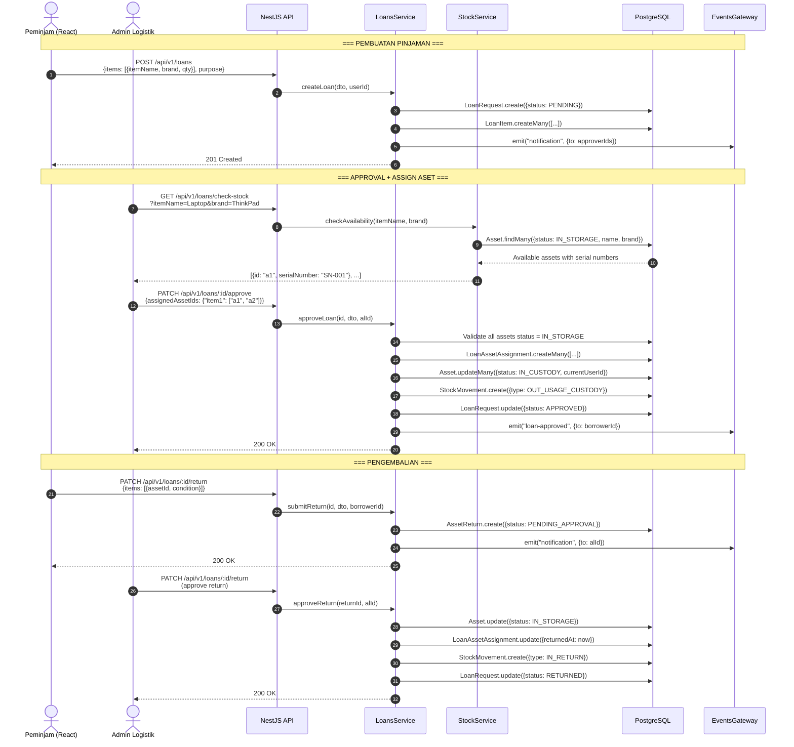
```mermaid
sequenceDiagram
    autonumber
    actor Borrower as Peminjam (React)
    actor AL as Admin Logistik
    participant API as NestJS API
    participant Svc as LoansService
    participant Stock as StockService
    participant DB as PostgreSQL
    participant WS as EventsGateway

    Note over Borrower,WS: === PEMBUATAN PINJAMAN ===

    Borrower->>API: POST /api/v1/loans<br/>{items: [{itemName, brand, qty}], purpose}
    API->>Svc: createLoan(dto, userId)
    Svc->>DB: LoanRequest.create({status: PENDING})
    Svc->>DB: LoanItem.createMany([...])
    Svc->>WS: emit("notification", {to: approverIds})
    Svc-->>Borrower: 201 Created

    Note over Borrower,WS: === APPROVAL + ASSIGN ASET ===

    AL->>API: GET /api/v1/loans/check-stock<br/>?itemName=Laptop&brand=ThinkPad
    API->>Stock: checkAvailability(itemName, brand)
    Stock->>DB: Asset.findMany({status: IN_STORAGE, name, brand})
    DB-->>Stock: Available assets with serial numbers
    Stock-->>AL: [{id: "a1", serialNumber: "SN-001"}, ...]

    AL->>API: PATCH /api/v1/loans/:id/approve<br/>{assignedAssetIds: {"item1": ["a1", "a2"]}}
    API->>Svc: approveLoan(id, dto, alId)
    Svc->>DB: Validate all assets status = IN_STORAGE
    Svc->>DB: LoanAssetAssignment.createMany([...])
    Svc->>DB: Asset.updateMany({status: IN_CUSTODY, currentUserId})
    Svc->>DB: StockMovement.create({type: OUT_USAGE_CUSTODY})
    Svc->>DB: LoanRequest.update({status: APPROVED})
    Svc->>WS: emit("loan-approved", {to: borrowerId})
    Svc-->>AL: 200 OK

    Note over Borrower,WS: === PENGEMBALIAN ===

    Borrower->>API: PATCH /api/v1/loans/:id/return<br/>{items: [{assetId, condition}]}
    API->>Svc: submitReturn(id, dto, borrowerId)
    Svc->>DB: AssetReturn.create({status: PENDING_APPROVAL})
    Svc->>WS: emit("notification", {to: alId})
    Svc-->>Borrower: 200 OK

    AL->>API: PATCH /api/v1/loans/:id/return<br/>(approve return)
    API->>Svc: approveReturn(returnId, alId)
    Svc->>DB: Asset.update({status: IN_STORAGE})
    Svc->>DB: LoanAssetAssignment.update({returnedAt: now})
    Svc->>DB: StockMovement.create({type: IN_RETURN})
    Svc->>DB: LoanRequest.update({status: RETURNED})
    Svc-->>AL: 200 OK
```

---

## 11. State Machine: Siklus Hidup Request/Transaksi

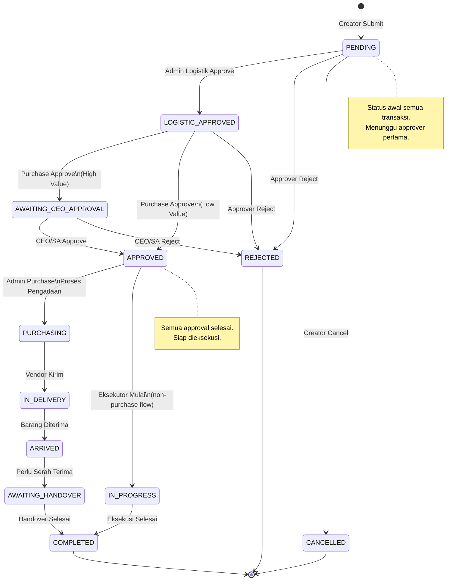
```mermaid
stateDiagram-v2
    [*] --> PENDING : Creator Submit

    PENDING --> LOGISTIC_APPROVED : Admin Logistik Approve
    PENDING --> REJECTED : Approver Reject
    PENDING --> CANCELLED : Creator Cancel

    LOGISTIC_APPROVED --> AWAITING_CEO_APPROVAL : Purchase Approve\n(High Value)
    LOGISTIC_APPROVED --> APPROVED : Purchase Approve\n(Low Value)
    LOGISTIC_APPROVED --> REJECTED : Approver Reject

    AWAITING_CEO_APPROVAL --> APPROVED : CEO/SA Approve
    AWAITING_CEO_APPROVAL --> REJECTED : CEO/SA Reject

    APPROVED --> PURCHASING : Admin Purchase\nProses Pengadaan
    APPROVED --> IN_PROGRESS : Eksekutor Mulai\n(non-purchase flow)

    PURCHASING --> IN_DELIVERY : Vendor Kirim
    IN_DELIVERY --> ARRIVED : Barang Diterima

    ARRIVED --> AWAITING_HANDOVER : Perlu Serah Terima
    AWAITING_HANDOVER --> COMPLETED : Handover Selesai

    IN_PROGRESS --> COMPLETED : Eksekusi Selesai

    REJECTED --> [*]
    CANCELLED --> [*]
    COMPLETED --> [*]

    note right of PENDING
        Status awal semua transaksi.
        Menunggu approver pertama.
    end note

    note right of APPROVED
        Semua approval selesai.
        Siap dieksekusi.
    end note
```

---

## 12. State Machine: Siklus Hidup Aset

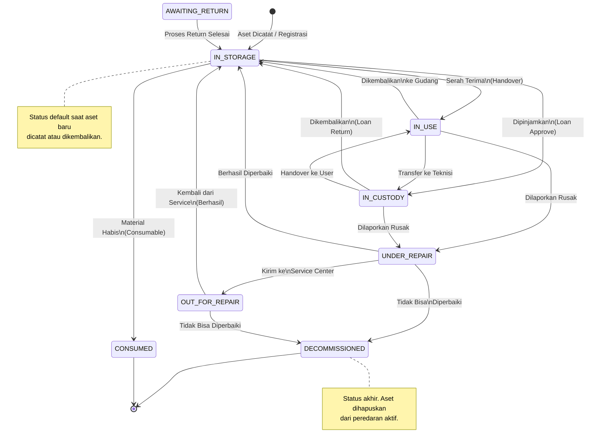
```mermaid
stateDiagram-v2
    [*] --> IN_STORAGE : Aset Dicatat / Registrasi

    IN_STORAGE --> IN_USE : Serah Terima\n(Handover)
    IN_STORAGE --> IN_CUSTODY : Dipinjamkan\n(Loan Approve)
    IN_STORAGE --> CONSUMED : Material Habis\n(Consumable)

    IN_USE --> IN_STORAGE : Dikembalikan\nke Gudang
    IN_USE --> UNDER_REPAIR : Dilaporkan Rusak
    IN_USE --> IN_CUSTODY : Transfer ke Teknisi

    IN_CUSTODY --> IN_STORAGE : Dikembalikan\n(Loan Return)
    IN_CUSTODY --> UNDER_REPAIR : Dilaporkan Rusak
    IN_CUSTODY --> IN_USE : Handover ke User

    UNDER_REPAIR --> IN_STORAGE : Berhasil Diperbaiki
    UNDER_REPAIR --> OUT_FOR_REPAIR : Kirim ke\nService Center
    UNDER_REPAIR --> DECOMMISSIONED : Tidak Bisa\nDiperbaiki

    OUT_FOR_REPAIR --> IN_STORAGE : Kembali dari Service\n(Berhasil)
    OUT_FOR_REPAIR --> DECOMMISSIONED : Tidak Bisa Diperbaiki

    AWAITING_RETURN --> IN_STORAGE : Proses Return Selesai

    DECOMMISSIONED --> [*]
    CONSUMED --> [*]

    note right of IN_STORAGE
        Status default saat aset baru
        dicatat atau dikembalikan.
    end note

    note right of DECOMMISSIONED
        Status akhir. Aset dihapuskan
        dari peredaran aktif.
    end note
```

---

## 13. State Machine: Siklus Hidup Pinjaman

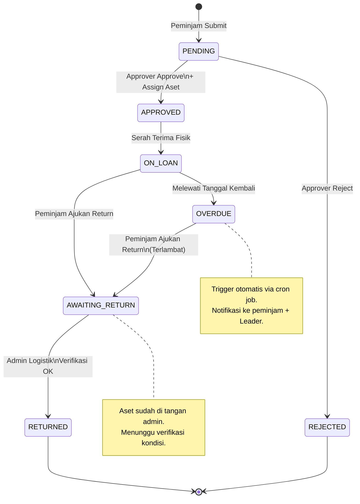
```mermaid
stateDiagram-v2
    [*] --> PENDING : Peminjam Submit

    PENDING --> APPROVED : Approver Approve\n+ Assign Aset
    PENDING --> REJECTED : Approver Reject

    APPROVED --> ON_LOAN : Serah Terima Fisik

    ON_LOAN --> AWAITING_RETURN : Peminjam Ajukan Return
    ON_LOAN --> OVERDUE : Melewati Tanggal Kembali

    OVERDUE --> AWAITING_RETURN : Peminjam Ajukan Return\n(Terlambat)

    AWAITING_RETURN --> RETURNED : Admin Logistik\nVerifikasi OK

    REJECTED --> [*]
    RETURNED --> [*]

    note right of OVERDUE
        Trigger otomatis via cron job.
        Notifikasi ke peminjam + Leader.
    end note

    note right of AWAITING_RETURN
        Aset sudah di tangan admin.
        Menunggu verifikasi kondisi.
    end note
```

---

## 14. State Machine: Siklus Hidup Proyek

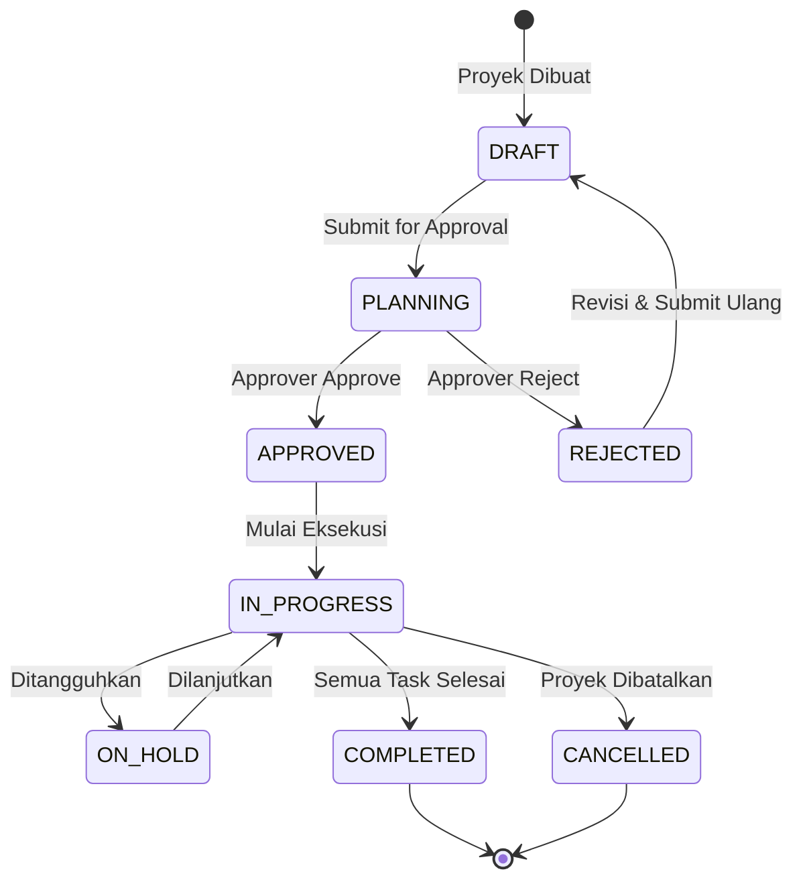
```mermaid
stateDiagram-v2
    [*] --> DRAFT : Proyek Dibuat

    DRAFT --> PLANNING : Submit for Approval
    PLANNING --> APPROVED : Approver Approve
    PLANNING --> REJECTED : Approver Reject

    APPROVED --> IN_PROGRESS : Mulai Eksekusi
    IN_PROGRESS --> ON_HOLD : Ditangguhkan
    ON_HOLD --> IN_PROGRESS : Dilanjutkan
    IN_PROGRESS --> COMPLETED : Semua Task Selesai
    IN_PROGRESS --> CANCELLED : Proyek Dibatalkan

    REJECTED --> DRAFT : Revisi & Submit Ulang

    COMPLETED --> [*]
    CANCELLED --> [*]
```

---

## 15. Approval Chain Decision Tree

Diagram berikut menunjukkan bagaimana sistem menentukan rantai approval berdasarkan **role creator** dan **modul transaksi**.

### 15.1 Workflow 1: Permintaan Pengadaan Aset

```mermaid
flowchart TD
    A{Role Creator?} --> B[Staff]
    A --> C[Leader]
    A --> D[Admin Logistik]
    A --> E[Admin Purchase]
    A --> F[Super Admin]

    B --> B1["Chain:
    1. Leader Divisi
    2. Admin Logistik
    3. Admin Purchase
    4. Super Admin"]

    C --> C1["Chain:
    1. Admin Logistik
    2. Admin Purchase
    3. Super Admin"]

    D --> D1["Chain:
    1. Admin Purchase
    2. Super Admin"]

    E --> E1["Chain:
    1. Admin Logistik
    2. Super Admin"]

    F --> F1["Chain:
    1. Admin Logistik
    2. Admin Purchase"]

    B1 --> G[Eksekutor: Admin Logistik]
    C1 --> G
    D1 --> G2[Eksekutor: SA / Admin Logistik]
    E1 --> G2
    F1 --> G

    style A fill:#e0f2fe,stroke:#0284c7
    style G fill:#dcfce7,stroke:#16a34a
    style G2 fill:#dcfce7,stroke:#16a34a
```

### 15.2 Workflow 2: Peminjaman, Pengembalian, Serah Terima, Lapor Rusak

```mermaid
flowchart TD
    A{Role Creator?} --> B[Staff]
    A --> C[Leader]
    A --> D[Admin Logistik]
    A --> E[Admin Purchase]
    A --> F[Super Admin]

    B --> B1["Chain:
    1. Leader Divisi
    2. Admin Logistik
    CC: Super Admin"]

    C --> C1["Chain:
    1. Admin Logistik
    CC: Super Admin"]

    D --> D1["Chain:
    1. Super Admin"]

    E --> E1["Chain:
    1. Admin Logistik
    CC: Super Admin"]

    F --> F1["Chain:
    1. Admin Logistik"]

    style A fill:#e0f2fe,stroke:#0284c7
```

### 15.3 Workflow 3: Proyek, Instalasi, Maintenance, Dismantle

```mermaid
flowchart TD
    A{Role Creator?} --> B[Staff]
    A --> C[Leader]

    B --> B1["Chain:
    1. Leader Divisi
    2. Admin Logistik
    CC: Super Admin"]

    C --> C1["Chain:
    1. Admin Logistik
    CC: Super Admin"]

    B1 --> G[Eksekutor: Admin Logistik]
    C1 --> G

    style A fill:#e0f2fe,stroke:#0284c7
    style G fill:#dcfce7,stroke:#16a34a
```

---

## 16. System Architecture Overview

```mermaid
flowchart TB
    subgraph Client ["Client Layer (Browser)"]
        direction TB
        React["React 18.3 + TypeScript 5.7
        Shadcn UI + Tailwind CSS 3.4"]
        Zustand["Zustand 5.0
        (Client State)"]
        TanStack["TanStack Query
        (Server State Cache)"]
        RHF["React Hook Form 7.71
        + Zod 3.25"]
        React --> Zustand
        React --> TanStack
        React --> RHF
    end

    subgraph Network ["Network Layer"]
        direction TB
        HTTPS["HTTPS / TLS 1.3
        (Layer 4-7 OSI)"]
        Nginx["Nginx Reverse Proxy
        SSL Termination"]
    end

    subgraph Server ["Server Layer (Docker)"]
        direction TB
        NestJS["NestJS 11.1 + TypeScript 5.9
        RESTful API (JSON)"]
        Auth["JWT Auth
        bcrypt (cost ≥ 12)"]
        RBAC["RBAC Guard
        @AuthPermissions()"]
        Validator["class-validator DTOs
        ValidationPipe"]
        WS["WebSocket Gateway
        (EventsGateway)"]
        Swagger["Swagger / OpenAPI
        /api/docs"]
        NestJS --> Auth
        NestJS --> RBAC
        NestJS --> Validator
        NestJS --> WS
        NestJS --> Swagger
    end

    subgraph Data ["Data Layer"]
        direction TB
        Prisma["Prisma ORM 7.2
        Type-safe queries"]
        PG["PostgreSQL 16
        Primary Database"]
        Prisma --> PG
    end

    subgraph Infra ["Infrastructure"]
        direction TB
        Docker["Docker Compose
        Multi-container"]
        GHA["GitHub Actions
        CI/CD Pipeline"]
        Backup["Daily Backup
        PostgreSQL pg_dump"]
        Docker --> GHA
        Docker --> Backup
    end

    Client -->|"HTTP/JSON
    Bearer JWT"| Network
    Network --> Server
    Server --> Data
    Server -.-> Infra

    style Client fill:#e0f2fe,stroke:#0284c7
    style Network fill:#fef9c3,stroke:#ca8a04
    style Server fill:#dcfce7,stroke:#16a34a
    style Data fill:#ede9fe,stroke:#7c3aed
    style Infra fill:#f3f4f6,stroke:#6b7280
```

---

## Referensi Silang

| Topik                                 | Dokumen                    | Section     |
| ------------------------------------- | -------------------------- | ----------- |
| Matriks approval workflow (tabel)     | PRD v3.1                   | Section 7.3 |
| Deskripsi fitur per modul             | PRD v3.1                   | Section 5–6 |
| URL mapping lengkap                   | SDD v3.1                   | Section 3–4 |
| Spesifikasi layout visual per halaman | UIUX_DESIGN_DOCUMENT.md    | Section 7   |
| Panduan langkah-langkah user          | USER_MANUAL_SOP.md         | Section 5–9 |
| Permission keys dan role defaults     | `permissions.constants.ts` | Source code |
| ERD dan relasi antar model            | SDD v3.1                   | Section 5   |

---

**— Akhir Dokumen User Flow & System Flow v1.0 —**
