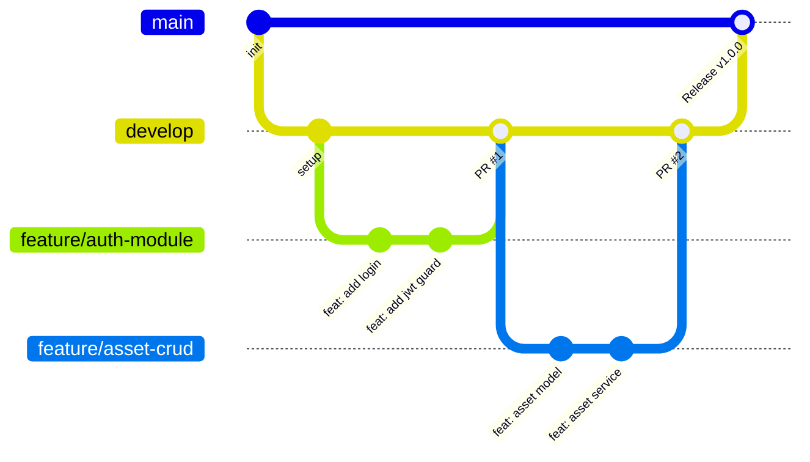
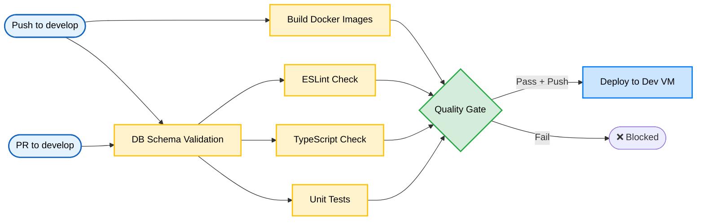

# Git Workflow & CI/CD Triggers

**Versi**: 1.0
**Tanggal**: 10 April 2026
**Referensi**: PRD v3.1, SDD v3.1
**Status**: ACTIVE

---

## 1. Branching Strategy

### 1.1 Branch Model

Proyek ini menggunakan model **GitHub Flow** yang disederhanakan untuk tim 1 developer, dengan potensi scaling ke GitFlow di masa depan.

```
main (production)
  └── develop (integration & staging)
        ├── feature/nama-fitur
        ├── bugfix/nama-bug
        ├── hotfix/nama-hotfix
        └── chore/nama-tugas
```

### 1.2 Branch Naming Convention

| Prefix     | Penggunaan                                  | Contoh                                |
| ---------- | ------------------------------------------- | ------------------------------------- |
| `feature/` | Fitur baru sesuai PRD                       | `feature/approval-workflow`           |
| `bugfix/`  | Perbaikan bug non-kritis                    | `bugfix/stock-calculation-off-by-one` |
| `hotfix/`  | Perbaikan bug kritis di production          | `hotfix/jwt-token-validation`         |
| `chore/`   | Tugas non-fungsional (deps, docs, refactor) | `chore/update-prisma-7`               |
| `release/` | Persiapan rilis (jika dibutuhkan)           | `release/v1.0.0`                      |

**Aturan Penamaan**:

- Gunakan huruf kecil dan kebab-case: `feature/asset-registration`
- Singkat tapi deskriptif, maksimal 50 karakter setelah prefix
- Referensikan ID fitur jika ada: `feature/f02-asset-crud`

### 1.3 Branch Protection Rules

| Branch    | Rule                                                              |
| --------- | ----------------------------------------------------------------- |
| `main`    | Protected. Hanya menerima merge dari `develop` via Pull Request   |
| `develop` | Semi-protected. Menerima push langsung & PR dari feature branches |

### 1.4 Alur Kerja Branch



---

## 2. Conventional Commits

### 2.1 Format Standar

```
<type>(<scope>): <subject>

[body]

[footer]
```

### 2.2 Type & Scope

| Type       | Deskripsi                                  | Contoh                                            |
| ---------- | ------------------------------------------ | ------------------------------------------------- |
| `feat`     | Fitur baru                                 | `feat(assets): add bulk asset registration`       |
| `fix`      | Perbaikan bug                              | `fix(auth): resolve refresh token race condition` |
| `docs`     | Perubahan dokumentasi saja                 | `docs(api): update swagger endpoint descriptions` |
| `style`    | Formatting, missing semicolons (bukan CSS) | `style(backend): fix eslint warnings`             |
| `refactor` | Refactor kode tanpa mengubah perilaku      | `refactor(loans): extract approval chain logic`   |
| `test`     | Menambah atau memperbaiki test             | `test(requests): add approval workflow unit test` |
| `chore`    | Build, CI, deps, tooling                   | `chore(deps): update prisma to v7.5`              |
| `perf`     | Peningkatan performa                       | `perf(dashboard): optimize aggregation queries`   |
| `ci`       | Perubahan CI/CD pipeline                   | `ci: add parallel test execution`                 |
| `revert`   | Revert commit sebelumnya                   | `revert: revert feat(assets): bulk registration`  |

**Scope yang Valid** (berdasarkan domain PRD):

| Scope           | Domain                     |
| --------------- | -------------------------- |
| `auth`          | Autentikasi & RBAC         |
| `assets`        | Manajemen Aset (F-02)      |
| `categories`    | Kategori/Tipe/Model        |
| `purchases`     | Data Pembelian (F-03)      |
| `depreciation`  | Depresiasi Aset            |
| `stock`         | Stok & Threshold           |
| `requests`      | Permintaan Baru (F-04)     |
| `loans`         | Peminjaman                 |
| `returns`       | Pengembalian               |
| `handovers`     | Serah Terima               |
| `repairs`       | Lapor Rusak                |
| `projects`      | Proyek Infrastruktur       |
| `customers`     | Manajemen Pelanggan (F-05) |
| `installation`  | Instalasi                  |
| `maintenance`   | Maintenance                |
| `dismantle`     | Dismantle                  |
| `dashboard`     | Dashboard (F-01)           |
| `settings`      | Pengaturan (F-06)          |
| `notifications` | Notifikasi                 |
| `api`           | API layer / contract       |
| `db`            | Database / Prisma          |
| `ui`            | Komponen UI                |
| `docker`        | Docker & containerization  |
| `ci`            | CI/CD pipeline             |
| `deps`          | Dependencies               |

### 2.3 Aturan Penulisan

1. **Subject**: Imperatif, huruf kecil, tanpa titik di akhir, maksimal 72 karakter
   - ✅ `feat(assets): add serial number validation`
   - ❌ `feat(Assets): Added serial number validation.`

2. **Body** (opsional): Jelaskan _mengapa_ perubahan dibuat, bukan _apa_ yang diubah

   ```
   fix(auth): resolve token version mismatch on password reset

   When admin resets user password, tokenVersion was not incremented,
   allowing old JWT tokens to remain valid. This violates BR-04
   (audit trail integrity).

   Refs: PRD 6.2 BR-04
   ```

3. **Footer** (opsional): Breaking changes atau issue references
   ```
   BREAKING CHANGE: API response format changed from {data} to {success, data, meta}
   Closes #42
   ```

### 2.4 Contoh Commit untuk Setiap Sprint

```bash
# Sprint 0 — Fondasi
chore: initialize monorepo with pnpm workspaces
ci: setup github actions pipeline for develop branch
feat(db): create prisma schema for core entities
feat(auth): implement jwt login with refresh token rotation
feat(ui): setup shadcn base components and layout

# Sprint 1 — Master Data
feat(categories): add category/type/model CRUD endpoints
feat(assets): implement asset registration with QR generation
feat(stock): add stock view with threshold alerts
feat(purchases): implement purchase data management

# Sprint 2 — Transaksi
feat(requests): implement dynamic approval workflow engine
feat(loans): add loan request with stock validation
feat(returns): implement asset return with condition check
feat(handovers): add 3-party handover flow

# Sprint 3 — Pelanggan & Polish
feat(customers): implement customer CRUD with fieldwork config
feat(dashboard): add role-specific dashboard aggregations
feat(notifications): integrate whatsapp notification service
```

---

## 3. CI/CD Pipeline

### 3.1 Arsitektur Pipeline



### 3.2 Trigger Rules

| Event                  | Jobs yang Dijalankan                           | Deploy?  |
| ---------------------- | ---------------------------------------------- | -------- |
| Push ke `develop`      | build-images → setup → lint/type/test → deploy | ✅ Ya    |
| PR ke `develop`        | setup → lint/type/test → quality-gate          | ❌ Tidak |
| Push ke `main`         | —                                              | —        |
| Push ke feature branch | —                                              | —        |

**Concurrency**: Pipeline baru membatalkan pipeline yang sedang berjalan pada branch yang sama (`cancel-in-progress: true`).

### 3.3 Job Details

#### Job 1: `build-images` (hanya pada Push)

```yaml
Kondisi: github.event_name == 'push'
Langkah:
  1. Checkout repository
  2. Login ke GitHub Container Registry (GHCR)
  3. Build backend Docker image (multi-stage)
  4. Build frontend Docker image (multi-stage, dengan build args)
  5. Push images dengan tag: git SHA
Timeout: 15 menit
```

#### Job 2: `setup` (Database Validation)

```yaml
Services: PostgreSQL 16 (service container)
Langkah: 1. Checkout + setup pnpm + install dependencies
  2. Generate Prisma Client
  3. Validate Prisma schema (prisma validate)
  4. Apply migrations (prisma migrate deploy)
  5. Verify migration status
Timeout: 10 menit
```

#### Job 3: `lint` (Parallel)

```yaml
Depends on: setup
Langkah: 1. Setup environment
  2. Generate Prisma Client (regenerate karena tidak shared antar job)
  3. Run ESLint (backend + frontend)
Timeout: 10 menit
```

#### Job 4: `typecheck` (Parallel)

```yaml
Depends on: setup
Langkah: 1. Setup environment
  2. Generate Prisma Client
  3. Run TypeScript compiler check (tsc --noEmit)
Timeout: 10 menit
```

#### Job 5: `test` (Parallel)

```yaml
Depends on: setup
Services: PostgreSQL 16 (service container)
Langkah: 1. Setup environment
  2. Generate Prisma Client
  3. Apply migrations ke test database
  4. Run Jest unit tests
Environment: NODE_ENV=test
Timeout: 15 menit
```

#### Job 6: `quality-gate`

```yaml
Depends on: build-images, lint, typecheck, test
Logika:
  - Periksa status semua jobs
  - build-images boleh skipped (untuk PR)
  - lint, typecheck, test HARUS success
  - Jika ada yang gagal → pipeline gagal
```

#### Job 7: `deploy-dev` (hanya pada Push)

```yaml
Depends on: quality-gate
Kondisi: github.event_name == 'push'
Langkah:
  1. Setup SSH key ke deployment VM
  2. Transfer docker-compose.yml + nginx configs ke VM
  3. Generate .env file dari GitHub Secrets
  4. Pull latest Docker images dari GHCR
  5. Verify database credentials
  6. Start containers: db → redis → backend → frontend
  7. Health check dengan exponential backoff
  8. Verify semua containers running
Environment:
  - VM_HOST, VM_USER, VM_SSH_KEY, VM_SSH_PORT (default: 2222)
  - VM_DEPLOY_PATH (target directory pada VM)
Timeout: 20 menit
```

### 3.4 Environment Variables (CI/CD)

#### GitHub Secrets (Sensitive)

| Secret              | Deskripsi                       | Digunakan di Job    |
| ------------------- | ------------------------------- | ------------------- |
| `POSTGRES_USER`     | Database username               | setup, test, deploy |
| `POSTGRES_PASSWORD` | Database password               | setup, test, deploy |
| `POSTGRES_DB`       | Database name                   | setup, test, deploy |
| `JWT_SECRET`        | JWT signing secret (≥64 chars)  | test, deploy        |
| `REDIS_PASSWORD`    | Redis auth password             | deploy              |
| `VM_SSH_KEY`        | SSH private key untuk deploy VM | deploy              |
| `VM_HOST`           | IP/hostname deployment VM       | deploy              |
| `VM_USER`           | SSH user pada VM                | deploy              |
| `GHCR_PAT`          | GitHub Container Registry token | build-images        |
| `WA_API_KEY`        | WhatsApp API key (opsional)     | deploy              |
| `WA_API_SECRET`     | WhatsApp API secret (opsional)  | deploy              |
| `GRAFANA_PASSWORD`  | Grafana dashboard password      | deploy              |

#### GitHub Variables (Non-Sensitive)

| Variable           | Deskripsi            | Default           |
| ------------------ | -------------------- | ----------------- |
| `VITE_API_URL`     | Frontend → API URL   | `/api/v1`         |
| `VITE_BASE_PATH`   | SPA base path        | `/`               |
| `VITE_APP_NAME`    | Nama aplikasi        | Trinity Inventory |
| `VITE_APP_VERSION` | Versi aplikasi       | `1.0.0`           |
| `CORS_ORIGIN`      | Allowed CORS origins | Domain production |
| `FRONTEND_URL`     | Frontend URL         | Domain production |
| `DB_HOST`          | Database host        | `trinity-db`      |
| `POSTGRES_PORT`    | Database port        | `5432`            |
| `VM_SSH_PORT`      | SSH port pada VM     | `2222`            |
| `VM_DEPLOY_PATH`   | Path deploy pada VM  | `/opt/trinity`    |

### 3.5 Catatan Teknis Penting

1. **Prisma v7 Requirement**: `prisma generate` memerlukan `DATABASE_URL` meskipun hanya untuk generate client. CI menggunakan dummy URL untuk build, URL asli untuk migration.

2. **Prisma Client Tidak Di-cache Antar Job**: Setiap job yang memerlukan Prisma Client harus menjalankan `prisma generate` sendiri karena GitHub Actions jobs berjalan di runner terpisah.

3. **pnpm Store Cache**: Dikelola oleh `actions/setup-node` dengan cache key berdasarkan `pnpm-lock.yaml` hash.

4. **Docker Build Context**: Monorepo root digunakan sebagai build context. Dockerfile menggunakan path relatif ke root.

5. **SSH Port Hardened**: Default port SSH pada VM adalah `2222` (bukan 22) untuk keamanan.

---

## 4. Release Strategy

### 4.1 Semantic Versioning

Format: `MAJOR.MINOR.PATCH`

| Komponen | Kapan Increment                                   | Contoh  |
| -------- | ------------------------------------------------- | ------- |
| MAJOR    | Breaking change pada API contract atau data model | `2.0.0` |
| MINOR    | Fitur baru yang backward-compatible               | `1.1.0` |
| PATCH    | Bug fix, security patch, performance improvement  | `1.0.1` |

### 4.2 Release Process

```
1. Feature branches → develop (via PR atau push)
2. Quality Gate pass pada develop
3. Auto-deploy ke development VM
4. Manual testing & UAT di staging
5. Create PR: develop → main
6. Review & merge
7. Tag release: git tag v1.0.0
8. Deploy production (manual trigger / future automation)
```

### 4.3 Changelog

Setiap release harus didokumentasikan di `changelog/version-X.Y.Z.md` dengan format:

```markdown
# Version X.Y.Z — [Tanggal]

## ✨ New Features

- feat(assets): add bulk asset registration (#PR)

## 🐛 Bug Fixes

- fix(auth): resolve token rotation issue (#PR)

## 🔧 Maintenance

- chore(deps): update prisma to v7.5

## ⚠️ Breaking Changes

- API response format changed (see migration guide)
```

---

## 5. Code Review Checklist

### 5.1 Self-Review sebelum Push/PR

- [ ] Commit message mengikuti Conventional Commits
- [ ] Tidak ada `console.log` atau `debugger` statement yang tertinggal
- [ ] ESLint dan TypeScript check lolos tanpa error
- [ ] Unit test ditulis untuk logic baru di service layer
- [ ] DTO validation menggunakan class-validator (backend) / Zod (frontend)
- [ ] Endpoint baru sudah dilindungi `@AuthPermissions()`
- [ ] Swagger decorator ditambahkan untuk endpoint baru
- [ ] Tidak ada hardcoded credentials atau secrets
- [ ] Prisma schema perubahan sudah dibuatkan migration

### 5.2 PR Review Checklist (untuk Future Team)

- [ ] PR description menjelaskan _apa_ dan _mengapa_
- [ ] Perubahan sesuai dengan scope PR (tidak ada unrelated changes)
- [ ] Test coverage tidak turun di bawah threshold (55% lines)
- [ ] Tidak ada N+1 query baru
- [ ] Error handling menggunakan standar exception filter
- [ ] RBAC permission yang tepat diterapkan

---

## 6. Git Hooks (Planned)

> **Status**: Direncanakan untuk implementasi setelah MVP stable.

### 6.1 Target Konfigurasi Husky

```bash
# .husky/pre-commit
pnpm lint-staged

# .husky/commit-msg
npx commitlint --edit $1
```

### 6.2 lint-staged Configuration (Target)

```json
{
  "backend/src/**/*.ts": ["eslint --fix", "prettier --write"],
  "frontend/src/**/*.{ts,tsx}": ["eslint --fix", "prettier --write"],
  "backend/prisma/schema/**/*.prisma": ["prisma format"]
}
```

### 6.3 commitlint Configuration (Target)

```json
{
  "extends": ["@commitlint/config-conventional"],
  "rules": {
    "type-enum": [
      2,
      "always",
      ["feat", "fix", "docs", "style", "refactor", "test", "chore", "perf", "ci", "revert"]
    ],
    "scope-empty": [1, "never"],
    "subject-max-length": [2, "always", 72]
  }
}
```
