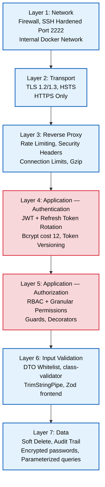
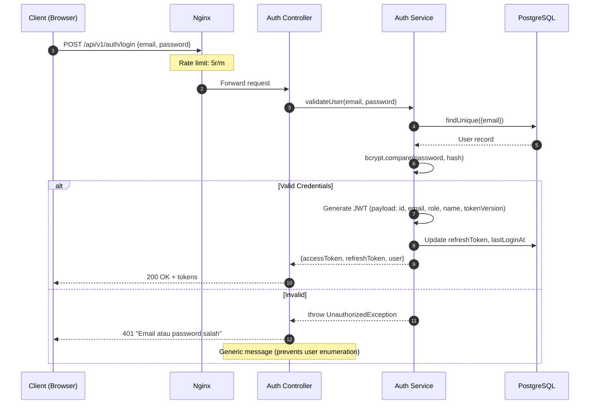
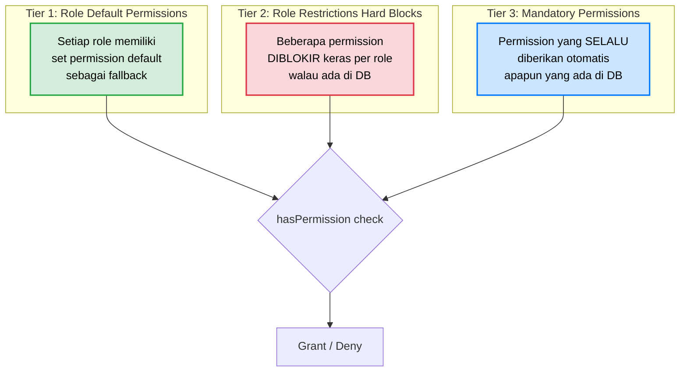

# Security & RBAC Matrix

**Versi**: 1.0
**Tanggal**: 10 April 2026
**Referensi**: PRD v3.1 (Bagian 7, NFR-03, NFR-04), SDD v3.1 (Bagian 8)
**Status**: ACTIVE

---

## 1. Security Architecture Overview

### 1.1 Defense-in-Depth Layers



### 1.2 OWASP Top 10 Compliance Matrix

| #   | Threat                             | Mitigasi yang Diterapkan                                                  | Status |
| --- | ---------------------------------- | ------------------------------------------------------------------------- | ------ |
| A01 | Broken Access Control              | RBAC Guards + 85+ granular permissions + role restrictions                | ✅     |
| A02 | Cryptographic Failures             | Bcrypt (cost 12), JWT signed, TLS 1.2/1.3, no secrets in code             | ✅     |
| A03 | Injection                          | Prisma ORM (parameterized queries), DTO whitelist, TrimStringPipe         | ✅     |
| A04 | Insecure Design                    | Threat modeling via PRD, approval workflow, audit trail                   | ✅     |
| A05 | Security Misconfiguration          | Helmet headers, CORS whitelist, Swagger disabled in prod, non-root Docker | ✅     |
| A06 | Vulnerable Components              | GitHub Dependabot, pnpm audit, LTS Node.js 22                             | ✅     |
| A07 | Authentication Failures            | Refresh token rotation, token versioning, rate limiting login (5r/m)      | ✅     |
| A08 | Software & Data Integrity Failures | CI/CD pipeline validation, Docker multi-stage builds, GHCR signed images  | ✅     |
| A09 | Logging & Monitoring Failures      | LoggingInterceptor, ActivityLog service, Prometheus metrics               | ✅     |
| A10 | Server-Side Request Forgery (SSRF) | Internal network isolation, no user-controlled URL fetching               | ✅     |

---

## 2. Authentication System

### 2.1 JWT Authentication Flow



### 2.2 JWT Payload Structure

```typescript
interface JwtPayload {
  sub: number; // user.id (primary key)
  email: string; // user email
  role: UserRole; // SUPER_ADMIN | ADMIN_LOGISTIK | ADMIN_PURCHASE | LEADER | STAFF
  name: string; // display name
  tokenVersion: number; // incremented on password reset → invalidates old tokens
  iat: number; // issued at (auto)
  exp: number; // expires at (auto, 1d production)
}
```

### 2.3 Token Security Measures

| Mekanisme                  | Deskripsi                                                              |
| -------------------------- | ---------------------------------------------------------------------- |
| **Bcrypt Cost Factor**     | 12 rounds (≈250ms per hash) — mencegah brute force                     |
| **Token Expiration**       | Access Token: 1 hari (production), Refresh Token: 7 hari               |
| **Token Versioning**       | `tokenVersion` di User model — di-increment saat password reset        |
| **Refresh Token Rotation** | Refresh token baru dikeluarkan setiap kali refresh, token lama invalid |
| **Generic Error Messages** | Login gagal selalu mengembalikan pesan generik (anti user enumeration) |
| **Rate Limiting: Login**   | 5 requests/menit per IP pada `/api/v1/auth/login`                      |
| **Must Change Password**   | Flag `mustChangePassword` memaksa user ganti password setelah reset    |

### 2.4 Session Management

| Aspek          | Implementasi                                                         |
| -------------- | -------------------------------------------------------------------- |
| Storage        | JWT di client (HttpOnly cookie / localStorage — frontend decision)   |
| Invalidation   | Token versioning — increment → semua token lama invalid              |
| Last Login     | `lastLoginAt` field diupdate setiap login sukses                     |
| Password Reset | Admin melakukan reset → `mustChangePassword = true` → tokenVersion++ |

---

## 3. Role-Based Access Control (RBAC)

### 3.1 Role Definitions

| Role               | Kode di DB       | Deskripsi                                                    | Estimasi User |
| ------------------ | ---------------- | ------------------------------------------------------------ | ------------- |
| **Superadmin**     | `SUPER_ADMIN`    | Akses penuh. Pemilik tertinggi keputusan                     | 1-2           |
| **Admin Logistik** | `ADMIN_LOGISTIK` | Mengelola aset fisik, stok, serah terima, eksekusi transaksi | 2-3           |
| **Admin Purchase** | `ADMIN_PURCHASE` | Mengelola data pembelian, depresiasi, validasi anggaran      | 1-2           |
| **Leader**         | `LEADER`         | Memimpin divisi, approve permintaan tim, monitor stok divisi | 3-5           |
| **Staff**          | `STAFF`          | Pengguna akhir. Membuat permintaan, melihat aset pribadi     | 20-50         |

### 3.2 Three-Tier Permission Model

Sistem menggunakan model permission 3 lapis yang fleksibel:



**Logika `hasPermission(role, userPermissions[], requiredPermission)`**:

```
1. Jika role === SUPER_ADMIN → GRANT (bypass semua)
2. Jika permission ada di ROLE_RESTRICTIONS[role] → DENY (hard block)
3. Jika permission ada di MANDATORY_PERMISSIONS[role] → GRANT (auto-inject)
4. Jika permission ada di userPermissions[] (dari DB) → GRANT
5. Jika permission ada di ROLE_DEFAULT_PERMISSIONS[role] → GRANT (fallback)
6. Else → DENY
```

### 3.3 Granular Permission Catalog (85+ Permissions)

#### Dashboard & Reports

| Permission         | SA  | AL  | AP  | Leader | Staff |
| ------------------ | --- | --- | --- | ------ | ----- |
| `DASHBOARD_VIEW`   | ✅  | ✅  | ✅  | ✅     | ✅    |
| `REPORTS_VIEW`     | ✅  | ✅  | ✅  | ✅     | —     |
| `DATA_EXPORT`      | ✅  | ✅  | ✅  | ✅     | —     |
| `SYSTEM_AUDIT_LOG` | ✅  | —   | —   | —      | —     |

#### Procurement (Permintaan Baru)

| Permission                  | SA  | AL  | AP  | Leader | Staff |
| --------------------------- | --- | --- | --- | ------ | ----- |
| `REQUESTS_VIEW_OWN`         | ✅  | ✅  | ✅  | ✅     | ✅    |
| `REQUESTS_VIEW_ALL`         | ✅  | ✅  | ✅  | ✅     | —     |
| `REQUESTS_CREATE`           | ✅  | ✅  | ✅  | ✅     | ✅    |
| `REQUESTS_CREATE_URGENT`    | ✅  | ✅  | ✅  | ✅     | —     |
| `REQUESTS_APPROVE_LOGISTIC` | ✅  | ✅  | —   | —      | —     |
| `REQUESTS_APPROVE_PURCHASE` | ✅  | —   | ✅  | —      | —     |
| `REQUESTS_APPROVE_FINAL`    | ✅  | —   | —   | —      | —     |
| `REQUESTS_CANCEL_OWN`       | ✅  | ✅  | ✅  | ✅     | ✅    |
| `REQUESTS_DELETE`           | ✅  | —   | —   | —      | —     |

#### Loan Management (Peminjaman)

| Permission               | SA  | AL  | AP  | Leader | Staff |
| ------------------------ | --- | --- | --- | ------ | ----- |
| `LOAN_REQUESTS_VIEW_OWN` | ✅  | ✅  | ✅  | ✅     | ✅    |
| `LOAN_REQUESTS_VIEW_ALL` | ✅  | ✅  | —   | ✅     | —     |
| `LOAN_REQUESTS_CREATE`   | ✅  | ✅  | ✅  | ✅     | ✅    |
| `LOAN_REQUESTS_APPROVE`  | ✅  | ✅  | —   | ✅     | —     |
| `LOAN_REQUESTS_RETURN`   | ✅  | ✅  | —   | —      | —     |

#### Asset Management

| Permission             | SA  | AL  | AP  | Leader | Staff |
| ---------------------- | --- | --- | --- | ------ | ----- |
| `ASSETS_VIEW`          | ✅  | ✅  | ✅  | ✅     | ✅    |
| `ASSETS_VIEW_DIVISION` | ✅  | ✅  | —   | ✅     | —     |
| `ASSETS_VIEW_PRICE`    | ✅  | —   | ✅  | —      | —     |
| `ASSETS_CREATE`        | ✅  | ✅  | —   | —      | —     |
| `ASSETS_EDIT`          | ✅  | ✅  | —   | —      | —     |
| `ASSETS_DELETE`        | ✅  | —   | —   | —      | —     |
| `ASSETS_HANDOVER`      | ✅  | ✅  | —   | —      | —     |
| `HANDOVERS_VIEW`       | ✅  | ✅  | —   | ✅     | ✅    |
| `ASSETS_REPAIR_REPORT` | ✅  | ✅  | ✅  | ✅     | ✅    |
| `ASSETS_REPAIR_MANAGE` | ✅  | ✅  | —   | —      | —     |

#### Field Operations (Instalasi, Maintenance, Dismantle)

| Permission            | SA  | AL  | AP  | Leader | Staff |
| --------------------- | --- | --- | --- | ------ | ----- |
| `ASSETS_INSTALL`      | ✅  | ✅  | —   | ✅     | ✅    |
| `INSTALLATIONS_VIEW`  | ✅  | ✅  | —   | ✅     | ✅    |
| `ASSETS_DISMANTLE`    | ✅  | ✅  | —   | ✅     | ✅    |
| `DISMANTLES_VIEW`     | ✅  | ✅  | —   | ✅     | ✅    |
| `MAINTENANCES_CREATE` | ✅  | ✅  | —   | ✅     | ✅    |
| `MAINTENANCES_VIEW`   | ✅  | ✅  | —   | ✅     | ✅    |

#### Stock & Inventory

| Permission     | SA  | AL  | AP  | Leader | Staff |
| -------------- | --- | --- | --- | ------ | ----- |
| `STOCK_VIEW`   | ✅  | ✅  | ✅  | ✅     | ✅    |
| `STOCK_MANAGE` | ✅  | ✅  | —   | —      | —     |

#### Customer Management

| Permission         | SA  | AL  | AP  | Leader | Staff |
| ------------------ | --- | --- | --- | ------ | ----- |
| `CUSTOMERS_VIEW`   | ✅  | ✅  | —   | ✅     | ✅    |
| `CUSTOMERS_CREATE` | ✅  | ✅  | —   | ✅     | ✅    |
| `CUSTOMERS_EDIT`   | ✅  | ✅  | —   | ✅     | —     |
| `CUSTOMERS_DELETE` | ✅  | —   | —   | —      | —     |

#### User & Division Management

| Permission                 | SA  | AL  | AP  | Leader | Staff |
| -------------------------- | --- | --- | --- | ------ | ----- |
| `USERS_VIEW`               | ✅  | —   | —   | —      | —     |
| `USERS_CREATE`             | ✅  | —   | —   | —      | —     |
| `USERS_EDIT`               | ✅  | —   | —   | —      | —     |
| `USERS_DELETE`             | ✅  | —   | —   | —      | —     |
| `USERS_RESET_PASSWORD`     | ✅  | —   | —   | —      | —     |
| `USERS_MANAGE_PERMISSIONS` | ✅  | —   | —   | —      | —     |
| `DIVISIONS_MANAGE`         | ✅  | —   | —   | —      | —     |
| `ACCOUNT_MANAGE`           | ✅  | ✅  | ✅  | ✅     | ✅    |

#### Categories & Projects

| Permission              | SA  | AL  | AP  | Leader | Staff |
| ----------------------- | --- | --- | --- | ------ | ----- |
| `CATEGORIES_VIEW`       | ✅  | ✅  | —   | ✅     | ✅    |
| `CATEGORIES_MANAGE`     | ✅  | ✅  | —   | —      | —     |
| `PROJECTS_VIEW`         | ✅  | ✅  | —   | ✅     | ✅    |
| `PROJECTS_CREATE`       | ✅  | ✅  | —   | ✅     | ✅    |
| `PROJECTS_EDIT`         | ✅  | ✅  | —   | ✅     | —     |
| `PROJECTS_APPROVE`      | ✅  | ✅  | —   | —      | —     |
| `PROJECTS_MANAGE_TEAM`  | ✅  | ✅  | —   | ✅     | —     |
| `PROJECTS_MANAGE_TASKS` | ✅  | ✅  | —   | ✅     | —     |

> **Legenda**: SA = Superadmin, AL = Admin Logistik, AP = Admin Purchase

### 3.4 Role Restrictions (Hard Blocks)

Permission yang **diblokir keras** meskipun ada di `user.permissions[]` di database:

| Role               | Blocked Permissions                                                                                                                                                                   |
| ------------------ | ------------------------------------------------------------------------------------------------------------------------------------------------------------------------------------- |
| **STAFF**          | `USERS_DELETE`, `USERS_MANAGE_PERMISSIONS`, `ASSETS_VIEW_PRICE`, `ASSETS_DELETE`, `REQUESTS_DELETE`, `SYSTEM_AUDIT_LOG`, `DIVISIONS_MANAGE`, `STOCK_MANAGE`, `REQUESTS_APPROVE_FINAL` |
| **LEADER**         | `USERS_DELETE`, `USERS_MANAGE_PERMISSIONS`, `ASSETS_DELETE`, `REQUESTS_DELETE`, `SYSTEM_AUDIT_LOG`, `DIVISIONS_MANAGE`                                                                |
| **ADMIN_PURCHASE** | `USERS_DELETE`, `USERS_MANAGE_PERMISSIONS`, `ASSETS_DELETE`, `SYSTEM_AUDIT_LOG`, `DIVISIONS_MANAGE`                                                                                   |
| **ADMIN_LOGISTIK** | `USERS_DELETE`, `USERS_MANAGE_PERMISSIONS`, `SYSTEM_AUDIT_LOG`, `DIVISIONS_MANAGE`                                                                                                    |

### 3.5 Mandatory Permissions (Always Granted)

Permission yang **selalu diberikan** otomatis terlepas dari konfigurasi DB:

| Role      | Mandatory Permissions                                                                                                                                                                  |
| --------- | -------------------------------------------------------------------------------------------------------------------------------------------------------------------------------------- |
| **ALL**   | `DASHBOARD_VIEW`, `ACCOUNT_MANAGE`                                                                                                                                                     |
| **STAFF** | `REQUESTS_VIEW_OWN`, `REQUESTS_CREATE`, `REQUESTS_CANCEL_OWN`, `LOAN_REQUESTS_VIEW_OWN`, `LOAN_REQUESTS_CREATE`, `ASSETS_VIEW`, `STOCK_VIEW`, `HANDOVERS_VIEW`, `ASSETS_REPAIR_REPORT` |

---

## 4. API Endpoint Security Matrix

### 4.1 Public Endpoints (No Auth Required)

| Method | Endpoint               | Deskripsi     | Rate Limit |
| ------ | ---------------------- | ------------- | ---------- |
| POST   | `/api/v1/auth/login`   | Login         | 5r/m       |
| POST   | `/api/v1/auth/refresh` | Refresh token | 30r/s      |
| GET    | `/api/v1/health`       | Health check  | 30r/s      |

### 4.2 Protected Endpoints Pattern

Semua endpoint non-public dilindungi oleh composite decorator:

```typescript
// Role-based (legacy, jarang digunakan)
@Auth('SUPER_ADMIN', 'ADMIN_LOGISTIK')

// Permission-based (standar — digunakan pada 50+ endpoint)
@AuthPermissions(PERMISSIONS.ASSETS_CREATE)
```

### 4.3 Endpoint → Permission Mapping (by Controller)

| Module            | Endpoint Pattern                  | Permission Required            |
| ----------------- | --------------------------------- | ------------------------------ |
| **Assets**        | `GET /assets`                     | `ASSETS_VIEW`                  |
|                   | `POST /assets`                    | `ASSETS_CREATE`                |
|                   | `POST /assets/bulk`               | `ASSETS_CREATE`                |
|                   | `PATCH /assets/:id`               | `ASSETS_EDIT`                  |
|                   | `DELETE /assets/:id`              | `ASSETS_DELETE`                |
| **Requests**      | `GET /requests`                   | `REQUESTS_VIEW_ALL`            |
|                   | `GET /requests/mine`              | `REQUESTS_VIEW_OWN`            |
|                   | `POST /requests`                  | `REQUESTS_CREATE`              |
|                   | `POST /requests/:id/approve`      | `REQUESTS_APPROVE_*` (dynamic) |
| **Loans**         | `GET /loan-requests`              | `LOAN_REQUESTS_VIEW_ALL`       |
|                   | `POST /loan-requests`             | `LOAN_REQUESTS_CREATE`         |
|                   | `POST /loan-requests/:id/approve` | `LOAN_REQUESTS_APPROVE`        |
|                   | `POST /loan-requests/:id/return`  | `LOAN_REQUESTS_RETURN`         |
| **Handovers**     | `GET /handovers`                  | `HANDOVERS_VIEW`               |
|                   | `POST /handovers`                 | `ASSETS_HANDOVER`              |
| **Customers**     | `GET /customers`                  | `CUSTOMERS_VIEW`               |
|                   | `POST /customers`                 | `CUSTOMERS_CREATE`             |
|                   | `PATCH /customers/:id`            | `CUSTOMERS_EDIT`               |
|                   | `DELETE /customers/:id`           | `CUSTOMERS_DELETE`             |
| **Stock**         | `GET /stock`                      | `STOCK_VIEW`                   |
|                   | `POST /stock/threshold`           | `STOCK_MANAGE`                 |
| **Projects**      | `GET /projects`                   | `PROJECTS_VIEW`                |
|                   | `POST /projects`                  | `PROJECTS_CREATE`              |
|                   | `POST /projects/:id/approve`      | `PROJECTS_APPROVE`             |
| **Users**         | `GET /users`                      | `USERS_VIEW`                   |
|                   | `POST /users`                     | `USERS_CREATE`                 |
|                   | `POST /users/:id/reset-password`  | `USERS_RESET_PASSWORD`         |
|                   | `PATCH /users/:id/permissions`    | `USERS_MANAGE_PERMISSIONS`     |
| **Activity Logs** | `GET /activity-logs`              | `SYSTEM_AUDIT_LOG`             |
| **Categories**    | `GET /categories`                 | `CATEGORIES_VIEW`              |
|                   | `POST /categories`                | `CATEGORIES_MANAGE`            |

---

## 5. Approval Workflow Security

### 5.1 Workflow Rules (Dari PRD 6.3)

| Aturan                       | Implementasi                                                          |
| ---------------------------- | --------------------------------------------------------------------- |
| Creator ≠ Approver           | Service validates `request.creatorId !== approverId`                  |
| Sequential approval          | Status machine — next approver unlocked hanya setelah current approve |
| Reject stops chain           | Satu rejection → status `REJECTED`, notifikasi ke creator             |
| CC (Mengetahui) non-blocking | Superadmin menerima notifikasi informasional                          |

### 5.2 Approval Chain per Workflow

Lihat PRD 6.3.2 untuk matriks lengkap. Ringkasan:

| Workflow             | Max Approval Layers | Modul                                               |
| -------------------- | ------------------- | --------------------------------------------------- |
| **WF1: Pengadaan**   | 4 layers            | Permintaan Baru                                     |
| **WF2: Operasional** | 2 layers + CC       | Peminjaman, Pengembalian, Serah Terima, Lapor Rusak |
| **WF3: Field Ops**   | 2 layers + CC       | Proyek, Instalasi, Maintenance, Dismantle           |

---

## 6. Infrastructure Security

### 6.1 Network Security

| Kontrol                  | Konfigurasi                                            |
| ------------------------ | ------------------------------------------------------ |
| Docker Network Isolation | `trinity-net` — semua container dalam network internal |
| Database Port            | 5432 — **TIDAK** di-expose ke public                   |
| Redis Port               | 6379 — **TIDAK** di-expose ke public                   |
| SSH Hardened Port        | Port 2222 (bukan default 22)                           |
| Firewall Ports           | Hanya 80, 443, dan 2222 terbuka ke public              |

### 6.2 HTTP Security Headers (Nginx)

| Header                      | Value                                      |
| --------------------------- | ------------------------------------------ |
| `Strict-Transport-Security` | `max-age=31536000; includeSubDomains`      |
| `X-Frame-Options`           | `SAMEORIGIN`                               |
| `X-Content-Type-Options`    | `nosniff`                                  |
| `X-XSS-Protection`          | `1; mode=block`                            |
| `Referrer-Policy`           | `strict-origin-when-cross-origin`          |
| `Content-Security-Policy`   | Configured per production requirements     |
| `Permissions-Policy`        | Restricted geolocation, camera, microphone |

### 6.3 Application Security (NestJS)

| Kontrol              | Implementasi                                          |
| -------------------- | ----------------------------------------------------- |
| **Helmet**           | CSP di production, COEP disabled                      |
| **CORS**             | Whitelist specific origins, credentials: true         |
| **Rate Limiting**    | ThrottlerGuard global: 100 req/60s per IP             |
| **Input Validation** | ValidationPipe: whitelist, forbidNonWhitelisted, trim |
| **Request Timeout**  | 30 seconds (TimeoutInterceptor)                       |
| **Compression**      | Response compression via `compression` middleware     |
| **API Versioning**   | URI-based: `/api/v1/...`                              |

### 6.4 Docker Security

| Kontrol              | Implementasi                                       |
| -------------------- | -------------------------------------------------- |
| Non-root user        | Backend runs as `trinity:trinity` (UID 1001)       |
| Minimal base image   | `node:22-alpine`, `nginx:1.27-alpine`              |
| Multi-stage build    | Build dependencies tidak masuk ke production image |
| Read-only filesystem | Hanya `/app/uploads` yang writable                 |
| Memory limits        | Per-container: DB 512MB, Redis 256MB, BE 1GB       |
| Health checks        | Docker-level health checks per container           |
| No privileged mode   | Semua container tanpa `--privileged`               |

---

## 7. Data Protection

### 7.1 Sensitive Data Handling

| Data                 | Storage                   | Enkripsi             | Access                |
| -------------------- | ------------------------- | -------------------- | --------------------- |
| Password             | `User.password`           | Bcrypt (cost 12)     | Never returned in API |
| Refresh Token        | `User.refreshToken`       | Hashed in DB         | Auth service only     |
| JWT Secret           | Environment variable      | Not stored in code   | Backend process only  |
| Password Reset Token | `User.passwordResetToken` | Hashed, time-limited | Auth service only     |

### 7.2 Audit Trail

Setiap aksi signifikan dicatat dalam `ActivityLog`:

| Field        | Deskripsi                                                                |
| ------------ | ------------------------------------------------------------------------ |
| `userId`     | ID pengguna yang melakukan aksi                                          |
| `userName`   | Nama pengguna (denormalized untuk speed)                                 |
| `action`     | Tipe aksi (CREATE, UPDATE, DELETE, APPROVE, REJECT, LOGIN, LOGOUT, etc.) |
| `details`    | JSON detail perubahan (before/after)                                     |
| `timestamp`  | Waktu aksi                                                               |
| `assetId`    | FK ke aset terkait (opsional)                                            |
| `customerId` | FK ke pelanggan terkait (opsional)                                       |
| `requestId`  | FK ke transaksi terkait (opsional)                                       |

### 7.3 Soft Delete Policy

Sesuai BR-01 (PRD 6.2): Aset dengan riwayat transaksi tidak boleh di-hard delete. Prisma soft delete extension mengintercept operasi `delete` dan mengubahnya menjadi status update (`DISPOSED` / `ARCHIVED`).

---

## 8. Concurrency Control — Optimistic Locking

### 8.1 Implementasi

Semua entitas transaksional menggunakan **Optimistic Locking** via kolom `version Int @default(1)` di database. Setiap mutation menggunakan `updateMany()` dengan version check:

```typescript
const { count } = await this.prisma.entity.updateMany({
  where: { id, version },
  data: { status: nextStatus, version: { increment: 1 } },
});
if (count === 0) {
  throw new ConflictException('Data telah diubah oleh pengguna lain.');
}
```

### 8.2 Coverage Matrix

| Entitas      | `version` Field | Optimistic Lock | SSE Event | Status |
| ------------ | --------------- | --------------- | --------- | ------ |
| Request      | ✅              | ✅              | ✅        | ✅     |
| LoanRequest  | ✅              | ✅              | ✅        | ✅     |
| AssetReturn  | ✅              | ✅              | ✅        | ✅     |
| Handover     | ✅              | ✅              | ✅        | ✅     |
| Repair       | ✅              | ✅              | ✅        | ✅     |
| InfraProject | ✅              | ✅              | ✅        | ✅     |
| Asset        | ✅              | ✅              | —         | ✅     |

### 8.3 Frontend Handling

- **Axios interceptor** menangkap HTTP 409 → toast dengan action "Muat Ulang"
- **Semua mutation hooks** mengirim `version` dari state entity yang sedang ditampilkan
- **SSE stream** (`/api/v1/events/stream`) meng-update UI secara real-time saat entitas berubah

### 8.4 Permission-Based UI

Frontend menggunakan `usePermissions()` hook untuk menampilkan/menyembunyikan action buttons:

| Page           | Permission Check                                       |
| -------------- | ------------------------------------------------------ |
| LoanDetail     | `LOAN_REQUESTS_APPROVE`, `LOAN_REQUESTS_CREATE`        |
| RequestDetail  | `REQUESTS_APPROVE_*`, `REQUESTS_CANCEL_OWN`            |
| ReturnDetail   | `RETURNS_APPROVE`                                      |
| HandoverDetail | `ASSETS_HANDOVER`                                      |
| RepairDetail   | `ASSETS_REPAIR_MANAGE`, `ASSETS_REPAIR_REPORT`         |
| ProjectDetail  | `PROJECTS_APPROVE`, `PROJECTS_CREATE`, `PROJECTS_EDIT` |
| AssetDetail    | `ASSETS_EDIT`, `ASSETS_DELETE`                         |
