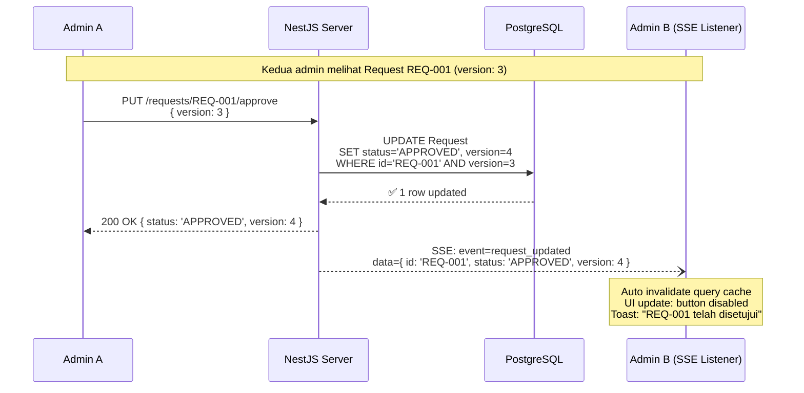
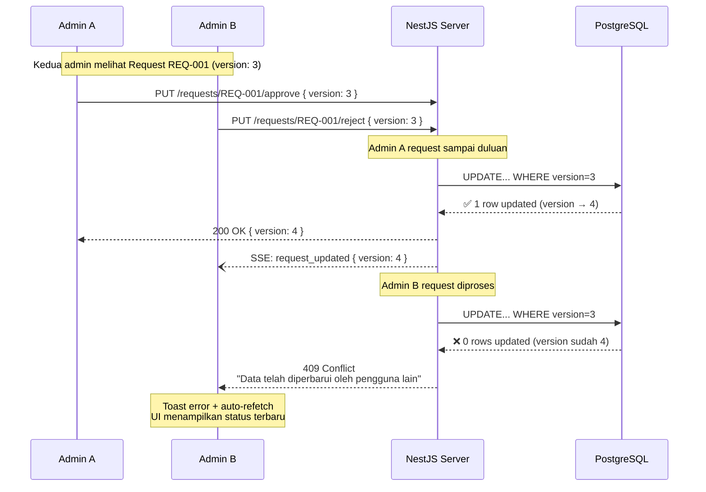
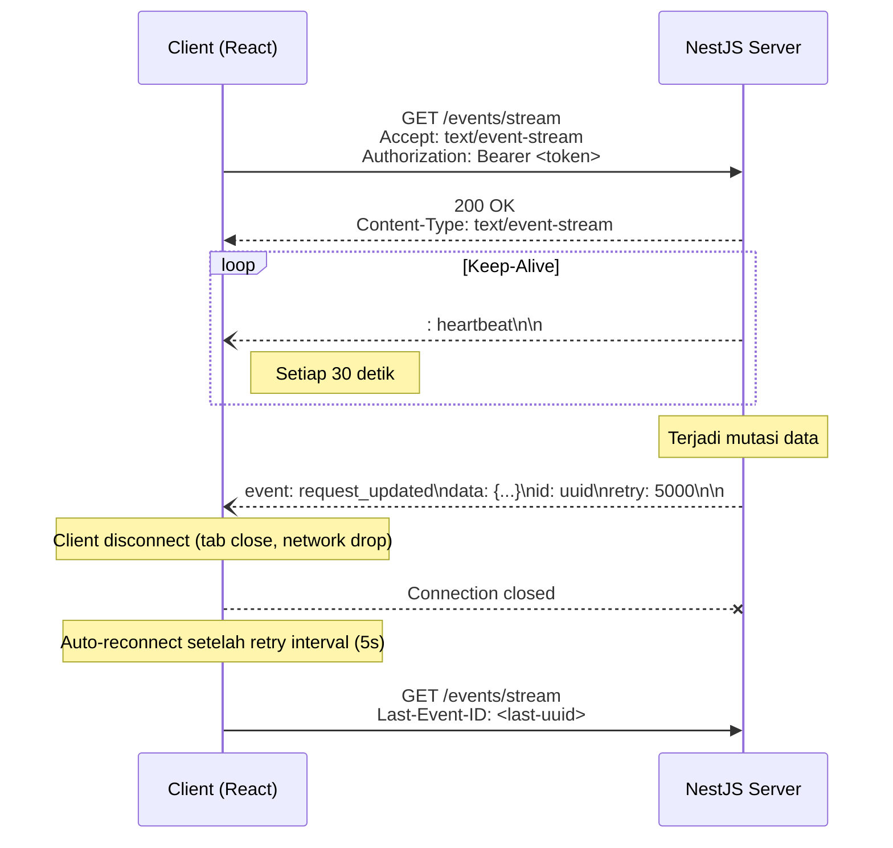

# Auto Sinkronisasi Data — Implementation Plan

**Fitur**: Real-time Data Synchronization antar Admin  
**Teknologi**: Server-Sent Events (SSE) + Optimistic Locking  
**Status**: Planned  
**Tanggal**: 12 April 2026

---

## Daftar Isi

- [1. Latar Belakang & Masalah](#1-latar-belakang--masalah)
- [2. Solusi Arsitektural](#2-solusi-arsitektural)
- [3. Dokumen yang Harus Diperbarui](#3-dokumen-yang-harus-diperbarui)
- [4. Detail Teknis — Backend (NestJS)](#4-detail-teknis--backend-nestjs)
- [5. Detail Teknis — Frontend (React)](#5-detail-teknis--frontend-react)
- [6. Detail Teknis — Database (Prisma)](#6-detail-teknis--database-prisma)
- [7. Sequence Diagram](#7-sequence-diagram)
- [8. Error Handling & Edge Cases](#8-error-handling--edge-cases)
- [9. UX Scenarios](#9-ux-scenarios)
- [10. Testing Plan](#10-testing-plan)
- [11. Checklist Implementasi](#11-checklist-implementasi)

---

## 1. Latar Belakang & Masalah

### Problem Statement

Dalam sistem multi-admin, terdapat potensi **Race Condition** saat dua admin memproses aksi pada entitas yang sama secara bersamaan. Contoh kasus:

| Skenario           | Admin A                 | Admin B                                    | Masalah                                              |
| ------------------ | ----------------------- | ------------------------------------------ | ---------------------------------------------------- |
| **Approval Ganda** | Approve Request REQ-001 | Approve Request REQ-001 (detik berikutnya) | Request di-approve 2x, data inkonsisten              |
| **Edit Konflik**   | Edit asset detail       | Edit asset yang sama                       | Perubahan salah satu admin tertimpa                  |
| **Status Stale**   | Reject loan request     | Masih melihat tombol Approve (data lama)   | Admin B mengambil keputusan berdasarkan data expired |
| **Handover Race**  | Assign asset ke User X  | Assign asset sama ke User Y                | Aset ditugaskan ke 2 user                            |

### Dampak Tanpa Solusi

- Data inventaris tidak konsisten → laporan salah
- Approval workflow rusak → aset terkirim ganda
- User experience buruk → admin tidak tahu data sudah berubah
- Audit trail membingungkan → siapa yang benar-benar approve?

---

## 2. Solusi Arsitektural

### Keputusan: SSE + Optimistic Locking

| Aspek                   | Pilihan                             | Alasan                                                                                                           |
| ----------------------- | ----------------------------------- | ---------------------------------------------------------------------------------------------------------------- |
| **Real-time Update**    | Server-Sent Events (SSE)            | Satu arah (server→client), hemat resource, ramah proxy/WAF, native browser support, tidak perlu library tambahan |
| **Concurrency Control** | Optimistic Locking (version column) | Tidak blocking, performa tinggi, cocok untuk read-heavy inventory system                                         |
| **Alternatif Ditolak**  | WebSocket                           | Overkill untuk notifikasi satu arah, kompleksitas reconnect, masalah dengan beberapa WAF/proxy                   |
| **Alternatif Ditolak**  | Polling                             | Boros bandwidth, delay tidak real-time, beban server tinggi                                                      |
| **Alternatif Ditolak**  | Pessimistic Locking                 | Blocking, deadlock risk, tidak scalable untuk multi-admin                                                        |

### Arsitektur High-Level

```
Admin A (Browser)                    NestJS Backend                    Admin B (Browser)
    │                                     │                                  │
    │  PUT /requests/:id/approve          │                                  │
    │  { version: 3 }                     │                                  │
    │ ──────────────────────────────────> │                                  │
    │                                     │  1. Check version == 3 ✓         │
    │                                     │  2. Update status + version=4    │
    │                                     │  3. Emit SSE event               │
    │  200 OK { version: 4 }              │                                  │
    │ <────────────────────────────────── │                                  │
    │                                     │                                  │
    │                                     │  SSE: request_updated            │
    │                                     │  { id, status, version: 4 }      │
    │                                     │ ─────────────────────────────────>│
    │                                     │                                  │
    │                                     │                    UI auto-update │
    │                                     │                    Button disabled│
    │                                     │                    Toast: "Telah  │
    │                                     │                    disetujui"     │
```

---

## 3. Dokumen yang Harus Diperbarui

Setelah implementasi fitur ini, dokumen-dokumen berikut **WAJIB** diperbarui:

### 3.1. TECH_STACK_AND_ADR.md (Prioritas Utama)

Tambahkan ADR baru:

- **Judul**: ADR — Penanganan Konkurensi & Sinkronisasi Real-time pada Aksi Admin
- **Konteks**: Potensi Race Condition saat dua admin memproses Request/Loan/Handover yang sama
- **Keputusan**: SSE untuk real-time UI update + Optimistic Locking (kolom `version`) di database
- **Konsekuensi**: Frontend harus handle HTTP 409 Conflict, tidak perlu WebSocket library

### 3.2. API_CONTRACT.md

- **Endpoint SSE baru**: `GET /api/v1/events/stream` — text/event-stream
- **Update endpoint mutasi**: Semua endpoint approval/reject/update wajib menerima `version` di payload
- **Response 409**: Dokumentasikan format error Conflict

### 3.3. ERROR_HANDLING.md

- **HTTP 409 Conflict**: Standarisasi handling — frontend menampilkan toast ramah, auto-refetch data
- **Error message**: "Mohon maaf, data ini baru saja diperbarui oleh pengguna lain. Memuat ulang data..."

### 3.4. SDD.md (System Design Document)

- **Database Schema**: Tambahkan kolom `version` (Int, default 1) pada tabel yang mendukung optimistic locking
- **Sequence Diagram**: Tambahkan flow server cek versi → update versi (+1) → trigger SSE

### 3.5. USER_SYSTEM_FLOW.md & UIUX_DESIGN_DOCUMENT.md

- **UX Scenario**: Apa yang terjadi secara visual pada Admin B ketika Admin A approve/reject/update
- **State Transitions**: Perubahan UI otomatis tanpa manual refresh

---

## 4. Detail Teknis — Backend (NestJS)

### 4.1. SSE Module Structure

```
src/core/events/
├── events.module.ts            # EventsModule
├── events.controller.ts        # SSE endpoint controller
├── events.service.ts           # Event emitter service (singleton)
├── events.gateway.ts           # Event type definitions
└── dto/
    └── event-payload.dto.ts    # Typed event payloads
```

### 4.2. Events Service (Singleton)

NestJS native SSE menggunakan `Observable` dari RxJS. Service ini menjadi pusat broadcasting event ke semua connected clients.

```typescript
// Konsep — events.service.ts
@Injectable()
export class EventsService {
  private readonly subjects = new Map<string, Subject<SseEvent>>();

  /**
   * Subscribe ke channel tertentu (per user atau global)
   */
  subscribe(channel: string): Observable<SseEvent> {
    if (!this.subjects.has(channel)) {
      this.subjects.set(channel, new Subject<SseEvent>());
    }
    return this.subjects.get(channel)!.asObservable();
  }

  /**
   * Emit event ke channel
   */
  emit(channel: string, event: SseEvent): void {
    const subject = this.subjects.get(channel);
    if (subject) {
      subject.next(event);
    }
  }

  /**
   * Broadcast ke semua active channels
   */
  broadcast(event: SseEvent): void {
    this.subjects.forEach((subject) => subject.next(event));
  }

  /**
   * Cleanup saat client disconnect
   */
  removeChannel(channel: string): void {
    const subject = this.subjects.get(channel);
    if (subject) {
      subject.complete();
      this.subjects.delete(channel);
    }
  }
}
```

### 4.3. SSE Controller Endpoint

```typescript
// Konsep — events.controller.ts
@Controller('events')
export class EventsController {
  constructor(private readonly eventsService: EventsService) {}

  @Sse('stream')
  @UseGuards(JwtAuthGuard)
  stream(@CurrentUser() user: UserPayload): Observable<MessageEvent> {
    const channel = `user:${user.sub}`;

    return merge(
      // Channel personal (per-user events)
      this.eventsService.subscribe(channel),
      // Channel global (broadcast events)
      this.eventsService.subscribe('global'),
    ).pipe(
      map((event) => ({
        type: event.type,
        data: JSON.stringify(event.payload),
        id: event.id,
        retry: 5000,
      })),
    );
  }
}
```

### 4.4. Integrasi dengan Service Layer

Setiap service yang melakukan mutasi (approve, reject, update) harus emit event setelah operasi berhasil:

```typescript
// Konsep — di dalam request.service.ts
async approve(id: string, userId: string, version: number): Promise<Request> {
  // 1. Optimistic Lock Check + Update (atomic)
  const updated = await this.prisma.request.update({
    where: { id, version }, // WHERE id = ? AND version = ?
    data: {
      status: 'APPROVED',
      approvedById: userId,
      approvedAt: new Date(),
      version: { increment: 1 },  // version + 1
    },
  });
  // Prisma throws jika WHERE tidak match (P2025: Record not found)

  // 2. Emit SSE event ke semua connected admin
  this.eventsService.broadcast({
    type: 'request_updated',
    id: randomUUID(),
    payload: {
      entityId: updated.id,
      entityType: 'Request',
      action: 'APPROVED',
      code: updated.code,
      version: updated.version,
      updatedBy: userId,
      timestamp: new Date().toISOString(),
    },
  });

  return updated;
}
```

### 4.5. Event Types

```typescript
// events.gateway.ts
export interface SseEvent {
  type: SseEventType;
  id: string;
  payload: Record<string, unknown>;
}

export type SseEventType =
  // Transaction events
  | 'request_updated'
  | 'loan_updated'
  | 'return_updated'
  | 'handover_updated'
  | 'repair_updated'
  // Asset events
  | 'asset_updated'
  | 'asset_registered'
  // Notification events
  | 'notification_new'
  // Generic
  | 'data_changed';
```

---

## 5. Detail Teknis — Frontend (React)

### 5.1. SSE Hook Structure

```
src/hooks/
├── use-sse.ts                  # Core SSE connection hook
└── use-sse-sync.ts             # Integration dengan TanStack Query
```

### 5.2. Core SSE Hook

```typescript
// Konsep — use-sse.ts
export function useSSE(url: string, options?: UseSSEOptions) {
  const [isConnected, setIsConnected] = useState(false);
  const eventSourceRef = useRef<EventSource | null>(null);

  useEffect(() => {
    const token = useAuthStore.getState().accessToken;
    // SSE tidak support custom headers, gunakan query param atau cookie
    const eventSource = new EventSource(`${url}?token=${token}`);

    eventSource.onopen = () => setIsConnected(true);

    eventSource.onerror = () => {
      setIsConnected(false);
      // Auto-reconnect sudah built-in di EventSource
      // retry interval dikontrol oleh server (retry: 5000)
    };

    // Listen to specific event types
    options?.eventTypes?.forEach((type) => {
      eventSource.addEventListener(type, (event) => {
        const data = JSON.parse(event.data);
        options?.onEvent?.(type, data);
      });
    });

    eventSourceRef.current = eventSource;

    return () => {
      eventSource.close();
      setIsConnected(false);
    };
  }, [url]);

  return { isConnected };
}
```

### 5.3. Integrasi TanStack Query

SSE event memicu **invalidation** pada query cache, sehingga data otomatis di-refetch:

```typescript
// Konsep — use-sse-sync.ts
export function useSSESync() {
  const queryClient = useQueryClient();

  useSSE(`${API_URL}/events/stream`, {
    eventTypes: [
      'request_updated',
      'loan_updated',
      'return_updated',
      'handover_updated',
      'repair_updated',
      'asset_updated',
      'asset_registered',
      'notification_new',
    ],
    onEvent: (type, payload) => {
      // Invalidate relevant queries berdasarkan event type
      switch (type) {
        case 'request_updated':
          queryClient.invalidateQueries({ queryKey: ['requests'] });
          queryClient.invalidateQueries({ queryKey: ['request', payload.entityId] });
          break;

        case 'loan_updated':
          queryClient.invalidateQueries({ queryKey: ['loans'] });
          break;

        case 'asset_updated':
        case 'asset_registered':
          queryClient.invalidateQueries({ queryKey: ['assets'] });
          break;

        case 'notification_new':
          queryClient.invalidateQueries({ queryKey: ['notifications'] });
          break;

        default:
          // Generic: invalidate semua queries
          queryClient.invalidateQueries();
      }

      // Toast notification untuk user awareness
      if (payload.action) {
        toast.info(`Data ${payload.entityType} telah diperbarui`, {
          description: `${payload.code} — ${payload.action}`,
        });
      }
    },
  });
}
```

### 5.4. Pengiriman Version pada Mutasi

Setiap form yang melakukan approval/update harus mengirimkan `version` saat ini:

```typescript
// Konsep — di approval handler
const approveMutation = useMutation({
  mutationFn: (data: { id: string; version: number }) =>
    api.put(`/requests/${data.id}/approve`, { version: data.version }),

  onError: (error) => {
    if (error.response?.status === 409) {
      // Conflict — data sudah berubah
      toast.error('Data telah diperbarui oleh pengguna lain', {
        description: 'Memuat ulang data terbaru...',
      });
      // Refetch data terbaru
      queryClient.invalidateQueries({ queryKey: ['request', id] });
    }
  },
});
```

---

## 6. Detail Teknis — Database (Prisma)

### 6.1. Kolom Version untuk Optimistic Locking

Tambahkan kolom `version` pada semua tabel yang mendukung operasi konkuren:

```prisma
// Tabel yang perlu kolom version:
model Request {
  // ... existing fields
  version  Int  @default(1)  // Optimistic Locking
}

model LoanRequest {
  // ... existing fields
  version  Int  @default(1)
}

model AssetReturn {
  // ... existing fields
  version  Int  @default(1)
}

model Handover {
  // ... existing fields
  version  Int  @default(1)
}

model Repair {
  // ... existing fields
  version  Int  @default(1)
}

model Asset {
  // ... existing fields
  version  Int  @default(1)
}
```

### 6.2. Migration

```bash
# Generate migration
cd apps/backend
pnpm prisma migrate dev --name add_optimistic_locking_version

# Hasilnya:
# ALTER TABLE "Request" ADD COLUMN "version" INTEGER NOT NULL DEFAULT 1;
# ALTER TABLE "LoanRequest" ADD COLUMN "version" INTEGER NOT NULL DEFAULT 1;
# ... (untuk semua tabel di atas)
```

### 6.3. Query Pattern — Atomic Check & Update

```typescript
// Prisma otomatis throw error jika WHERE tidak cocok
try {
  const result = await this.prisma.request.update({
    where: {
      id: requestId,
      version: expectedVersion, // Optimistic lock check
    },
    data: {
      status: 'APPROVED',
      version: { increment: 1 },
    },
  });
  return result;
} catch (error) {
  if (error.code === 'P2025') {
    // Record not found = version mismatch (sudah diubah user lain)
    throw new ConflictException(
      'Data telah diperbarui oleh pengguna lain. Silakan muat ulang dan coba lagi.',
    );
  }
  throw error;
}
```

---

## 7. Sequence Diagram

### 7.1. Normal Flow — Approval Berhasil



### 7.2. Conflict Flow — Race Condition Tertangkap



### 7.3. SSE Connection Lifecycle



---

## 8. Error Handling & Edge Cases

### 8.1. HTTP 409 Conflict Response Format

```json
{
  "success": false,
  "error": {
    "statusCode": 409,
    "error": "Conflict",
    "message": "Data telah diperbarui oleh pengguna lain. Silakan muat ulang dan coba lagi.",
    "details": {
      "entityType": "Request",
      "entityId": "REQ-001",
      "currentVersion": 4,
      "requestedVersion": 3
    }
  }
}
```

### 8.2. Edge Cases

| Case                              | Handling                                                                                                             |
| --------------------------------- | -------------------------------------------------------------------------------------------------------------------- |
| **SSE connection drop**           | `EventSource` auto-reconnect (built-in browser behavior, retry: 5000ms)                                              |
| **Token expired saat SSE**        | Server close stream → client reconnect → redirect ke login jika refresh gagal                                        |
| **Server restart**                | Semua SSE connections terputus → clients auto-reconnect → initial data fetch                                         |
| **Rapid sequential updates**      | Tiap update increment version, Prisma atomic operation menjamin konsistensi                                          |
| **Admin offline, kembali online** | SSE reconnect → `Last-Event-ID` header → server kirim missed events (jika di-buffer), atau client refetch semua data |
| **Multiple browser tabs**         | Setiap tab punya SSE connection sendiri, pertimbangkan `BroadcastChannel` API untuk sharing                          |
| **Concurrent edit form**          | Kirim version saat submit, bukan saat form dibuka — mencegah stale version                                           |

### 8.3. Heartbeat Mechanism

Server mengirim komentar heartbeat setiap 30 detik untuk menjaga koneksi tetap hidup:

```
: heartbeat\n\n
```

Ini mencegah proxy/load balancer menutup idle connections.

---

## 9. UX Scenarios

### 9.1. Admin B Melihat Approval oleh Admin A

**Sebelum** (tanpa SSE):

- Admin B masih melihat tombol "Approve" dan "Reject" aktif
- Admin B klik Approve → error 500 atau data aneh

**Sesudah** (dengan SSE):

```
┌─────────────────────────────────────────────────────┐
│  REQ-001 — Permintaan Laptop Divisi IT              │
│                                                     │
│  Status: ██████ DISETUJUI                           │
│  Disetujui oleh: Admin A · 12 Apr 2026, 14:32      │
│                                                     │
│  ┌──────────────────┐                               │
│  │  Telah Disetujui │  ← tombol disabled, abu-abu   │
│  └──────────────────┘                               │
│                                                     │
│  💬 Toast: "REQ-001 telah disetujui oleh Admin A"   │
└─────────────────────────────────────────────────────┘
```

### 9.2. Admin B Mencoba Approve Setelah Data Berubah

```
┌──────────────────────────────────────────────────────┐
│  ⚠️ Konflik Data                                     │
│                                                      │
│  "Mohon maaf, permintaan ini baru saja diproses      │
│   oleh Admin lain. Memuat ulang data..."             │
│                                                      │
│  ┌───────────┐                                       │
│  │  Tutup    │                                       │
│  └───────────┘                                       │
│                                                      │
│  → Auto-refetch data dalam 1 detik                   │
└──────────────────────────────────────────────────────┘
```

### 9.3. SSE Connection Indicator

```
┌─ Header ──────────────────────────────────────────┐
│  Trinity Inventory    🟢 Real-time   Admin A  ▾   │
│                       ↑                           │
│                       └── Hijau = connected       │
│                           Kuning = reconnecting   │
│                           Merah = disconnected    │
└───────────────────────────────────────────────────┘
```

### 9.4. Perubahan UI Otomatis pada Tabel

Ketika SSE event diterima, baris di tabel yang berubah mendapat highlight sementara:

```
┌─────────┬──────────────────┬────────────┬──────────┐
│  Kode   │  Judul           │  Status    │  Aksi    │
├─────────┼──────────────────┼────────────┼──────────┤
│ REQ-001 │ Laptop IT        │ ██ APPROVED│ [Detail] │ ← flash highlight 2 detik
│ REQ-002 │ Monitor Finance  │ ○ PENDING  │ [✓] [✗]  │
│ REQ-003 │ Keyboard HR      │ ○ PENDING  │ [✓] [✗]  │
└─────────┴──────────────────┴────────────┴──────────┘
```

---

## 10. Testing Plan

### 10.1. Unit Tests — Backend

| Test                                 | Deskripsi                               |
| ------------------------------------ | --------------------------------------- |
| `EventsService.subscribe()`          | Membuat channel dan return observable   |
| `EventsService.emit()`               | Mengirim event ke subscriber yang benar |
| `EventsService.broadcast()`          | Mengirim ke semua subscriber            |
| `EventsService.removeChannel()`      | Cleanup saat disconnect                 |
| `Optimistic Lock — version match`    | Update berhasil, version increment      |
| `Optimistic Lock — version mismatch` | Throw ConflictException (409)           |

### 10.2. Unit Tests — Frontend

| Test                      | Deskripsi                                    |
| ------------------------- | -------------------------------------------- |
| `useSSE` — connect        | EventSource dibuat dengan URL yang benar     |
| `useSSE` — disconnect     | EventSource.close() dipanggil saat unmount   |
| `useSSE` — event handling | Callback dipanggil dengan data yang benar    |
| `409 Conflict handling`   | Toast error ditampilkan, query di-invalidate |

### 10.3. Integration Tests

| Test                    | Deskripsi                                              |
| ----------------------- | ------------------------------------------------------ |
| **SSE connection auth** | Hanya user terautentikasi yang bisa connect            |
| **End-to-end approval** | Approve request → SSE event → UI update di client lain |
| **Conflict resolution** | 2 concurrent approve → 1 berhasil, 1 mendapat 409      |
| **Reconnect**           | Drop connection → auto-reconnect → data consistent     |

### 10.4. Manual UAT Checklist

- [ ] Admin A approve request → Admin B melihat perubahan real-time
- [ ] Admin A dan B approve bersamaan → satu mendapat error konflik yang ramah
- [ ] Network drop → reconnect → indicator berubah hijau kembali
- [ ] Close tab → reopen → SSE connect otomatis → data terbaru
- [ ] 5+ admin concurrent → semua menerima SSE events

---

## 11. Checklist Implementasi

### Phase 1: Database & Backend Foundation

- [x] Migration: Tambah kolom `version` pada 6 tabel (Request, LoanRequest, AssetReturn, Handover, Repair, Asset)
- [x] `EventsModule` — Module registration
- [x] `EventsService` — Subject-based event emitter
- [x] `EventsController` — SSE endpoint `GET /events/stream`
- [x] Event type definitions dan DTO
- [x] Heartbeat mechanism (30s interval)

### Phase 2: Service Integration

- [x] `RequestService.approve/reject` — Optimistic lock + emit SSE
- [x] `LoanService.approve/reject/issue` — Optimistic lock + emit SSE
- [x] `AssetReturnService.approve/reject/execute/cancel` — Optimistic lock + emit SSE
- [x] `HandoverService.approve/reject/execute` — Optimistic lock + emit SSE
- [x] `RepairService.approve/reject/execute/complete/cancel` — Optimistic lock + emit SSE
- [ ] `AssetService.update/register` — Optimistic lock + emit SSE
- [x] `ConflictException` handler — Format response 409

### Phase 3: Frontend Integration

- [x] `useSSE` hook — Core SSE connection management + TanStack Query invalidation
- [x] SSE connection di `AppLayout` level
- [ ] Connection status indicator di header
- [x] 409 Conflict handling di axios interceptor (global)
- [x] Version tracking di form submission (semua transaction API)
- [ ] Toast notification pada SSE events

### Phase 4: UX Polish

- [ ] Table row highlight pada perubahan real-time
- [ ] Button state transition (active → disabled) saat data berubah
- [ ] Reconnection indicator (hijau/kuning/merah)
- [x] Conflict modal/toast yang informatif (via axios interceptor)
- [ ] Loading state saat refetch setelah SSE event

### Phase 5: Testing & Documentation

- [ ] Unit tests — EventsService
- [ ] Unit tests — useSSE hook
- [ ] Integration tests — SSE + approval flow
- [ ] Manual UAT — Semua skenario di section 10.4
- [ ] Update API_CONTRACT.md — SSE endpoint
- [ ] Update ERROR_HANDLING.md — 409 Conflict
- [ ] Update TECH_STACK_AND_ADR.md — ADR entry
- [ ] Update SDD.md — Schema & sequence diagram
- [x] Update changelog

---

## Referensi

- [NestJS SSE Documentation](https://docs.nestjs.com/techniques/server-sent-events)
- [MDN EventSource API](https://developer.mozilla.org/en-US/docs/Web/API/EventSource)
- [Prisma Optimistic Concurrency Control](https://www.prisma.io/docs/guides/performance-and-optimization/prisma-client-transactions-guide#optimistic-concurrency-control)
- [SSE_PLAN (Original)](./SSE_PLAN) — Dokumen perencanaan awal

---

_Dokumen ini adalah referensi implementasi fitur Auto Sinkronisasi Data. Untuk perubahan atau pertanyaan, lihat [Changelog](../changelog/ReadMe.md) atau buat issue._
