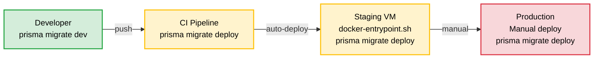

# Database Migration & Backup Strategy

**Versi**: 1.0
**Tanggal**: 10 April 2026
**Referensi**: PRD v3.1 (NFR-05, Acceptance Criteria #4), SDD v3.1 (Bagian 4)
**Status**: ACTIVE

---

## 1. Prisma ORM Migration Strategy

### 1.1 Migration Flow Overview



### 1.2 Prisma Configuration

```typescript
// backend/prisma.config.ts
export default defineConfig({
  schema: 'prisma/schema/', // Multi-file schema per domain
  migrations: {
    path: 'prisma/migrations', // Auto-generated migration SQL
    seed: 'npx tsx prisma/seed.ts', // Seeder script
  },
  datasource: {
    url: process.env.DATABASE_URL,
  },
});
```

### 1.3 Multi-File Schema Organization

| File                  | Domain Business       | Entitas                                                                                                   |
| --------------------- | --------------------- | --------------------------------------------------------------------------------------------------------- |
| `schema.prisma`       | Core & cross-cutting  | Generator, datasource, enums global, StockThreshold, StockMovement, Attachment, ActivityLog, Notification |
| `akundivisi.prisma`   | Auth & Settings       | User, Division, UserRole enum                                                                             |
| `kategoriaset.prisma` | Hirarki Aset          | AssetCategory, AssetType, AssetModel                                                                      |
| `registaset.prisma`   | Instance Aset         | Asset, AssetRegistration, PurchaseMasterData                                                              |
| `request.prisma`      | Permintaan Baru       | Request, RequestItem                                                                                      |
| `pinjamaset.prisma`   | Peminjaman            | LoanRequest, LoanItem, LoanAssetAssignment                                                                |
| `kembaliaset.prisma`  | Pengembalian          | AssetReturn, AssetReturnItem                                                                              |
| `handover.prisma`     | Serah Terima          | Handover, HandoverItem                                                                                    |
| `project.prisma`      | Proyek Infrastruktur  | InfraProject, InfraProjectTask, InfraProjectMaterial                                                      |
| `customer.prisma`     | Pelanggan & Field Ops | Customer, Installation, Maintenance, Dismantle                                                            |

---

## 2. SOP Migration

### 2.1 Development — Membuat Migration Baru

```bash
# 1. Edit schema file yang relevan
# Contoh: tambah field baru di backend/prisma/schema/registaset.prisma

# 2. Generate migration
cd backend
pnpm prisma migrate dev --name deskripsi_perubahan
# Atau dari root:
pnpm db:migrate --name deskripsi_perubahan

# 3. Review SQL yang di-generate
cat prisma/migrations/YYYYMMDDHHMMSS_deskripsi_perubahan/migration.sql

# 4. Validate schema
pnpm prisma validate

# 5. Generate ulang Prisma Client
pnpm prisma generate

# 6. Test aplikasi lokal
pnpm dev

# 7. Commit migration beserta schema
git add prisma/
git commit -m "db: add deskripsi_perubahan migration"
```

### 2.2 Naming Convention untuk Migration

Format: `YYYYMMDDHHMMSS_deskripsi_singkat`

| Pola           | Contoh                                                 |
| -------------- | ------------------------------------------------------ |
| Init / setup   | `20260122061314_init_start_fresh`                      |
| Tambah field   | `20260205175949_add_asset_depreciation_fields`         |
| Optimasi index | `20260123130759_optimasi_user_division_index`          |
| Rename         | `20260128081205_rename_standard_items_to_asset_models` |
| Fix schema     | `20260126145738_fix_notification`                      |

### 2.3 Staging — Automatic Migration (CI/CD)

Migration dijalankan otomatis oleh `docker-entrypoint.sh` saat container backend start:

```bash
# Alur docker-entrypoint.sh:
# 1. Wait for DB ready (max 30 retries)
for i in $(seq 1 30); do
  if pg_isready -h trinity-db -p 5432; then break; fi
  sleep 2
done

# 2. Apply pending migrations (idempotent)
npx prisma migrate deploy

# 3. Optional: Run seeder
if [ "$RUN_SEED" = "true" ]; then
  npx prisma db seed
fi

# 4. Start application
node dist/src/main.js
```

**Karakteristik `prisma migrate deploy`**:

- ✅ Idempotent — aman dijalankan berulang kali
- ✅ Hanya menjalankan migration yang belum diapply
- ❌ Tidak membuat migration baru (read-only)
- ❌ Tidak melakukan reset database

### 2.4 Production — Manual Migration

> **⚠️ KRITIS**: Production migration harus dilakukan dengan hati-hati dan didahului backup.

```bash
# STEP 1: Backup database (WAJIB)
./scripts/backup-db.sh
# Atau manual:
docker compose exec trinity-db pg_dump -U $POSTGRES_USER -d $POSTGRES_DB \
  -Fc -f /tmp/backup_pre_migration_$(date +%Y%m%d_%H%M).dump

# STEP 2: Copy backup ke host
docker compose cp trinity-db:/tmp/backup_pre_migration_*.dump ./backups/

# STEP 3: Review pending migrations
docker compose exec backend npx prisma migrate status

# STEP 4: Apply migration
docker compose exec backend npx prisma migrate deploy

# STEP 5: Verify
docker compose exec backend npx prisma migrate status
# Semua migration harus berstatus "Applied"

# STEP 6: Smoke test
curl -s https://app.domain.com/api/v1/health
# Test beberapa endpoint kritis
```

### 2.5 Menangani Migration yang Gagal

```bash
# Scenario 1: Migration gagal di tengah jalan
# Prisma menandai migration sebagai "failed"

# Opsi A: Fix dan retry
# 1. Perbaiki masalah (misal: constraint conflict)
# 2. Mark migration sebagai rolled back
docker compose exec backend npx prisma migrate resolve --rolled-back <migration_name>
# 3. Re-apply
docker compose exec backend npx prisma migrate deploy

# Opsi B: Rollback manual + restore backup
# 1. Restore database dari backup
docker compose exec -T trinity-db pg_restore -U $POSTGRES_USER -d $POSTGRES_DB \
  --clean --if-exists < ./backups/backup_pre_migration.dump
# 2. Mark migration sebagai rolled back
docker compose exec backend npx prisma migrate resolve --rolled-back <migration_name>

# Scenario 2: Migration sukses tapi aplikasi error
# 1. Rollback ke image sebelumnya
export TAG=<previous-sha>
docker compose up -d backend
# 2. Restore database jika diperlukan (lihat Opsi B di atas)
```

### 2.6 Migration Guidelines (Best Practices)

| ✅ DO                                                 | ❌ DON'T                                          |
| ----------------------------------------------------- | ------------------------------------------------- |
| Backup sebelum migration di production                | Jalankan `migrate dev` di production              |
| Review SQL migration yang di-generate                 | Edit file migration SQL yang sudah di-apply       |
| Satu migration untuk satu perubahan logis             | Gabung banyak perubahan unrelated ke 1 migration  |
| Tambah field `nullable` atau dengan `default`         | Tambah `NOT NULL` tanpa default ke table existing |
| Index pada foreign key dan field yang sering di-query | Buat index pada semua field                       |
| Test migration di staging sebelum production          | Skip staging, langsung ke production              |

---

## 3. Backup Strategy

### 3.1 Jenis Backup

| Tipe                | Metode                          | Frekuensi      | Retensi  |
| ------------------- | ------------------------------- | -------------- | -------- |
| **Full Dump**       | `pg_dump` (compressed, custom)  | Harian (02:00) | 30 hari  |
| **Pre-Deploy**      | `pg_dump` sebelum setiap deploy | Per deploy     | 7 hari   |
| **WAL Archive**     | PostgreSQL WAL (future)         | Continuous     | 7 hari   |
| **Volume Snapshot** | Docker volume backup            | Mingguan       | 4 minggu |

### 3.2 Automated Daily Backup (Cron Job)

```bash
#!/bin/bash
# /opt/trinity/scripts/backup-db.sh

set -euo pipefail

# Configuration
BACKUP_DIR="/opt/trinity/backups"
RETENTION_DAYS=30
TIMESTAMP=$(date +%Y-%m-%d_%H-%M)
BACKUP_FILE="backup_trinity_${TIMESTAMP}.dump"
LOG_FILE="${BACKUP_DIR}/backup.log"

# Ensure backup directory exists
mkdir -p "${BACKUP_DIR}"

echo "[$(date)] Starting backup..." >> "${LOG_FILE}"

# Perform backup using Docker
docker compose exec -T trinity-db pg_dump \
  -U "${POSTGRES_USER}" \
  -d "${POSTGRES_DB}" \
  -Fc \
  --verbose \
  -f "/tmp/${BACKUP_FILE}" 2>> "${LOG_FILE}"

# Copy backup from container to host
docker compose cp "trinity-db:/tmp/${BACKUP_FILE}" "${BACKUP_DIR}/${BACKUP_FILE}"

# Verify backup integrity
pg_restore --list "${BACKUP_DIR}/${BACKUP_FILE}" > /dev/null 2>&1
if [ $? -eq 0 ]; then
  BACKUP_SIZE=$(du -sh "${BACKUP_DIR}/${BACKUP_FILE}" | cut -f1)
  echo "[$(date)] Backup successful: ${BACKUP_FILE} (${BACKUP_SIZE})" >> "${LOG_FILE}"
else
  echo "[$(date)] ERROR: Backup verification failed!" >> "${LOG_FILE}"
  # Kirim notifikasi (opsional)
  exit 1
fi

# Cleanup old backups
find "${BACKUP_DIR}" -name "backup_trinity_*.dump" -mtime +${RETENTION_DAYS} -delete
echo "[$(date)] Cleaned backups older than ${RETENTION_DAYS} days" >> "${LOG_FILE}"

# Cleanup temp file in container
docker compose exec -T trinity-db rm -f "/tmp/${BACKUP_FILE}"
```

### 3.3 Cron Schedule

```bash
# /etc/cron.d/trinity-backup
# Daily backup at 02:00 AM
0 2 * * * root /opt/trinity/scripts/backup-db.sh

# Weekly volume snapshot at 03:00 AM Sunday
0 3 * * 0 root /opt/trinity/scripts/volume-snapshot.sh
```

### 3.4 Backup Verification Checklist

| Check                            | Frekuensi | Metode                                 |
| -------------------------------- | --------- | -------------------------------------- |
| Backup file exists dan size > 0  | Harian    | Automated (script di atas)             |
| `pg_restore --list` berhasil     | Harian    | Automated (script di atas)             |
| Full restore ke test environment | Mingguan  | Manual — restore ke database temporary |
| Data integrity spot check        | Bulanan   | Manual — query count dan sample data   |

---

## 4. Restore Procedures

### 4.1 Full Database Restore

```bash
# ⚠️ PERHATIAN: Ini akan MENGHAPUS semua data saat ini di database target

# STEP 1: Stop backend (mencegah write ke DB)
docker compose stop backend

# STEP 2: Restore dari backup file
docker compose cp ./backups/backup_trinity_YYYY-MM-DD.dump trinity-db:/tmp/restore.dump

docker compose exec -T trinity-db pg_restore \
  -U "${POSTGRES_USER}" \
  -d "${POSTGRES_DB}" \
  --clean \
  --if-exists \
  --no-owner \
  --verbose \
  /tmp/restore.dump

# STEP 3: Verify
docker compose exec trinity-db psql -U "${POSTGRES_USER}" -d "${POSTGRES_DB}" \
  -c "SELECT COUNT(*) FROM \"Asset\";"

# STEP 4: Start backend
docker compose start backend

# STEP 5: Smoke test
curl -s https://app.domain.com/api/v1/health
```

### 4.2 Partial Table Restore

```bash
# Restore hanya table tertentu menggunakan pg_restore --table
docker compose exec -T trinity-db pg_restore \
  -U "${POSTGRES_USER}" \
  -d "${POSTGRES_DB}" \
  --data-only \
  --table="Asset" \
  /tmp/restore.dump
```

### 4.3 Point-in-Time Recovery (Future Enhancement)

> **Status**: Direncanakan untuk production.
> Memerlukan PostgreSQL WAL archiving yang belum dikonfigurasi.

```
Alur:
1. Enable WAL archiving di postgresql.conf
2. Simpan WAL segments ke backup storage
3. Gunakan pg_basebackup + WAL replay untuk PITR
```

---

## 5. Data Seeding

### 5.1 Initial Seed Data

Seed data dijalankan saat pertama kali setup atau setelah database reset:

```bash
# Run seeder
pnpm db:seed
# Atau via Docker:
docker compose exec backend npx prisma db seed
```

**Data yang di-seed (dari `prisma/seed.ts`)**:

| Entitas       | Data                                                  |
| ------------- | ----------------------------------------------------- |
| User          | 1 Superadmin account (email: admin, password: hashed) |
| Division      | Default divisions (sesuai struktur organisasi)        |
| AssetCategory | Kategori awal (Device, Tools, Material Jaringan)      |
| AssetType     | Tipe standar per kategori                             |

### 5.2 Seed Strategy per Environment

| Environment | Seed Data                                  | Trigger                   |
| ----------- | ------------------------------------------ | ------------------------- |
| Development | Full seed + sample data                    | `pnpm db:seed`            |
| Staging     | Full seed + test data                      | `RUN_SEED=true` di .env   |
| Production  | Minimal seed (Superadmin + default config) | Manual, sekali saat setup |

---

## 6. Database Inspection Tools

Proyek menyediakan 90+ perintah inspeksi database untuk debugging:

```bash
# List semua tables
pnpm db:inspect

# Inspect entity tertentu
pnpm db:inspect:asset         # Tabel Asset
pnpm db:inspect:user          # Tabel User
pnpm db:inspect:request       # Tabel Request
pnpm db:inspect:loan          # Tabel LoanRequest
pnpm db:inspect:customer      # Tabel Customer
# ... dan 80+ perintah lainnya
```

---

## 7. Disaster Recovery Plan

### 7.1 Recovery Time Objective (RTO) & Recovery Point Objective (RPO)

| Metrik  | Target   | Metode                                           |
| ------- | -------- | ------------------------------------------------ |
| **RTO** | < 2 jam  | Restore dari daily backup + redeploy containers  |
| **RPO** | < 24 jam | Daily backup (improvement ke < 1 jam dengan WAL) |

### 7.2 Disaster Recovery Scenarios

| Skenario                      | Severity | Prosedur                                                     |
| ----------------------------- | -------- | ------------------------------------------------------------ |
| Backend container crash       | Low      | Auto-restart (Docker restart policy), health check           |
| Database corruption           | High     | Stop services → Restore dari backup → Verify → Start         |
| Server hardware failure       | Critical | Provision server baru → Install Docker → Restore dari backup |
| Data accidentally deleted     | Medium   | Restore table dari backup (partial restore)                  |
| Migration gagal di production | High     | Rollback migration → Restore backup → Fix → Re-deploy        |

### 7.3 Emergency Contacts

| Level   | Kontak                  | Kapan Dihubungi                 |
| ------- | ----------------------- | ------------------------------- |
| Level 1 | Developer (on-call)     | Setiap insiden                  |
| Level 2 | Project Owner (Angga)   | Insiden High & Critical         |
| Level 3 | Stakeholder PT. Trinity | Downtime > 4 jam atau data loss |
