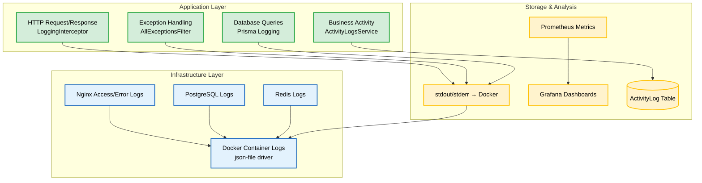

# Logging & Monitoring Plan

**Versi**: 1.0
**Tanggal**: 10 April 2026
**Referensi**: PRD v3.1 (NFR-01, NFR-05), SDD v3.1
**Status**: ACTIVE

---

## 1. Logging Architecture

### 1.1 Logging Layers



---

## 2. Application Logging

### 2.1 HTTP Request Logging (LoggingInterceptor)

Setiap HTTP request yang masuk ke backend dicatat secara otomatis oleh `LoggingInterceptor`.

**Format Log**:

```
[HTTP] <METHOD> <URL> <STATUS> <SIZE>B - <DURATION>ms - <IP> - User:<ID> - <USER_AGENT>
```

**Contoh Output**:

```
[HTTP] GET /api/v1/assets 200 4096B - 145ms - 192.168.1.10 - User:42 - Mozilla/5.0...
[HTTP] POST /api/v1/requests 201 512B - 230ms - 192.168.1.15 - User:7 - Mozilla/5.0...
[HTTP] GET /api/v1/assets/999 404 128B - 12ms - 192.168.1.22 - User:3 - Mozilla/5.0...
```

**Data yang Dicatat**:

| Field         | Sumber               | Contoh                         |
| ------------- | -------------------- | ------------------------------ |
| Method        | `request.method`     | GET, POST, PATCH, DELETE       |
| URL           | `request.url`        | /api/v1/assets?page=1          |
| Status Code   | `response.status`    | 200, 201, 400, 401, 404, 500   |
| Response Size | `response.headers`   | 4096B                          |
| Duration      | `Date.now() - start` | 145ms                          |
| Client IP     | `request.ip`         | 192.168.1.10                   |
| User ID       | `request.user?.id`   | 42 (null jika unauthenticated) |
| User Agent    | `request.headers`    | Mozilla/5.0...                 |

**Error Logging**: Request yang gagal juga dicatat dengan pesan error:

```
[HTTP] POST /api/v1/auth/login 401 - 52ms - 192.168.1.99 - User:- - Error: "Email atau password salah"
```

### 2.2 Business Activity Logging (ActivityLogsService)

Pencatatan aksi bisnis signifikan ke database `ActivityLog`. Ini berbeda dari HTTP logging karena fokus pada **semantik bisnis**, bukan teknikalitas request.

**Action Types**:

| Action          | Kapan Dicatat                                |
| --------------- | -------------------------------------------- |
| `CREATE`        | Aset, transaksi, pelanggan, user baru dibuat |
| `UPDATE`        | Perubahan data entity                        |
| `DELETE`        | Entity dihapus (soft delete)                 |
| `APPROVE`       | Approver menyetujui transaksi                |
| `REJECT`        | Approver menolak transaksi                   |
| `COMPLETE`      | Transaksi selesai dieksekusi                 |
| `CANCEL`        | Creator membatalkan transaksi                |
| `LOGIN`         | User berhasil login                          |
| `LOGOUT`        | User logout                                  |
| `STATUS_CHANGE` | Perubahan status aset atau transaksi         |
| `HANDOVER`      | Serah terima aset                            |
| `BATCH_UPDATE`  | Perubahan massal (bulk operations)           |

**Detail yang Disimpan** (JSON di field `details`):

```json
{
  "action": "UPDATE",
  "entity": "Asset",
  "entityId": "AS-2026-0410-0001",
  "changes": {
    "status": { "from": "IN_STORAGE", "to": "IN_USE" },
    "currentHolderId": { "from": null, "to": 42 }
  },
  "metadata": {
    "triggeredBy": "HandoverService",
    "handoverId": "HD-2026-0410-0001"
  }
}
```

**Convenience Methods di Service**:

```typescript
// Asset events
activityLogsService.logAssetCreated(userId, assetId, details);
activityLogsService.logAssetUpdated(userId, assetId, changes);

// Transaction events
activityLogsService.logRequestCreated(userId, requestId, details);
activityLogsService.logRequestApproved(userId, requestId, details);

// Auth events
activityLogsService.logUserLogin(userId);
activityLogsService.logUserLogout(userId);
```

**Query Capabilities**:

| Endpoint                    | Permission             | Deskripsi                  |
| --------------------------- | ---------------------- | -------------------------- |
| `GET /activity-logs`        | `SYSTEM_AUDIT_LOG`     | Filtered logs + pagination |
| `GET /activity-logs/entity` | `SYSTEM_AUDIT_LOG`     | History per entity         |
| `GET /activity-logs/recent` | Public (authenticated) | Dashboard widget feed      |

### 2.3 Exception Logging (AllExceptionsFilter)

Semua exception ditangani oleh global exception filter dengan logging terstruktur:

| Severity     | Status Code | Log Level      | Detail                                       |
| ------------ | ----------- | -------------- | -------------------------------------------- |
| Client Error | 400-499     | `warn`         | Validasi gagal, unauthorized, not found      |
| Server Error | 500+        | `error`        | Internal error + stack trace                 |
| Prisma Error | Varies      | `warn`/`error` | Mapped ke HTTP status (lihat tabel di bawah) |

**Prisma Error Code Mapping**:

| Prisma Code | HTTP Status | Pesan                                    |
| ----------- | ----------- | ---------------------------------------- |
| P2002       | 409         | Duplikasi data: [field] sudah digunakan  |
| P2003       | 400         | Referensi data tidak valid (foreign key) |
| P2025       | 404         | Data tidak ditemukan                     |
| P2014       | 400         | Relasi data tidak valid                  |

**Standardized Error Response**:

```json
{
  "success": false,
  "statusCode": 409,
  "message": "Duplikasi data: email sudah digunakan",
  "error": "ConflictError",
  "timestamp": "2026-04-10T10:30:45.123Z",
  "path": "/api/v1/users",
  "details": {}
}
```

### 2.4 Database Query Logging (Prisma)

Prisma Client dikonfigurasi untuk logging:

| Level   | Apa yang Dicatat                         | Environment |
| ------- | ---------------------------------------- | ----------- |
| `info`  | Informasi koneksi, client initialization | Semua       |
| `warn`  | Deprecated features, slow queries        | Semua       |
| `error` | Query errors, connection failures        | Semua       |
| `query` | Semua SQL queries (verbose)              | Development |

### 2.5 Log Level Configuration

| Environment | `LOG_LEVEL` | Yang Dicatat                    |
| ----------- | ----------- | ------------------------------- |
| Development | `debug`     | Semua: debug, info, warn, error |
| Staging     | `info`      | Info, warn, error               |
| Production  | `warn`      | Hanya warn dan error            |

---

## 3. Infrastructure Logging

### 3.1 Nginx Logging

**Access Log Format**:

```
$remote_addr - $remote_user [$time_local] "$request" $status $body_bytes_sent
"$http_referer" "$http_user_agent" rt=$request_time
```

**Error Log**: Level `warn` (production), `info` (staging).

**Log Location** (dalam container):
| Log Type | Path |
| ----------- | --------------------------- |
| Access Log | `/var/log/nginx/access.log` |
| Error Log | `/var/log/nginx/error.log` |

### 3.2 PostgreSQL Logging

| Configuration                | Value    | Deskripsi                          |
| ---------------------------- | -------- | ---------------------------------- |
| `log_statement`              | `ddl`    | Log DDL statements (CREATE, ALTER) |
| `log_min_duration_statement` | `1000ms` | Log query yang > 1 detik           |
| `log_connections`            | `on`     | Log koneksi baru                   |
| `log_disconnections`         | `on`     | Log disconnect                     |

### 3.3 Docker Container Log Limits

| Container  | Max Size per File | Max Files | Total Storage |
| ---------- | ----------------- | --------- | ------------- |
| PostgreSQL | 10 MB             | 3         | 30 MB         |
| Redis      | 10 MB             | 3         | 30 MB         |
| Backend    | 50 MB             | 5         | 250 MB        |
| Frontend   | 20 MB             | 5         | 100 MB        |

**Akses Docker Logs**:

```bash
# Lihat log terbaru
docker compose logs --tail=100 backend

# Follow log real-time
docker compose logs -f backend

# Log dengan timestamp
docker compose logs -t --tail=50 trinity-db

# Log semua services
docker compose logs --tail=20
```

---

## 4. Monitoring

### 4.1 Prometheus Configuration

```yaml
# monitoring/prometheus.yml
global:
  scrape_interval: 15s # Default scrape interval
  evaluation_interval: 15s # Rule evaluation interval

scrape_configs:
  # Prometheus self-monitoring
  - job_name: 'prometheus'
    static_configs:
      - targets: ['localhost:9090']

  # Backend API metrics
  - job_name: 'backend'
    static_configs:
      - targets: ['backend:3001']
    metrics_path: /api/v1/metrics
    scrape_interval: 30s # More frequent for app metrics

  # Redis metrics
  - job_name: 'redis'
    static_configs:
      - targets: ['redis:6379']
```

### 4.2 Application Metrics (Backend)

Metrics yang di-expose di `/api/v1/metrics`:

| Metric                          | Type      | Deskripsi                                 |
| ------------------------------- | --------- | ----------------------------------------- |
| `http_requests_total`           | Counter   | Total HTTP requests per method/status     |
| `http_request_duration_seconds` | Histogram | Request latency distribution              |
| `http_request_size_bytes`       | Histogram | Request body size                         |
| `http_response_size_bytes`      | Histogram | Response body size                        |
| `active_connections`            | Gauge     | Current active connections                |
| `prisma_query_duration_seconds` | Histogram | Database query latency                    |
| `prisma_pool_connections`       | Gauge     | Active database pool connections (max 10) |

### 4.3 Health Check Endpoints

| Endpoint         | Method | Deskripsi                  | Response 200         |
| ---------------- | ------ | -------------------------- | -------------------- |
| `/api/v1/health` | GET    | Basic health (app running) | `{ "status": "ok" }` |

Docker health checks per container:

| Container  | Check Command                                       | Interval | Retries |
| ---------- | --------------------------------------------------- | -------- | ------- |
| PostgreSQL | `pg_isready -U $POSTGRES_USER`                      | 10s      | 5       |
| Redis      | `redis-cli --pass $REDIS_PASSWORD ping`             | 10s      | 5       |
| Backend    | `wget --spider http://localhost:3001/api/v1/health` | 30s      | 3       |
| Frontend   | `curl -f http://localhost:80`                       | 30s      | 3       |

### 4.4 Grafana Dashboards (Planned)

| Dashboard            | Metrics Source       | Target Panels                                 |
| -------------------- | -------------------- | --------------------------------------------- |
| **API Overview**     | Prometheus → Backend | Request rate, error rate, latency p50/p95/p99 |
| **Database Health**  | Prometheus → PG      | Connections, query duration, pool usage       |
| **Infrastructure**   | Prometheus → All     | Container memory/CPU, disk, network           |
| **Business Metrics** | Custom queries       | Active users, transactions/day, approval time |

### 4.5 Alerting Rules (Planned)

| Alert                    | Condition                                | Severity | Notification |
| ------------------------ | ---------------------------------------- | -------- | ------------ |
| High Error Rate          | HTTP 5xx > 5% dalam 5 menit              | Critical | WhatsApp     |
| Slow API Response        | p95 latency > 2 detik selama 10 menit    | Warning  | In-app       |
| Database Connection Pool | Active connections > 8/10 selama 5 menit | Warning  | In-app       |
| Disk Space Low           | Available < 20%                          | Warning  | WhatsApp     |
| Container Restart        | Restart count > 3 dalam 1 jam            | Critical | WhatsApp     |
| Stock Below Threshold    | Asset model stock < threshold            | Info     | In-app + WA  |
| Backup Failed            | Daily backup script exit ≠ 0             | Critical | WhatsApp     |

---

## 5. Log Retention & Cleanup

### 5.1 Retention Policy

| Log Type              | Retention | Storage              | Cleanup Method                   |
| --------------------- | --------- | -------------------- | -------------------------------- |
| Docker container logs | Auto      | Disk (json-file)     | Docker log rotation (configured) |
| Activity Logs (DB)    | 365 hari  | PostgreSQL           | `cleanupOld(365)` cron job       |
| Nginx access logs     | 30 hari   | Docker logs          | Docker log rotation              |
| Prometheus metrics    | 15 hari   | Prometheus TSDB      | Prometheus retention config      |
| Backup logs           | 90 hari   | /opt/trinity/backups | Cron cleanup                     |

### 5.2 Activity Log Cleanup

```typescript
// Dijadwalkan sebagai cron job (bulanan)
// Menghapus activity logs yang lebih tua dari N hari
await activityLogsService.cleanupOld(365);
```

---

## 6. Troubleshooting with Logs

### 6.1 Common Investigation Patterns

**User melaporkan "gagal login"**:

```bash
# Check auth logs
docker compose logs backend | grep "POST /api/v1/auth/login" | tail -20

# Check rate limiting
docker compose logs frontend | grep "429" | tail -10
```

**Transaksi hilang atau status tidak update**:

```bash
# Check activity logs via API
GET /api/v1/activity-logs?entityType=request&entityId=RQ-2026-0410-0001

# Check backend logs untuk error
docker compose logs backend | grep "RQ-2026-0410-0001"
```

**API lambat**:

```bash
# Check slow requests (>1s)
docker compose logs backend | grep -E "[0-9]{4,}ms"

# Check database slow queries
docker compose logs trinity-db | grep "duration"
```

**Container restart loop**:

```bash
# Check restart count
docker compose ps

# Check last error before restart
docker compose logs --tail=50 backend

# Check health check status
docker inspect --format='{{json .State.Health}}' trinity-backend
```

### 6.2 Log Access Quick Reference

```bash
# Semua services (recent)
docker compose logs --tail=50

# Follow backend real-time
docker compose logs -f backend

# Filter by waktu
docker compose logs --since="2026-04-10T10:00:00" backend

# Export logs ke file
docker compose logs backend > /tmp/backend-logs-$(date +%Y%m%d).txt

# Grep specific error
docker compose logs backend 2>&1 | grep -i "prisma"
```
