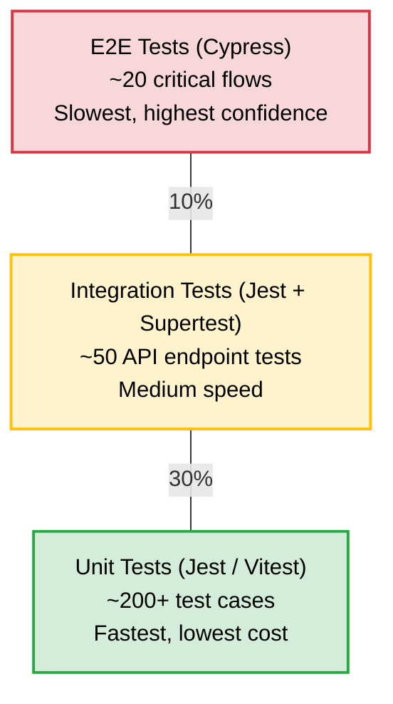

# Test Plan & UAT Document

**Versi**: 1.0
**Tanggal**: 10 April 2026
**Referensi**: PRD v3.1 (Bagian 6, 7, 10.2), SDD v3.1
**Status**: ACTIVE
**Target UAT**: Minggu 2 Mei 2026 (12-18 Mei)

---

## 1. Testing Strategy Overview

### 1.1 Test Pyramid



### 1.2 Testing Tools & Coverage Targets

| Layer         | Tool    | Framework | Coverage Target           | Lokasi File Test             |
| ------------- | ------- | --------- | ------------------------- | ---------------------------- |
| **Unit (BE)** | Jest    | NestJS    | ≥55% lines, ≥40% branches | `backend/test/unit/`         |
| **Unit (FE)** | Vitest  | React     | ≥55% lines                | `frontend/src/**/*.test.tsx` |
| **E2E**       | Cypress | —         | Critical flows 100%       | `e2e/cypress/e2e/`           |

### 1.3 Test Execution Commands

```bash
# Backend unit tests
pnpm --filter backend test          # Run once
pnpm --filter backend test:watch    # Watch mode
pnpm --filter backend test:cov      # With coverage report

# Frontend unit tests
pnpm --filter frontend test         # Run once
pnpm --filter frontend test:watch   # Watch mode
pnpm --filter frontend test:coverage # With coverage

# E2E tests
pnpm --filter e2e cy:open           # Interactive GUI
pnpm --filter e2e cy:run            # Headless CI mode
pnpm --filter e2e test:auth         # Only auth tests
pnpm --filter e2e test:assets       # Only asset tests
```

---

## 2. Test Scenarios per Module

### 2.1 Authentication & Authorization (F-07 Cross-Cutting)

#### 2.1.1 Login

| ID      | Skenario                    | Input                         | Expected Result                                | Priority |
| ------- | --------------------------- | ----------------------------- | ---------------------------------------------- | -------- |
| AUTH-01 | Login valid                 | Email & password benar        | 200 OK, token returned, lastLoginAt updated    | Critical |
| AUTH-02 | Login password salah        | Email benar, password salah   | 401, pesan generik "Email atau password salah" | Critical |
| AUTH-03 | Login email tidak terdaftar | Email tidak ada di DB         | 401, pesan generik (sama dengan AUTH-02)       | Critical |
| AUTH-04 | Login akun non-aktif        | User.isActive = false         | 401, akun dinonaktifkan                        | High     |
| AUTH-05 | Login rate limiting         | 6 request login dalam 1 menit | 429 Too Many Requests pada request ke-6        | High     |
| AUTH-06 | Login must change password  | mustChangePassword = true     | 200 + flag mustChangePassword di response      | Medium   |

#### 2.1.2 Token Management

| ID      | Skenario                                     | Expected Result                | Priority |
| ------- | -------------------------------------------- | ------------------------------ | -------- |
| AUTH-07 | Refresh token valid                          | 200, new access token returned | Critical |
| AUTH-08 | Refresh token expired                        | 401 Unauthorized               | Critical |
| AUTH-09 | Refresh token reuse (rotation)               | 401, token invalidated         | High     |
| AUTH-10 | Access expired API endpoint                  | 401 Unauthorized               | Critical |
| AUTH-11 | Token version mismatch (post password reset) | 401, token rejected            | High     |

#### 2.1.3 RBAC & Permissions

| ID      | Skenario                              | Expected Result                                  | Priority |
| ------- | ------------------------------------- | ------------------------------------------------ | -------- |
| AUTH-12 | Staff access Superadmin-only endpoint | 403 Forbidden                                    | Critical |
| AUTH-13 | Role restriction enforcement          | Staff + ASSETS_DELETE permission → still 403     | Critical |
| AUTH-14 | Mandatory permission auto-grant       | Staff tanpa DASHBOARD_VIEW di DB → tetap granted | High     |
| AUTH-15 | Custom permission override            | Staff + REPORTS_VIEW di DB → granted             | Medium   |

---

### 2.2 Manajemen Aset (F-02)

#### 2.2.1 CRUD Aset

| ID     | Skenario                             | Input / Kondisi             | Expected Result                            | Priority |
| ------ | ------------------------------------ | --------------------------- | ------------------------------------------ | -------- |
| AST-01 | Create aset valid                    | Semua field wajib terisi    | 201, kode unik AS-YYYY-MMDD-XXXX generated | Critical |
| AST-02 | Create aset — field wajib kosong     | Nama kosong                 | 400, validation error                      | Critical |
| AST-03 | Create aset — serial number duplikat | SN yang sudah ada di DB     | 409, Conflict                              | High     |
| AST-04 | Update aset                          | Perubahan field yang valid  | 200, data updated + audit trail            | Critical |
| AST-05 | Delete aset tanpa transaksi          | Aset belum pernah digunakan | 200, soft delete                           | High     |
| AST-06 | Delete aset dengan transaksi (BR-01) | Aset pernah dipinjam        | 400, "Aset memiliki riwayat transaksi"     | Critical |
| AST-07 | Staff mencoba create aset            | Role: Staff                 | 403 Forbidden                              | Critical |
| AST-08 | Bulk create aset                     | Array 10 aset valid         | 201, semua berhasil + unique codes         | Medium   |

#### 2.2.2 Stok Aset

| ID     | Skenario                                     | Expected Result                              | Priority |
| ------ | -------------------------------------------- | -------------------------------------------- | -------- |
| STK-01 | View stok gudang utama                       | Daftar stok per model, jumlah akurat         | Critical |
| STK-02 | View stok divisi (Leader melihat divisinya)  | Hanya aset milik divisi Leader               | High     |
| STK-03 | View stok pribadi (Staff)                    | Hanya aset yang dipegang Staff               | High     |
| STK-04 | Set threshold stok minimum                   | Admin Logistik set threshold per model       | Medium   |
| STK-05 | Notifikasi stok di bawah threshold           | Sistem mengirim alert saat stok < threshold  | Medium   |
| STK-06 | Stok otomatis berkurang setelah serah terima | Serah terima selesai → stok gudang berkurang | Critical |

#### 2.2.3 Kategori / Tipe / Model

| ID     | Skenario                                   | Expected Result                             | Priority |
| ------ | ------------------------------------------ | ------------------------------------------- | -------- |
| CAT-01 | Create kategori valid                      | 201, kategori terbuat                       | High     |
| CAT-02 | Delete kategori yang masih dipakai (BR-09) | 400, "Kategori masih digunakan oleh X aset" | Critical |
| CAT-03 | Hirarki: Kategori → Tipe → Model           | Relasi terstruktur & queryable              | High     |

---

### 2.3 Data Pembelian & Depresiasi (F-03)

| ID     | Skenario                            | Input / Kondisi                         | Expected Result              | Priority |
| ------ | ----------------------------------- | --------------------------------------- | ---------------------------- | -------- |
| PUR-01 | Create data pembelian               | Model aset + supplier + harga + tanggal | 201, terkait dengan model    | High     |
| PUR-02 | Staff mengakses data pembelian      | Role: Staff                             | 403, Forbidden (BR-03)       | Critical |
| PUR-03 | Admin Purchase view harga aset      | Role: ADMIN_PURCHASE                    | 200, field harga visible     | High     |
| PUR-04 | Staff view harga aset               | Role: Staff (no ASSETS_VIEW_PRICE)      | Harga di-hide dari response  | High     |
| DEP-01 | Hitung depresiasi straight-line     | Harga 10jt, umur 5th                    | Depresiasi 2jt/tahun         | High     |
| DEP-02 | Hitung depresiasi declining balance | Harga 10jt, rate 20%                    | Tahun 1: 2jt, Tahun 2: 1.6jt | High     |

---

### 2.4 Modul Transaksi (F-04)

#### 2.4.1 Permintaan Baru (Pengadaan Aset)

| ID     | Skenario                                  | Kondisi                          | Expected Result                               | Priority |
| ------ | ----------------------------------------- | -------------------------------- | --------------------------------------------- | -------- |
| REQ-01 | Staff membuat permintaan                  | Form valid                       | 201, status PENDING, kode RQ-YYYY-MMDD-XXXX   | Critical |
| REQ-02 | Approval chain Staff (4 layer)            | Staff → Leader → AL → AP → SA    | Masing-masing mendapat notifikasi berurutan   | Critical |
| REQ-03 | Leader approve, lanjut ke Admin Logistik  | Leader click Approve             | Status update, AL notified, next step enabled | Critical |
| REQ-04 | Admin Logistik reject permintaan          | AL click Reject + alasan         | Status REJECTED, Staff notified + alasan      | Critical |
| REQ-05 | Creator cancel permintaan sendiri         | Staff cancel permintaan PENDING  | Status CANCELLED                              | High     |
| REQ-06 | Creator cancel permintaan sudah diapprove | Staff cancel permintaan APPROVED | 400, tidak bisa cancel setelah approved       | High     |
| REQ-07 | Creator approve sendiri (self-approve)    | Staff = approver                 | 400, "Tidak bisa approve permintaan sendiri"  | Critical |
| REQ-08 | Approval chain Leader (3 layer)           | Leader → AL → AP → SA            | 3 layer approval                              | High     |
| REQ-09 | Approval chain Superadmin (2 layer)       | SA → AL → AP                     | 2 layer approval                              | High     |

#### 2.4.2 Peminjaman

| ID    | Skenario                                | Kondisi                  | Expected Result                                  | Priority |
| ----- | --------------------------------------- | ------------------------ | ------------------------------------------------ | -------- |
| LN-01 | Staff membuat permintaan pinjam         | Aset tersedia di gudang  | 201, status PENDING, kode LN-...                 | Critical |
| LN-02 | Validasi stok tidak cukup (BR-05)       | Aset yang diminta > stok | Transaksi tetap dibuat, ditandai perlu pengadaan | High     |
| LN-03 | Approval chain Staff (2 layer)          | Staff → Leader → AL      | Sequential approval                              | Critical |
| LN-04 | Peminjaman disetujui → stok berkurang   | Semua approval selesai   | Aset status → LOANED, stok gudang −1             | Critical |
| LN-05 | Aset yang sudah dipinjam diminta pinjam | Aset status LOANED       | 400, "Aset sedang dipinjam"                      | High     |

#### 2.4.3 Pengembalian

| ID    | Skenario                              | Expected Result                           | Priority |
| ----- | ------------------------------------- | ----------------------------------------- | -------- |
| RT-01 | Pengembalian aset kondisi baik        | Aset status → IN_STORAGE, stok +1         | Critical |
| RT-02 | Pengembalian aset kondisi rusak       | Aset status → DAMAGED, dipindah ke repair | High     |
| RT-03 | Pengembalian aset yang tidak dipinjam | 400, "Aset tidak dalam status LOANED"     | High     |

#### 2.4.4 Serah Terima

| ID    | Skenario                       | Expected Result                                        | Priority |
| ----- | ------------------------------ | ------------------------------------------------------ | -------- |
| HD-01 | Serah terima aset antar user   | PIC berubah, audit trail lengkap                       | Critical |
| HD-02 | Serah terima 3-party signature | Pemberi, penerima, mengetahui tercatat                 | High     |
| HD-03 | Satu aset satu PIC (BR-07)     | Setelah handover, PIC lama = null, PIC baru = penerima | Critical |

#### 2.4.5 Lapor Rusak & Aset Hilang

| ID    | Skenario                        | Expected Result                             | Priority |
| ----- | ------------------------------- | ------------------------------------------- | -------- |
| RP-01 | Lapor aset rusak                | Aset status → UNDER_REPAIR                  | High     |
| RP-02 | Lapor aset hilang (BR-06)       | Aset status → LOST, notifikasi ke SA+AL     | Critical |
| RP-03 | Aset hilang tidak bisa dipinjam | Aset LOST → coba pinjam → 400 blocked       | Critical |
| RP-04 | Resolusi: aset ditemukan        | Admin restore status ke sebelumnya          | High     |
| RP-05 | Resolusi: tidak ditemukan       | Status → DISPOSED, dicatat sebagai kerugian | High     |
| RP-06 | Pelapor bukan PIC aset          | 400, "Anda bukan PIC aset ini"              | High     |

#### 2.4.6 Proyek Infrastruktur

| ID     | Skenario                      | Expected Result                    | Priority |
| ------ | ----------------------------- | ---------------------------------- | -------- |
| PRJ-01 | Create proyek                 | 201, kode PRJ-..., status PENDING  | High     |
| PRJ-02 | Assign team members           | Anggota terdaftar di proyek        | Medium   |
| PRJ-03 | Alokasi material dari stok    | Stok terkurangi, material tercatat | High     |
| PRJ-04 | Approval chain (2 layer + CC) | Leader → AL, CC: SA                | High     |

---

### 2.5 Manajemen Pelanggan (F-05)

| ID     | Skenario                           | Expected Result                             | Priority |
| ------ | ---------------------------------- | ------------------------------------------- | -------- |
| CUS-01 | CRUD pelanggan                     | Create, read, update, delete berfungsi      | High     |
| CUS-02 | Tiket instalasi                    | Aset diinstalasi di lokasi pelanggan        | High     |
| CUS-03 | Tiket maintenance                  | Maintenance tercatat, material dipakai      | High     |
| CUS-04 | Tiket dismantle                    | Aset dikembalikan ke gudang post-dismantle  | High     |
| CUS-05 | Hanya divisi dengan canDoFieldwork | Divisi tanpa flag → tidak bisa create tiket | Medium   |

---

### 2.6 Pengaturan (F-06)

| ID     | Skenario                             | Expected Result                           | Priority |
| ------ | ------------------------------------ | ----------------------------------------- | -------- |
| SET-01 | Ganti password sendiri               | Password updated, tokenVersion++          | Critical |
| SET-02 | Superadmin create user baru          | User terbuat, password awal digenerate    | Critical |
| SET-03 | Non-superadmin manage users          | 403 Forbidden                             | Critical |
| SET-04 | Create divisi                        | Divisi terbuat dengan canDoFieldwork flag | High     |
| SET-05 | Edit permission user secara granular | Permission tersimpan + sanitized          | High     |

---

### 2.7 Dashboard (F-01)

| ID     | Skenario                               | Expected Result                          | Priority |
| ------ | -------------------------------------- | ---------------------------------------- | -------- |
| DSH-01 | Dashboard Superadmin — overview global | Total aset, transaksi aktif, user stats  | High     |
| DSH-02 | Dashboard Admin Purchase — keuangan    | Ringkasan pembelian, grafik depresiasi   | Medium   |
| DSH-03 | Dashboard Admin Logistik — operasional | Stok, transaksi pending, alert threshold | High     |
| DSH-04 | Dashboard Leader — divisi              | Aset divisi, transaksi tim               | Medium   |
| DSH-05 | Dashboard Staff — pribadi              | Aset yang dipegang, riwayat peminjaman   | Medium   |
| DSH-06 | Role melihat dashboard role lain       | 403 atau redirect ke dashboard sendiri   | High     |

---

### 2.8 Cross-Cutting (F-07)

| ID    | Skenario                                 | Expected Result                           | Priority |
| ----- | ---------------------------------------- | ----------------------------------------- | -------- |
| CC-01 | Audit trail tercatat untuk setiap mutasi | ActivityLog record terbuat (BR-04)        | Critical |
| CC-02 | Notifikasi in-app untuk approval         | Approver menerima notifikasi              | High     |
| CC-03 | QR code generation untuk aset            | QR code berisi kode aset, scannable       | Medium   |
| CC-04 | Export data ke Excel                     | File Excel valid, data sesuai filter      | Medium   |
| CC-05 | Export report ke PDF                     | PDF ter-generate, layout benar            | Medium   |
| CC-06 | Import data dari Excel                   | Data valid di-import, invalid di-skip     | Medium   |
| CC-07 | File attachment upload (gambar/PDF)      | File tersimpan, max size respected        | High     |
| CC-08 | Theme toggle (dark/light)                | UI berubah tanpa reload, preference saved | Low      |

---

## 3. Non-Functional Test Scenarios

### 3.1 Performance (NFR-01, NFR-02)

| ID    | Skenario                         | Target                               | Priority |
| ----- | -------------------------------- | ------------------------------------ | -------- |
| PF-01 | API response time rata-rata      | < 500ms (p95 < 2 detik)              | Critical |
| PF-02 | Throughput API                   | ≥ 100 transaksi/detik pada peak load | High     |
| PF-03 | Page load time (initial)         | < 3 detik pada 4G connection         | High     |
| PF-04 | List aset dengan 10.000+ records | Pagination response < 1 detik        | Medium   |
| PF-05 | Dashboard aggregation queries    | < 2 detik untuk semua widget         | High     |

### 3.2 Security (NFR-03, NFR-04)

| ID    | Skenario                              | Expected                                   | Priority |
| ----- | ------------------------------------- | ------------------------------------------ | -------- |
| SC-01 | SQL injection pada input field        | Input di-escape oleh Prisma ORM, no effect | Critical |
| SC-02 | XSS pada field nama/deskripsi         | Input di-sanitize, script tidak executed   | Critical |
| SC-03 | CSRF pada mutation endpoint           | CORS policy memblokir cross-origin request | High     |
| SC-04 | Brute force login                     | Rate limited setelah 5 attempt/menit       | Critical |
| SC-05 | Token tampering                       | 401, signature invalid                     | Critical |
| SC-06 | Accessing other user's data           | RBAC enforcement, 403 Forbidden            | Critical |
| SC-07 | File upload malicious (non-image/PDF) | 400, file type rejected                    | High     |

### 3.3 Usability

| ID    | Skenario                   | Target                                     | Priority |
| ----- | -------------------------- | ------------------------------------------ | -------- |
| UX-01 | Responsive design (tablet) | Layout adapts, usable pada 768px width     | Medium   |
| UX-02 | Form validation feedback   | Error message jelas, field di-highlight    | High     |
| UX-03 | Loading states             | Skeleton/spinner saat fetch, no blank page | High     |
| UX-04 | Error states               | User-friendly error message, retry option  | High     |
| UX-05 | Keyboard navigation        | Tab order logis, Enter submit form         | Low      |

---

## 4. UAT (User Acceptance Testing) Plan

### 4.1 UAT Schedule

| Fase               | Tanggal        | Aktivitas                                      |
| ------------------ | -------------- | ---------------------------------------------- |
| **Preparation**    | 5-11 Mei 2026  | Deploy ke staging, prepare test data, training |
| **UAT Execution**  | 12-16 Mei 2026 | User menjalankan skenario pengujian            |
| **Feedback & Fix** | 16-18 Mei 2026 | Pengumpulan feedback, fix bug kritis           |
| **Sign-off**       | 18 Mei 2026    | Approval formal dari stakeholder               |

### 4.2 UAT Participants

| Role               | Nama / Jabatan               | Tanggung Jawab UAT                                      |
| ------------------ | ---------------------------- | ------------------------------------------------------- |
| **Superadmin**     | PIC PT. Trinity              | Validasi dashboard, user management, audit trail        |
| **Admin Logistik** | Admin gudang                 | Validasi aset, stok, serah terima, eksekusi transaksi   |
| **Admin Purchase** | Admin pembelian              | Validasi data pembelian, depresiasi, dashboard keuangan |
| **Leader**         | Kepala divisi (2-3 orang)    | Validasi approval workflow, stok divisi, dashboard      |
| **Staff**          | Perwakilan staff (3-5 orang) | Validasi pembuatan permintaan, peminjaman, dashboard    |

### 4.3 UAT Test Checklist per Role

#### Superadmin

- [ ] Login dan lihat Dashboard Utama dengan statistik lengkap
- [ ] Buat user baru untuk setiap role
- [ ] Assign Permission khusus ke user
- [ ] Reset password user dan verifikasi mustChangePassword
- [ ] Buat divisi baru dengan flag canDoFieldwork
- [ ] Approve permintaan baru (sebagai approval final)
- [ ] Lihat Audit Trail dan filter berdasarkan entity
- [ ] Export report ke Excel dan PDF
- [ ] Verifikasi semua notifikasi masuk

#### Admin Logistik

- [ ] Login dan lihat Dashboard Operasional
- [ ] Tambah kategori → tipe → model (hirarki lengkap)
- [ ] Tambah aset baru (5 aset) dan verifikasi kode unik
- [ ] Set threshold stok minimum per model
- [ ] Lakukan serah terima aset ke Staff (3-party signature)
- [ ] Approve permintaan peminjaman dari Staff
- [ ] Proses pengembalian aset (kondisi baik & rusak)
- [ ] Eksekusi permintaan setelah semua approval chain complete
- [ ] Scan QR code aset dan verifikasi detail

#### Admin Purchase

- [ ] Login dan lihat Dashboard Keuangan
- [ ] Tambah data pembelian untuk model aset
- [ ] Hitung depresiasi (straight-line & declining balance)
- [ ] Approve permintaan baru (sebagai approval purchase)
- [ ] Verifikasi harga aset visible di detail aset
- [ ] Export data pembelian ke Excel

#### Leader

- [ ] Login dan lihat Dashboard Divisi
- [ ] Lihat stok aset divisi
- [ ] Approve permintaan dari Staff di divisi
- [ ] Buat permintaan baru sendiri, verifikasi approval chain 3 layer
- [ ] Lihat riwayat transaksi divisi

#### Staff

- [ ] Login dan lihat Dashboard Pribadi
- [ ] Lihat aset yang dipegang
- [ ] Buat permintaan baru aset (verifikasi approval chain 4 layer)
- [ ] Buat permintaan peminjaman
- [ ] Lapor aset rusak (verifikasi notifikasi ke Admin)
- [ ] Ganti password melalui profil
- [ ] Verifikasi TIDAK bisa akses halaman admin (403/redirect)

### 4.4 UAT Feedback Form

Setiap participant diminta mengisi form berikut untuk setiap skenario:

| Field                | Deskripsi                               |
| -------------------- | --------------------------------------- |
| Tester               | Nama & role tester                      |
| Skenario ID          | ID test case (misal: REQ-01)            |
| Tanggal              | Tanggal pengujian                       |
| Status               | ✅ Pass / ❌ Fail / ⚠️ Pass with Issue  |
| Detail Temuan        | Deskripsi bug atau masalah (jika ada)   |
| Screenshot/Video     | Bukti visual (wajib untuk Fail)         |
| Severity             | Critical / High / Medium / Low          |
| Ekspektasi vs Aktual | Apa yang diharapkan vs apa yang terjadi |

### 4.5 UAT Bug Severity Classification

| Severity     | Definisi                                    | SLA Fix  | Contoh                                        |
| ------------ | ------------------------------------------- | -------- | --------------------------------------------- |
| **Critical** | Fitur core tidak bisa digunakan sama sekali | < 4 jam  | Login gagal, data hilang, security hole       |
| **High**     | Fitur penting terganggu, ada workaround     | < 24 jam | Approval gagal tapi bisa manual, export error |
| **Medium**   | Fitur minor terganggu, UX kurang optimal    | < 72 jam | Layout rusak di mobile, typo di pesan         |
| **Low**      | Kosmetik, nice-to-have                      | Backlog  | Warna tidak konsisten, spacing off            |

### 4.6 Go-Live Acceptance Criteria (dari PRD 10.2)

Sistem layak Go-Live jika SEMUA kriteria terpenuhi:

| #   | Kriteria                                     | Metode Verifikasi                  |
| --- | -------------------------------------------- | ---------------------------------- |
| 1   | Seluruh fitur MVP berfungsi dan lolos UAT    | UAT sign-off sheet 100% Pass       |
| 2   | 0 bug Critical atau High yang belum resolved | Bug tracking report                |
| 3   | Audit OWASP Top 10 lulus                     | Security checklist signed          |
| 4   | Backup & recovery mechanism teruji           | Restore test sukses minimal 1x     |
| 5   | User training dilaksanakan semua role        | Attendance sheet training          |
| 6   | Dokumentasi API (Swagger) lengkap            | Swagger UI accessible & complete   |
| 7   | Sign-off tertulis dari klien                 | Dokumen persetujuan ditandatangani |

---

## 5. Regression Testing Strategy

### 5.1 Kapan Regression Test Dijalankan

- Setiap push ke branch `develop` (automated via CI/CD)
- Setelah setiap bug fix di sprint stabilisasi
- Sebelum production deployment

### 5.2 Critical Path Regression Suite

Test suite minimum yang HARUS pass sebelum deploy:

1. **Auth**: Login, token refresh, logout
2. **RBAC**: Permission enforcement untuk 5 role
3. **Assets**: Create, edit, view, stock update
4. **Requests**: Create, approval chain complete, reject
5. **Loans**: Create, approve, return
6. **Handovers**: Create, 3-party signature, PIC transfer

### 5.3 Automated vs Manual Testing

| Scope                 | Automated (CI/CD) | Manual UAT |
| --------------------- | ----------------- | ---------- |
| Unit tests            | ✅                | —          |
| API integration tests | ✅                | —          |
| E2E critical flows    | ✅                | —          |
| Cross-browser testing | —                 | ✅         |
| Usability testing     | —                 | ✅         |
| Performance testing   | Partial           | ✅         |
| Security audit        | Partial           | ✅         |
